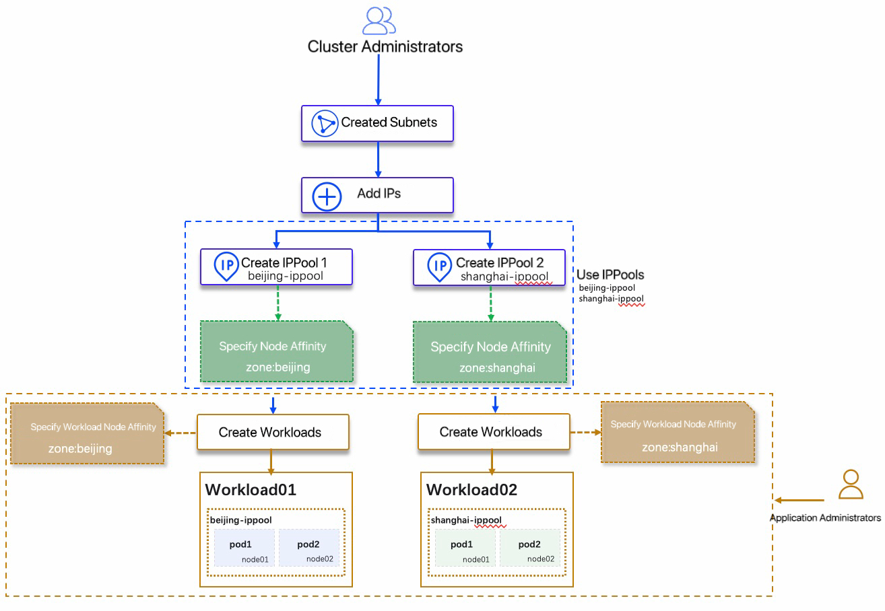

# Instructions for Using the IPPools

This page describes the different cases for using IPPools when using Spiderpool for IP allocation and management. Please make sure that [Spiderpool has been installed correctly](../../modules/spiderpool/install.md) before using it.

## Fixed IPs for workloads

Spiderpool provides two ways to use fixed IPs for workloads:

- **Manually create a fixed IPPool**. Administrators should specify the workload affinity of the IPPool to be used, and select the corresponding fixed IPPool when creating the workload.

    **Use cases**: This method is applicable to the scenario of strong IP control. It is necessary to apply for opening the firewall in advance for IP release. After the release, the workload can use the proper fixed IP. For the operational instructions, refer to [Create subnets and IPPools](createpool.md) and [Workload uses IPPools](../use-ippool/usage.md).

- **Automatically create a fixed IPPool**. After creating a subnet and adding an IP to be used, the application administrator will automatically create a fixed IPPool based on the created subnet, and the created IPPool will only be used exclusively by this workload.

    **Use cases**: This method is applicable to coarse-grained IP management. The firewall can be released based on a large range of IP (such as 10.6.124.10~10.6.124.200).
    After the release, the workload can automatically get an IP based on this IP segment and create a fixed IPPool.
    For the operational instructions, please refer to [Create Subnets and IPPools](createpool.md) and [Workload Uses IPPools](../use-ippool/usage.md).

    

## Workloads use the default IPPools

The default IPPools are a predefined collection of IP resources with a specific range of IP addresses.
Administrators need to manually set up and configure the default IPPool.
Because the IP addresses are pre-allocated, this method offers greater certainty.
These IP addresses can be assigned to specific workloads or applications.

**Use cases**: This method is applicable to scenarios with strict IP management,
such as scenarios with high security requirements or scenarios that require coordination with external systems (such as firewalls).
For operational instructions, refer to [Create Subnets and IPPools](../../config/ippool/createpool.md) and [Using IPPools for Workloads](../use-ippool/usage.md).

## Node affinity for IPPools

**Use cases**:

When the cluster nodes are across subnets or across data centers, the subnets available on different Nodes are different, for example:

- In the same data center, the nodes connected to the cluster belong to different subnets.
- In a single cluster, nodes span different data centers.

At the same time, when the workload is created:

- The same workload needs to be scheduled to **cross-subnet** or **cross-data center** nodes. The use process is as follows:

    

- Different workloads need to be scheduled on **different nodes** and use **different subnets**, such as [Mixed use of SR-IOV and Macvlan CNI](../../plans/ethplan.md). The use process is as follows:

    

## Namespace affinity for IPPools

**Use cases**:

If the created IPPool is only assigned to a certain namespace, the IPs in this IPPool can be used when the workload in this namespace is created, and the IPPool with namespace affinity is added to and shared by the specified namespace. For the operational instructions, refer to [Create subnets and IPPools](./createpool.md).

## FAQs

1. Question: What is the final effect of adding namespace affinity and adding workload affinity, or node affinity?

    Answer: The effect is overlay of multiple affinity, so that all affinities must be met before this IPPool can be used.

2. Question: Can the IPPool with namespace affinity be subdivided based on the namespace IPPool, and then allocated to the application as a fixed IPPool?

    For example: `ippool01` belongs to subnet 10.6.124.0/24. There are 100 (10.6.124.10~109) IPs in `ippool01`, and namespace affinity is added: `kubernetes.io/metadata.name: default`. Is it possible to implement the following:

    1. 10.6.124.10~19 is assigned to the workload01 under the `default` namespace and is **fixed**.
    2. 10.6.124.20~29 is assigned to the workload02 under the `default` namespace and is **fixed**.
    3. ...

    Answer: No, it cannot. It only can be used for **one** workload and be **fixed**. The usage method is to add the affinity of the corresponding workload to the IPPool at the same time.
