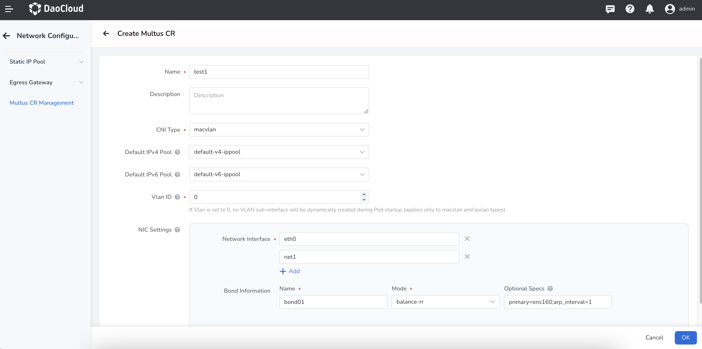
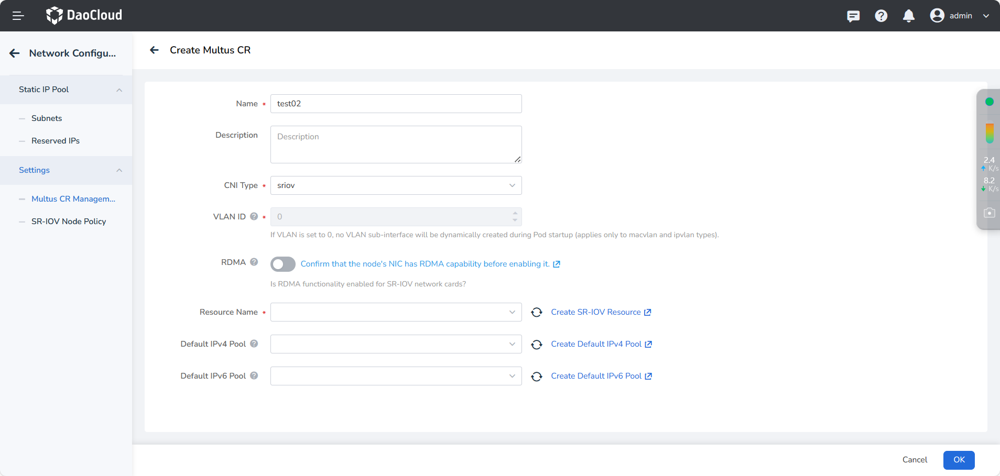

# Creating a Multus CR

Multus CR Management is the secondary encapsulation of configuration instances in Multus CNI by Spiderpool.
It aims to provide more flexible network connectivity and configuration options for containers
to meet different network requirements and provide users with a simpler and more cost-effective experience.
This page explains how to create a Multus CR before using multiple NIC configurations for creating workloads.
If you need to create a new **Multus CR instance**, you can refer to this document.

## Prerequisite

[SpiderPool has been successfully deployed](../modules/spiderpool/install/install.md) since [v0.8.7](https://github.com/spidernet-io/spiderpool/releases/tag/v0.8.7), which fully supports Multus-underlay.

## UI Operations

1. After logging in to the DCE UI, click __Container Management__ -> __Clusters__ in the left navigation menu to find the proper cluster. Then click __Container Network__ -> __Network Settings__ on the left navigation menu.

    

2. Enter __Network Settings__ -> __Multus CR Management__ , and click __Create Multus CR__ .

    

    !!! note

        When creating a Multus CR, the CNI shall be either macvlan, ipvlan, sriov, or custom. Three scenarios are available as below.

### Create a Multus CR for macvlan or ipvlan

Enter the following parameters:



- __Name__ : The instance name of the Multus CNI setting, which is the Multus CR name.
- __Description__ : Description of the instance.
- __CNI Type'__ : The type of CNI. Currently, you can choose between macvlan and ipvlan.
- __Vlan ID__ : Only allowed to be configured when the CNI type is macvlan, ipvlan, or sriov. "0" and "" have the same effect.
- __NIC Settings__ : It includes interface settings information.
    - Please make sure that the primary NIC exists on the host.
    - If you use the shared RDMA feature based on MacVlan/IPVlan, please make sure that the NIC has RDMA capability.
    - When the number of NIC interfaces is one, there will only be one NIC interface in the default NIC configuration.
      When the number of added interfaces is greater than or equal to two, Bond-related setting can be done.
- __NIC Interface__ : It is Only used for macvlan and ipvlan CNI types, and embraces at least one element. If there are two or more elements, Bond must not be empty.
- __Bond Information__ : The name cannot be empty, and the mode must be within the range [0,6], corresponding to the seven modes:
    - balance-rr
    - active-backup
    - balance-xor
    - broadcast
    - 802.3ad
    - balance-tlb
    - balance-alb

- `IPv4 Default Pool`: IPv4 default pool in the CNI configuration file.
- `IPv6 Default Pool`: IPv6 default pool in the CNI configuration file.
Parameters are optional, and the input format is `k1=v1;k2=v2;k3=v3`, separated by `;`.

#### VLAN Configuration

- Underlay network refers to the underlying physical network, usually involving VLAN networks.
  If the Underlay network does not involve VLAN networks, there is no need to configure the VLAN ID(default value is 0).
- **For VLAN subinterfaces**:
    - If the network administrator has already created the VLAN subinterfaces,
      there is no need to fill in the VLAN ID (default value is 0), just fill in the created VLAN subinterface in the Network Interface (Master) field.
    - If automatic creation of VLAN subinterfaces is required, the VLAN ID needs to be configured,
      and the main network interface (Master) should be set to the proper parent interface.
      When creating a Pod, Spiderpool dynamically creates a subinterface named `<master>.<vlanID>`
      on the host to connect the pod to the VLAN network.
- **For Bond NIC**:
    - If the network administrator has already created the Bond NIC and is using it to connect the Underlay network of the pod,
      there is no need to fill in the VLAN ID (default value is 0), and just fill in the name of the created Bond NIC in the Network Interface (Master) field.
    - If automatic creation of Bond NIC is required without creating VLAN subinterfaces,
      VLAN ID needs to be set to 0 and configured at least 2 network interfaces (Master) to form the Bond's Slave NICs. when creating a pod,
      Spiderpool dynamically creates a Bond NIC on the host to connect it to the Underlay network.
- **For RDMA NIC**:
    - If exposing the RoCE NIC on the host to the pod based on Macvlan/IPVLAN/SRIOV, the VLAN ID does not need to be filled in and defaults to 0.

- **Using Bond NIC to create VLAN subinterfaces**:
    - when the Bond NIC is created, VLAN subinterfaces needs to be created to accommodate the pod network at the same time,
      the VLAN ID needs to be configured. Spiderpool dynamically creates a VLAN subinterface
      named `<bondName>.<vlanID>` on the host when creating a pod to connect it to the VLAN network.
    - All interfaces created through Spiderpool are not configured with IP addresses,
      and these interfaces are not persistent. If they are accidentally deleted or the node is restarted,
      these interfaces will be deleted, and they will be automatically re-created after restarting the pod.
      If persistence of these interfaces or configuration of IP addresses is required, consider using the
      [nmcli](https://networkmanager.dev/docs/api/latest/nmcli.html) tool.

### Create a Multus CR for SR-IOV

Enter the following parameters:



- __CNI Type__ : Select SR-IOV.
- __VLAN ID__ : Must be filled in as `0`.
- __RDMA__ : Not enabled by default. If you need to enable it, please meet the [RDMA resource usage requirements](../modules/spiderpool/rdmapara.md).
- __SR-IOV Resources__ : Only used for the `sriov` type, enter the resource name,
which cannot be empty. Refer to [SR-IOV CNI Configuration](../modules/multus-underlay/sriov.md) for how to view SR-IOV resources.

**SR-IOV Resource Configuration Description:**

`SR-IOV resourceName` is the custom name used when deploying `sriovnetworknodepolicies`.

If using **SR-IOV with RDMA**, the SR-IOV resource configuration can be queried as follows:

**Command Query:**

The `spidernet.io/sriov_netdevice_enp4s0f0np0` below is the queried resource name.

```sh
   kubectl get no -o json | jq -r '[.items[] | {name:.metadata.name, allocable:.status.allocatable}]'
   [
     {
       "name": "10-20-1-220",
       "allocable": {
         "cpu": "56",
         "ephemeral-storage": "3971227249029",
         "hugepages-1Gi": "0",
         "hugepages-2Mi": "0",
         "memory": "131779740Ki",
         "pods": "110",
         "spidernet.io/hca_shared_devices": "0",
         "spidernet.io/mellanoxrdma": "0",
         "spidernet.io/sriov_netdevice": "0",
         "spidernet.io/sriov_netdevice_enp4s0f0np0": "8", # 查询的 RDMA 设备资源名称及数量
         ...
       }
     }
```

**GUI Query:**

The queried `resourceName` needs to be prefixed with `spidernet.io/`.

### Create a Custom Multus CR


- __JSON__ : for custom types, make sure to input a valid JSON file.

After creating it, you can use the Multus CR to manage [workloads](use-ippool/usage.md).
