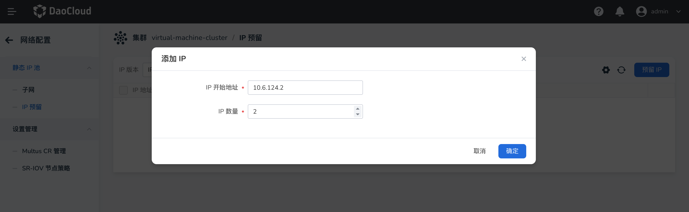

# IP Reservation

The DCE container network (Spiderpool) reserves some IP addresses for the entire Kubernetes cluster
through the ReservedIP CR. These IP addresses will not be allocated by IPAM.

## Feature Introduction

When it is clear that an IP address is already used outside the cluster, finding that IP address in
existing IPPool instances and removing it can be time-consuming and laborious in order to avoid IP
conflicts. In addition, network administrators want to ensure that the IP address is never allocated
from any existing or future IPPool resource. Therefore, you can set the IP addresses that should not
be used by the cluster in the ReservedIP CR. After that, even if the IPPool object contains those IP
addresses, the IPAM plugin will not allocate them to Pods.

The IP addresses in ReservedIP can be:

- IP addresses that are clearly used by hosts outside the cluster
- IP addresses that clearly cannot be used for network communication, such as the subnet IP and
  the broadcast IP

## Implementation Requirements

1. A Kubernetes cluster.

2. [Helm](https://helm.sh/docs/intro/install/) is installed.

## Install Spiderpool

Follow the prompts to [install Spiderpool](../modules/spiderpool/install/install.md).

## Install the CNI Configuration

To simplify writing Multus CNI configurations in JSON format, Spiderpool provides the
SpiderMultusConfig CR to automatically manage Multus NetworkAttachmentDefinition CRs.
The following is an example of creating a Macvlan SpiderMultusConfig configuration:

- master: In this example, the interface `ens192` is used as the value of master.

```bash
MACVLAN_MASTER_INTERFACE="ens192"
MACVLAN_MULTUS_NAME="macvlan-$MACVLAN_MASTER_INTERFACE"

cat <<EOF | kubectl apply -f -
apiVersion: spiderpool.spidernet.io/v2beta1
kind: SpiderMultusConfig
metadata:
  name: ${MACVLAN_MULTUS_NAME}
  namespace: kube-system
spec:
  cniType: macvlan
  enableCoordinator: true
  macvlan:
    master:
    - ${MACVLAN_MASTER_INTERFACE}
EOF
```

In the examples of this page, the configuration above is used to create the following Macvlan
SpiderMultusConfig, and the Multus NetworkAttachmentDefinition CR is automatically generated based on it.

```bash
~# kubectl get spidermultusconfigs.spiderpool.spidernet.io -n kube-system
NAME             AGE
macvlan-ens192   26m

~# kubectl get network-attachment-definitions.k8s.cni.cncf.io -n kube-system
NAME             AGE
macvlan-ens192   27m
```

## Create Reserved IPs

You can create reserved IPs through the graphical UI or through the command line.

### Create Through the UI

In DCE, enter the kpanda-global-cluster cluster,

1. In the left navigation bar, click **Container Network** -> **Network Configuration**
2. Click **Static IP Pool** -> **IP Reservation** - **Reserve IP**
3. In the dialog box, enter one or more IPs to be reserved and click **OK**



### Create Through the Command-Line YAML

Use the following YAML, set `spec.ips` to `10.6.168.131-10.6.168.132`, and create the ReservedIP.

```bash
cat <<EOF | kubectl apply -f -
apiVersion: spiderpool.spidernet.io/v2beta1
kind: SpiderReservedIP
metadata:
  name: test-reservedip
spec:
  ips:
  - 10.6.168.131-10.6.168.132
EOF
```

## Create an IPPool

Create an IPPool whose `spec.ips` is `10.6.168.131-10.6.168.133`, a total of 3 IP addresses.
Comparing it with the ReservedIP above shows that only 1 IP in this IP pool is available.

```bash
cat <<EOF | kubectl apply -f -
apiVersion: spiderpool.spidernet.io/v2beta1
kind: SpiderIPPool
metadata:
  name: test-ippool
spec:
  subnet: 10.6.0.0/16
  ips:
  - 10.6.168.131-10.6.168.133
EOF
```

Use the following YAML to create a Deployment with 2 replicas and allocate IP addresses from the
IPPool above.

```shell
cat <<EOF | kubectl create -f -
apiVersion: apps/v1
kind: Deployment
metadata:
  name: test-app
spec:
  replicas: 2
  selector:
    matchLabels:
      app: test-app
  template:
    metadata:
      annotations:
        ipam.spidernet.io/ippool: |-
            {
              "ipv4": ["test-ippool"]
            }
        v1.multus-cni.io/default-network: kube-system/macvlan-ens192
      labels:
        app: test-app
    spec:
      containers:
      - name: test-app
        image: nginx
        imagePullPolicy: IfNotPresent
        ports:
        - name: http
          containerPort: 80
          protocol: TCP
EOF
```

- `ipam.spidernet.io/ippool`: Used to specify the IP pool from which IP addresses are allocated
  to the application.

Because two IPs in the IP pool are reserved by the ReservedIP CR, only one IP in the IP pool is
available. Only one Pod of the application can run successfully; the other Pod fails to be created
because "all IPs have been used up".

```bash
~# kubectl get po -owide
NAME                       READY   STATUS              RESTARTS   AGE   IP             NODE    NOMINATED NODE   READINESS GATES
test-app-67dd9f645-dv8xz   1/1     Running             0          17s   10.6.168.133   node2   <none>           <none>
test-app-67dd9f645-lpjgs   0/1     ContainerCreating   0          17s   <none>         node1   <none>           <none>
```

If the IP address to be reserved has already been allocated to an application Pod, adding that IP
address to the ReservedIP CR prevents the replica from running after it is restarted.
Run the following command to add the IP address allocated to the Pod to the ReservedIP CR, and then
restart the Pod. The Pod fails to start because "all IPs have been used up", which is as expected.

```bash
~# kubectl patch spiderreservedip test-reservedip --patch '{"spec":{"ips":["10.6.168.131-10.6.168.133"]}}' --type=merge

~# kubectl delete po test-app-67dd9f645-dv8xz
pod "test-app-67dd9f645-dv8xz" deleted

~# kubectl get po -owide
NAME                       READY   STATUS              RESTARTS   AGE     IP       NODE    NOMINATED NODE   READINESS GATES
test-app-67dd9f645-fvx4m   0/1     ContainerCreating   0          9s      <none>   node2   <none>           <none>
test-app-67dd9f645-lpjgs   0/1     ContainerCreating   0          2m18s   <none>   node1   <none>           <none>
```

After the reserved IPs are removed, the Pods can obtain IP addresses and run.

```bash
~# kubectl delete sr test-reservedip
spiderreservedip.spiderpool.spidernet.io "test-reservedip" deleted

~# kubectl get po -owide
NAME                       READY   STATUS    RESTARTS   AGE     IP             NODE    NOMINATED NODE   READINESS GATES
test-app-67dd9f645-fvx4m   1/1     Running   0          4m23s   10.6.168.133   node2   <none>           <none>
test-app-67dd9f645-lpjgs   1/1     Running   0          6m14s   10.6.168.131   node1   <none>           <none>
```

## Summary

The SpiderReservedIP feature helps infrastructure administrators plan networks more easily.
