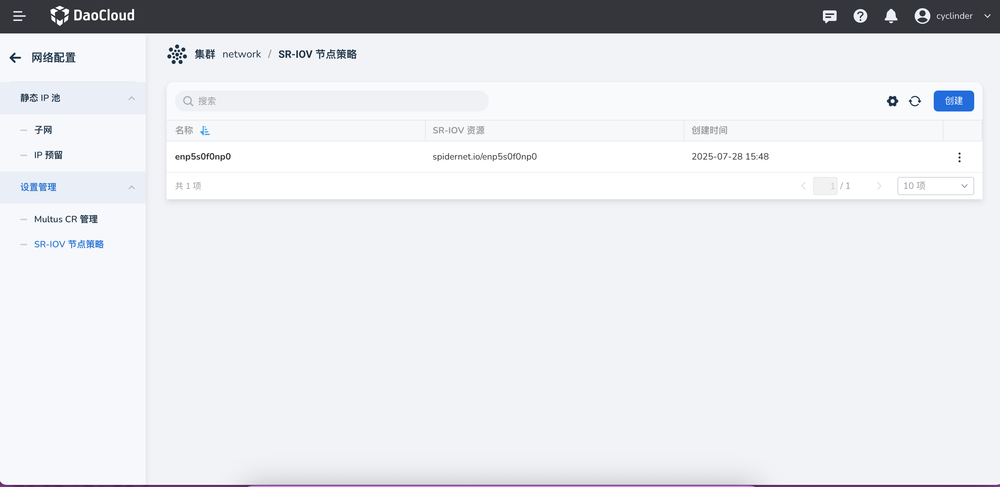
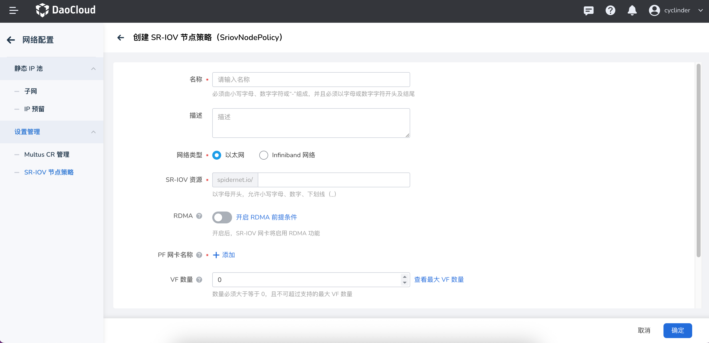

# Create an SR-IOV Node Policy

An SR-IOV node policy (SriovNetworkNodePolicy) is the core component of SR-IOV network configuration.
It defines how to configure and use SR-IOV VF devices on specific nodes. By creating an SR-IOV node policy,
you can specify which network interface cards (NICs) should have SR-IOV enabled and how to configure
virtual functions (VFs). This page describes how to create and configure an SR-IOV node policy.

## Prerequisites

- [Spiderpool has been deployed](../modules/spiderpool/install.md) and SR-IOV installation is enabled.
- The cluster nodes support the SR-IOV hardware feature
- You have cluster administrator permissions

## UI Operations

1. After signing in to the DCE UI, click __Container Management__ -> __Cluster List__ in the left navigation
   bar and find the corresponding cluster. Then click __Container Network__ -> __Network Configuration__
   in the left navigation bar.

    

2. Go to __Network Configuration__ -> __SR-IOV Node Policy Management__, and click to create an
   __SR-IOV Node Policy__.

    

    !!! note

        When creating an SR-IOV node policy, make sure that the target node supports SR-IOV hardware
        and that the related physical NIC is available.

### Basic Configuration Parameters

Enter the following basic parameters:



| Parameter | Description | Required |
| ---- | ---- | ---- |
| **Name** | The name of the SR-IOV node policy, used to identify this policy instance | Yes |
| **Description** | The description of the policy, for easier management and identification | No |
| **Network Type** | Specifies the network type to which this policy applies. Currently, `Ethernet` and `InfiniBand Network` can be selected in the UI | Yes |
| **SR-IOV Resource** | Specifies the SR-IOV resource name of this policy, which is referenced when creating a Multus CR | Yes |
| **RDMA** | Whether to enable RDMA. If enabled, Spiderpool grants the RDMA capability of the SR-IOV NIC to workloads. The NIC must support RDMA | No |
| **PF NIC Name** | Specifies the PF NIC name to which this policy applies | Yes |
| **VF Count** | The number of virtual functions (VFs) created by each physical function (PF) | Yes |
| **Node Selector** | Specifies the nodes to which this policy applies through a LabelSelector | Yes |

## Best Practices

- Node selector configuration

    - Use specific node labels to precisely control the scope where the policy applies
    - Avoid applying the policy to nodes that do not support SR-IOV
    - Consider using node affinity to optimize resource allocation

- VF count planning

    - Set the VF count properly based on actual requirements to avoid resource waste
    - Consider the hardware limits of the physical NIC
    - Reserve sufficient resources for the system

## Troubleshooting

### Common Issues

1. **The policy does not take effect**

    - Check whether the node selector correctly matches the target node
    - Verify that the NIC selector configuration is accurate
    - Confirm that the physical NIC supports SR-IOV

2. **VF creation fails**

    - Check whether the VF count exceeds the hardware limit
    - Verify that the NIC driver supports SR-IOV
    - Confirm the system kernel version compatibility

3. **Resources are unavailable**

    - Check whether the SR-IOV Network Device Plugin is running properly
    - Verify that the resource name is configured correctly
    - Confirm the node resource status

### View the Policy Status

Use the following commands to view the SR-IOV node policy status:

```bash
# View all SR-IOV node policies
kubectl get sriovnetworknodepolicies -n spiderpool

# View the details of a specific policy
kubectl describe sriovnetworknodepolicy <policy-name> -n spiderpool

# View the SR-IOV status of nodes
kubectl get sriovnetworknodestates -n spiderpool
```

### View Available Resources

```bash
# View the SR-IOV resources available on nodes
kubectl get nodes -o json | jq '.items[] | {name: .metadata.name, allocatable: .status.allocatable} | select(.allocatable | keys[] | contains("sriov"))'
```

After creation, you can use the configured SR-IOV resource in [Manage Multus CR](multus-cr.md)
to create a network attachment definition, thereby providing high-performance network connections
for workloads.
