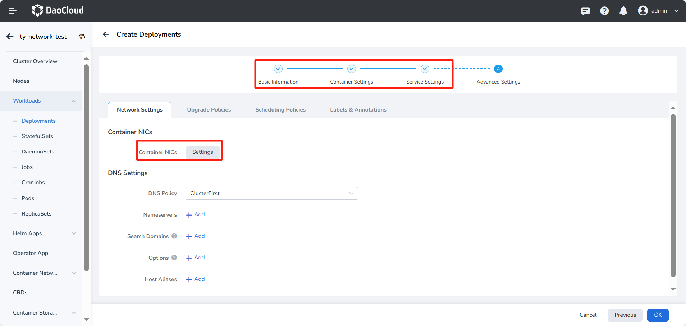

# Using RDMA in Deployments

This chapter mainly introduces how to configure and use RDMA resources in deployments.
DCE 5.0 provides three methods for RDMA passthrough. See [RDMA Usage Comparison](rdmatype.md) for details.

!!! note

    This chapter is based on the example of using RoCE NICs with SR-IOV. To facilitate
    RDMA testing, the configured image should be `docker.io/mellanox/rping-test`, and the `sh`
    command should be run to prevent the pod from exiting abnormally during the operation. Please
    refer to the following content for details.

## Prerequisites

- [Spiderpool has been successfully deployed](../modules/spiderpool/install/install.md)
- [RDMA installation and preparation have been completed](../modules/spiderpool/install/rdmapara.md)
- [Multus CR has been created](multus-cr.md)
- [IPPool has been created](./ippool/createpool.md)

## UI Operations

1. Log in to the platform UI, click __Container Management__ -> __Clusters__ in the left navigation bar, find the proper cluster. Then, select __Deployments__ in the left navigation bar and click __Create By Image__ .

    

1. On the __Create Deployments__ page, use the image `docker.io/mellanox/rping-test`. Set `Replica` to `2` to deploy a group of cross-node Pods.

1. Fill in the __Basic Information__ and enter the following information in the __Container Settings__ .

    

    - Network Resource Parameters:
      
        - When using RDMA based on Macvlan/VLAN CNI, the resource name is the custom name created in
          [RDMA Installation and Preparation](install/rdmapara.md) when creating Spiderpool. For more information,
          please refer to [Exposing RoCE NIC based on Macvlan/IPVLAN](rdmapara.md#exposing-roce-network-card-based-on-macvlan-ipvlan).

        - When using RDMA based on SRIOV CNI, the resource name is the `resourceName` defined in
          `SriovNetworkNodePolicy`. For more information, please refer to [Using RoCE NIC based on SR-IOV](../modules/spiderpool/install/rdmapara.md#using-roce-network-card-based-on-sr-iov).

        The `spidernet.io/mellnoxrdma` in the example is an example of __using RoCE NICs based on SR-IOV__ .
        The request and limit values are currently consistent, and the input value should not exceed the maximum available value.
        
    - Run Command: To prevent the pod from starting and exiting abnormally, add the following run command:
    
        ```para
        - sh
        - -c
        - |
          ls -l /dev/infiniband /sys/class/net
          sleep 1000000
        ```

1. After completing the information input on the __Container Settings__ -> __Service Settings__
   pages, proceed to __Advanced Settings__ and click to configure the __Container NICs__ .

    

1. Select the [created Multus CR](multus-cr.md), turn off the fixed IPPool creation function, select
   the [created IPPool](ippool/createpool.md), and click __OK__ to complete the creation.

    
