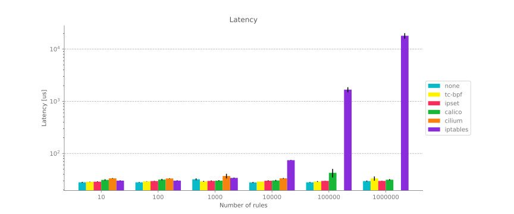

# Network policies

## Policy object

- Pod

    calico supports control of Egress/Ingress traffic for Pods via `GlobalNetworkPolicy` and `NetworkPolicy`.

    Pods in a particular Namespace can only communicate with Pods under that Namespace. If the namespace has Label: ``environment == "development`'', Pods under that namespace can only communicate with Pods under the same namespace.

    ```yaml
    apiVersion: projectcalico.org/v3
    kind: GlobalNetworkPolicy
    metadata:
      name: restrict-development-access
    spec:
      namespaceSelector: 'environment == "development"'
      ingress:
        - action: Allow
          source:
            namespaceSelector: 'environment == "development"'
      egress:
        - action: Allow
          destination:
            namespaceSelector: 'environment == "development"'
    ```

- Service

    Calico supports control of Kubernetes Service: ``yaml

    ```yaml
    apiVersion: projectcalico.org/v3
    kind: NetworkPolicy
    metadata:
      name: allow-api-access
      namespace: my-app
    spec:
      selector: all()
      egress:
        - action: Allow
          destination:
            services:
              name: kubernetes
              namespace: default
    ```

    The Policy herein refers to allowing all Pods to access the Kubernetes service.

- host

    Calico supports control of Kubernetes nodes via `GlobalNetworkPolicy`.

- VMs

- `ServiceAccount

    Calico supports `ServiceAccount` to flexibly control how policies are applied on Pods: 1.

    1. Use `ServiceAccounts` to restrict the ingress traffic to a Pod.

        When accessing a Pod with Label: `app == "db"` under namespace: prod-engineering, if the name of the `serviceAccounts` used by the visitor Pod is `api-service` or `user-auth-service`, the request passes.

        ```yaml
        apiVersion: projectcalico.org/v3
        kind: NetworkPolicy
        metadata:
          name: demo-calico
          namespace: prod-engineering
        spec:
          ingress:
            - action: Allow
              source:
                serviceAccounts:
                  names:
                    - api-service
                    - user-auth-service
          selector: 'app == "db"'
        ```

    2. Use the Label of `ServiceAccount` to restrict the ingress traffic of the workload.

        When the Label of `ServiceAccounts` bound to the visitor Pod meets `app == "web-frontend"`, access to Pods under the `prod-engineering` namespace that meet Label: 'app == "db"' is allowed.

        ```yaml
        apiVersion: projectcalico.org/v3
        kind: NetworkPolicy
        metadata:
          name: allow-web-frontend
          namespace: prod-engineering
        spec:
          ingress:
            - action: Allow
              source:
                serviceAccounts:
                  selector: 'app == "web-frontend"'
          selector: 'app == "db"'
        ```

    3. The target for filtering Policy using `serviceAccountSelector`.

        Only Pods whose ``serviceAccountSelector` matches ``role == "intern"` can access each other.

        ```yaml
        apiVersion: projectcalico.org/v3
        kind: NetworkPolicy
        metadata:
          name: restrict-intern-access
          namespace: prod-engineering
        spec:
          serviceAccountSelector: 'role == "intern"'
          ingress:
            - action: Allow
              source:
                serviceAccounts:
                  selector: 'role == "intern"'
          egress:
            - action: Allow
              destination:
                serviceAccounts:
                  selector: 'role == "intern"'
        ```

## Bidirectional control of traffic

- Egress

    Support egress traffic control for matching policy Endpoint.

- Ingress

    Support ingress control for Endpoint matching policy.

## Support multiple control behaviors

- Allow

    Allow packets to pass when they match the defined behavior.

- Deny

    When the packet does not match the defined behavior, it is prohibited to pass.

- Log

    Do not control the packet, just log it, and then continue to process the next rule.

- Pass

    The Pass action skips all remaining rules, jumps to the first Profile assigned to the Calico EndPoint, and then executes the rules defined by the Profile.
    Calico binds two Profiles for each Endpoint (`kns.<namespace>` and `ksa.<namespace>.default`).
    The Profile defines a set of labels and policies (for historical reasons, the Profile includes policy rules, which are deprecated).
    If the Endpoint is not bound to any Profile, then the policy result is equivalent to Deny.

## Policy priority

Policy priority is specified by the order field. If not specified, it is executed last by default. The smaller the value, the higher the priority. If the order value is the same, the policy is ordered by the name field of the policy.

## Cluster and tenant level control

Kubernetes uses a zero-trust model by default, meaning that all Pods and hosts in a cluster can access each other. We can define a global policy or a tenant-level policy to control the ingress and egress traffic of Pods.

- Global Policy Control

    The `GlobalNetworkPolicy` object works on all Pods in the namespace. e.g., the following example prohibits Pods with label: `app=client` from accessing Pods with label: `app=="server"`.

    ```yaml
    apiVersion: projectcalico.org/v3
    kind: GlobalNetworkPolicy
    metadata:
      name: deny-tcp-8080
    spec:
      order: 1
      selector: app == 'server'  
      types:
        - Ingress
        - Egress
      ingress:
        - action: Deny
          metadata:
          annotations:
            from: client
            to: server
          protocol: TCP
          source:
            selector: app == 'client'
          destination:
            ports:
            - 8080
      egress:
        - action: Allow
    ```

    - `selector`: filters which Pods this Policy applies to by tag
    - `types`: control the direction of traffic, `Ingress` means ingress traffic, `Egress` means egress traffic
    - `ingress`: defines the content of the ingress policy
    - `action`: policy action. Optional values are Allow, Deny, Log, Pass
    - `metadata`: additional information. Just for clarification
    - `protocol`: protocol. Options are `TCP`, `UDP`, `ICMP`, `ICMPv6`, `SCTP`, `UDPLite`.
    - `source`: filter access source by label
    - `destination`: filter access destination, here filter destination port is 8080
    - `egress`: no other requirements here, allow all by `calicoctl apply -f`, it will take effect.

- Tenant Level Control

    Calico controls Pods under specific namespaces through `NetworkPolicy` objects, unlike `GlobalNetworkPolicy`, which works on specific namespaces.
    For example.

    ```yaml
    apiVersion: projectcalico.org/v3
    kind: NetworkPolicy
    metadata:
      name: allow-tcp-8080
      namespace: production
    spec:
      selector: app == 'server'
      types:
      - Ingress
      - Egress
      ingress:
        - action: Allow
          metadata:
            annotations:
              from: frontend
              to: database
          protocol: TCP
            source:
              selector: app == 'client'
            destination:
              ports:
               - 8080
      egress:
        - action: Allow
    ```

    The difference with the `GlobalNetworkPolicy` above is that the `metadata` has an additional namespace field, which specifies the namespace that the policy acts on.

## Comparison with Kubernetes policy

- Support for policy priority

- Support for Deny rules

- More flexible matching rules

- Support controlling more policy objects whereas Kubernetes only supports controlling Pods

## Performance impact

Calico's Policy implementation relies on `IPtables`.
As the number of policies increases, the number of `iptables` on a node increases, which affects performance.
The following tests show the performance changes (including CPU overhead, throughput, latency) of different modes such as `iptables`, `ipset`, `tc-bpf`, `cilium`, `calico` when the policy is increased.

!!! note

    The following test scenario is designed to test the impact of the number of Policies on the traffic inside the cluster accessing the external CIDR egress traffic.
    Calico uses the `GlobalNetworkSet API` to pass a list of CIDR egresses it wants to deny, and then references the `GlobalNetworkSet` resource in `GlobalNetworkPolicy` via the label selector.
    In fact, this approach essentially uses `IPset`, so see the `IPtables` schema for data.

Performance test results (just an FYI):

- The throughput in `IPtables` mode increases dramatically when the number of rules is increased to 1000 or more.


- CPU usage in `IPtables` mode increases significantly when the number of rules increases to 1000 or more.


- The latency in `IPtables` mode increases significantly when the number of rules increases to 1000 or more.


