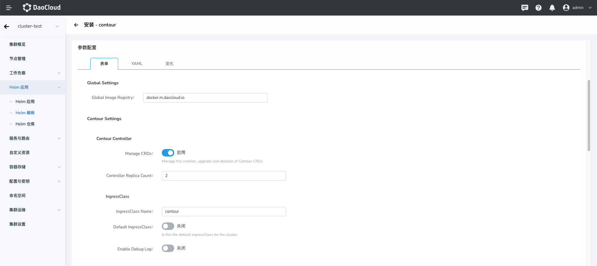

# Install

Open the cluster management interface in the browser, click "Helm Apps" in the sidebar navigation, and then click "Helm Charts", as shown below. 

Enter the keyword "contour" in the search bar and click the "Contour" application card to enter the application preview screen, as shown below.

In the upper right corner, you can select the version by using the drop-down box, and then click the "Install" button. Then you will enter the installation configuration screen, as shown below.
Enter the name of the deployed application, the namespace, and the deployment options in order.

Configuration Description

* “Global Image Registry” Set the global image registry.
* “Manage CRDs” Create Contour CRD during installation.
* “Controller Replica Count” The number of replicas of Contour controller.
* "IngressClass Name" Set Ingress Class name，If the cluster deploys multiple sets of Ingress, you can use this Class to differentiate them, and this field will be set when creating the Ingres CR.
* “Default IngressClass” Set this Ingress instance as the default Ingress.
* “Enable Debug Log” Enabled to set the control plane Debug level log output.

* “Envoy Replica Count” The number of replica of Envoy.
* “Envoy Deploy Kind” Set envoy deploy kind. Default is deployment.
* “Enable HostNetwork” Enable host network, default is disabled. 
* “Envoy Access Log Level” Set envoy log level.
* “Service Type” Set Service Type.
* “IP Family Policy” Set for IPv4/IPv6 dual-stack.

* “Match Expressions” Node affinity is conceptually similar to nodeSelector, allowing you to constrain which nodes your Pod can be scheduled on based on node labels.
* “Weight” You can specify a weight between 1 and 100 for each instance of the preferredDuringSchedulingIgnoredDuringExecution affinity type. 
* “ServiceMonitor” Create Service Monitor CR, required Prometheus Operator.
* “Prometheus Rule” Create PrometheusRule CR, required Prometheus Operator.

Click the tab YAML to perform advanced configuration through YAML. Click the "OK" button in the lower right corner to deploy it. 