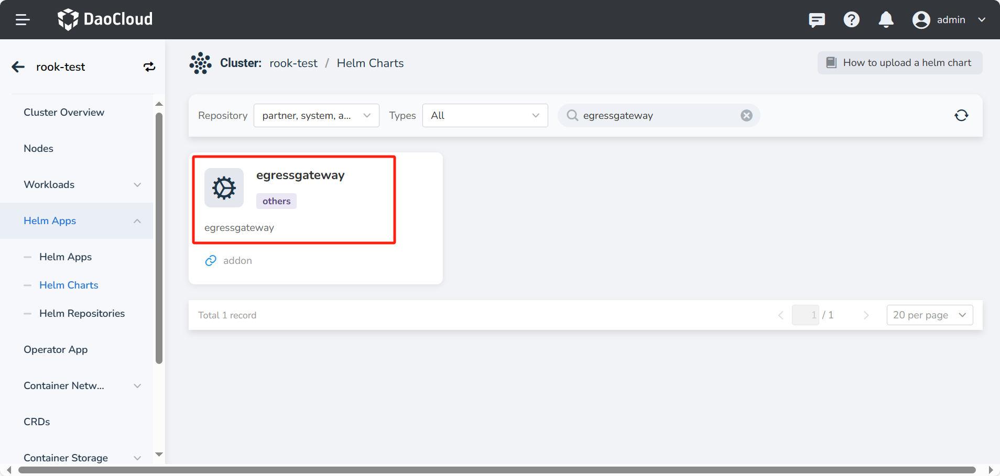
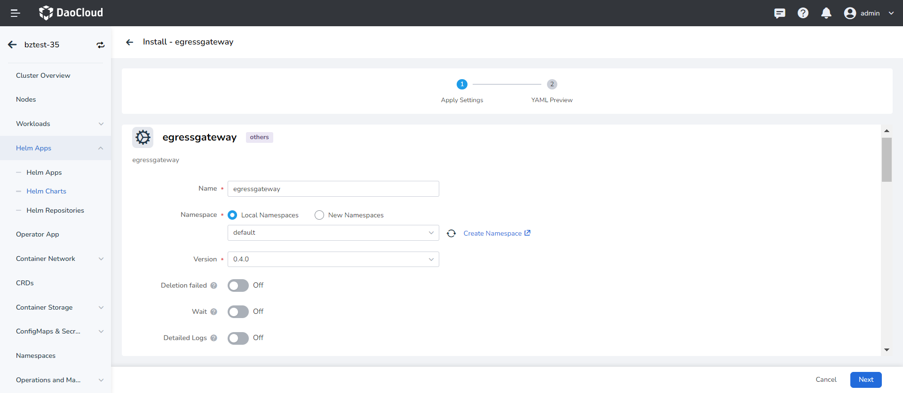
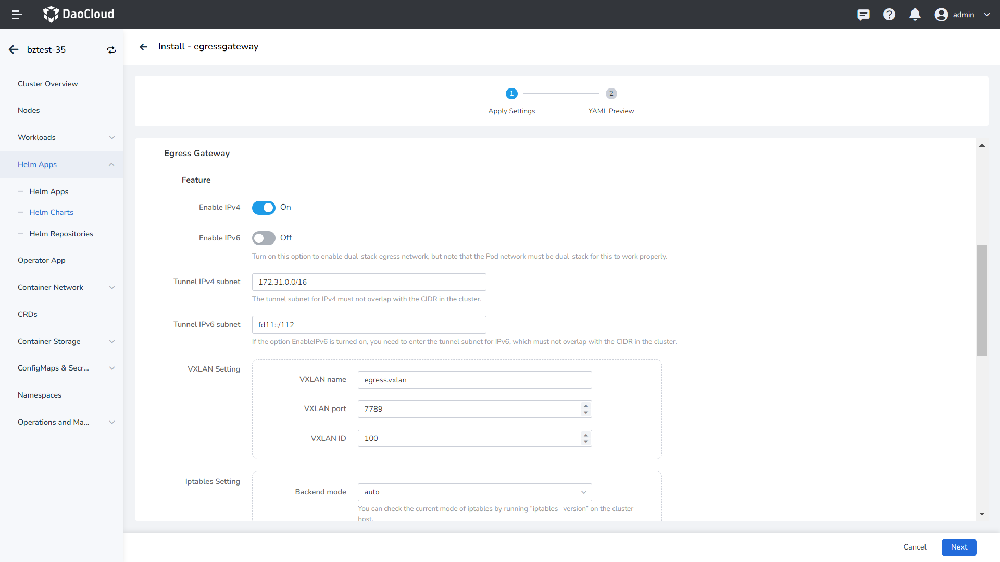
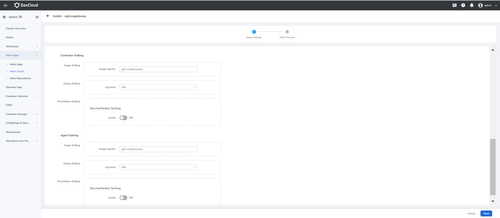

# Install EgressGateway

This chapter mainly introduces how to install the EgressGateway component.

## Prerequisites

- To use EgressGateway within a DCE 5.0 cluster, it is necessary to combine it with [Calico/Flannel/Weave/Spiderpool](../../modules/egressgateway/usage.md).

- It is recommended to install EgressGateway v0.4.0 or higher. After installation, instances of the egress gateway
  can be created and use them in conjunction with egress gateway policies.

## Steps

Confirm that your cluster has successfully connected to the __Container Management__ platform,
and then follow the steps below to install EgressGateway.

1. In the left navigation bar, click __Container Management__ -> __Clusters__ , and then locate the
   cluster where you intend to install EgressGateway.

1. In the left navigation bar, select __Helm Apps__ -> __Helm Charts__ , and find and click __egressgateway__ .

    

1. Choose the version you wish to install, then click __Install__ . In the installation UI,
   fill in the required installation parameters.

    

    

    The parameters in the above figure are described as follows:

    - __Namespace__ : The namespace for deploying the EgressGateway component defaults to __default__ . This can be changed to another namespace.
    - __Feature__ -> __Enable IPv4__ : Supports enabling IPv4, which is enabled by default.
    - __Feature__ -> __Enable IPv6__ : Supports enabling IPv6, which is disabled by default. If enabled, the pod network must be dual-stack to function properly.
    - __Feature__ -> __Tunnel IPv4 subnet__ : Sets the IPv4 subnet for the tunnel, which can use the default value. If changed, it must not overlap with the CIDR in the cluster to avoid network conflicts.
    - __Feature__ -> __Tunnel IPv6 subnet__ : Sets the IPv6 subnet for the tunnel, which can use the default value. If changed, it must not overlap with the CIDR in the cluster to avoid network conflicts.
    - __Feature__ -> __VXLAN Setting__ -> __VXLAN name__ : Sets the name for the VXLAN, which can use the default value.
    - __Feature__ -> __VXLAN Setting__ -> __VXLAN port__ : Sets the port for the VXLAN, which can use the default value.
    - __Feature__ -> __VXLAN Setting__ -> __VXLAN ID__ : Sets the VXLAN ID, which can use the default value.
    - __Feature__ -> __Iptables Setting__ -> __Backend mode__ : Sets the mode for iptables,
      with the default selection being auto mode. If changed, you can check the current mode of
      iptables by running “iptables –version” on the cluster host.

    

    The parameters in the above figure are described as follows:

    - __Controller Setting__ -> __Image Setting__ -> __Image registry__ : Set the image name, which can use the default value.
    - __Controller Setting__ -> __Debug Setting__ -> __Log level__ : Set the log level, which can use the default value, or you can select another level.
    - __Controller Setting__ -> __Prometheus Setting__ -> __ServiceMonitor Setting__ -> __Log level__ -> __Install__ : Support enabling the installation of Prometheus monitoring, which is not installed by default.
    - __Agent Setting__ -> __Image Setting__ -> __Image registry__ : Set the image name, which can use the default value.
    - __Controller Setting__ -> __Debug Setting__ -> __Log level__ : Set the log level, which can use the default value, or you can select another level.
    - __Controller Setting__ -> __Prometheus Setting__ -> __ServiceMonitor Setting__ -> __Log level__ -> __Install__ : Support enabling the installation of Prometheus monitoring, which is not installed by default.

1. After completing the parameter settings, click __OK__ to finish the installation. Once completed,
   you can refer to the creation of egress gateway instances and gateway policies for using the egress gateway.
