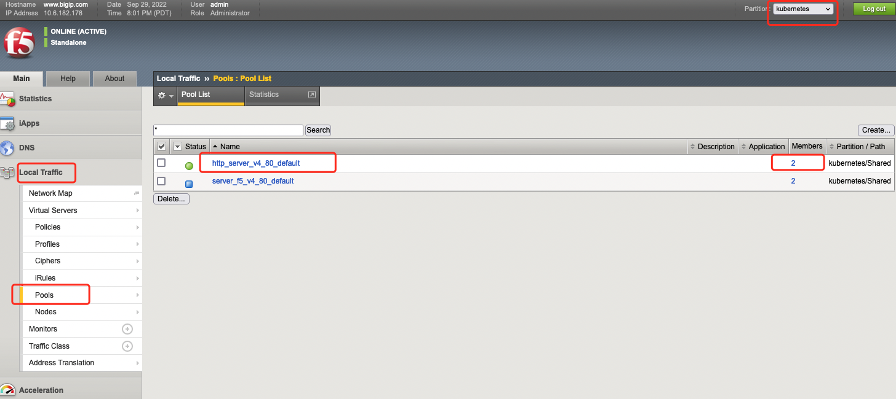
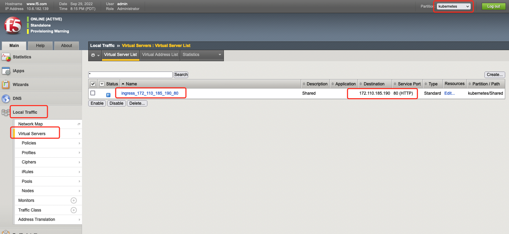

# use

This page describes how to use f5network from the perspective of layer 4 and layer 7 load balancing

## Layer 4 load balancing

When the component is installed in the 4-layer load balancing mode, F5 load balancing services can be created for the services in the cluster. For specific usage, please refer to [F5 official documents](https://clouddocs.f5.com/containers/latest/userguide/ loadbalancer/).

A simple example is given below:

1. When working with nodePort forwarding, a LoadBalancer type service must be created for the application.

    ```yaml
    apiVersion: v1
    kind: Service
    metadata:
      name: http-server
      annotations:
        cis.f5.com/ipamLabel: LabelName
        cis.f5.com/health: '{"interval": 10, "timeout": 31}'
    spec:
      type: LoadBalancer
      ports:
      - port: 80
        targetPort: 80
        name: http
      selector:
        app: http-server
    ```

    Note the annotation in YAML above:

    1. "cis.f5.com/ipamLabel" must be marked, pay attention to replace the value of this key, please set it to fill in the LabelName of "BIGIP L4 IP Pool" during installation, otherwise the forwarding rule will not be assigned to the VIP.
    2. "cis.f5.com/health" is optional.
    3. For more annotation support, please refer to [F5 Official Documentation](https://clouddocs.f5.com/containers/latest/userguide/loadbalancer/#parameters).

2. After creating the service, you can observe the assigned EXTERNAL-IP:
    
    ```shell
    $ kubectl get service -o wide
    NAME TYPE CLUSTER-IP EXTERNAL-IP PORT(S) AGE SELECTOR
    http-server LoadBalancer 172.21.25.10 172.110.185.51 80:31548/TCP 3d14h app=http-server
    ```

3. Log in to the F5 Web UI, switch to the partition you are using, and you can observe the delivered forwarding rules.

    

    

4. In the cluster, access the VIP assigned by F5 to access the service.

## Layer 7 load balancing http

When the component is installed in Layer 7 load balancing mode, F5 load balancing services can be created for the ingress in the cluster. For specific usage, please refer to [F5 official documents](https://clouddocs.f5.com/containers/latest/userguide/ ingress.html).

A simple example is given below:

1. Confirm the ingressClass of F5.

    ```shell
    $ kubectl get ingressClass
    NAME CONTROLLER PARAMETERS AGE
    f5 f5.com/cntr-ingress-svcs <none> 41h
    ```

2. When this component works in nodePort forwarding mode, a service and ingress object of nodePort type must be created for the application.

    ```yaml
    apiVersion: v1
    kind: Service
    metadata:
      name: http-server
    spec:
      type: nodePort
      ports:
      - port: 80
        targetPort: 80
        name: http
      selector:
        app: http-server
    ---
    apiVersion: networking.k8s.io/v1
    kind: Ingress
    metadata:
      name: http-server
    spec:
      ingressClassName: f5
      rules:
      - http:
          paths:
            - path: /http-server
              pathType: Prefix
              backend:
                service:
                  name: http-server
                  port:
                    number: 80
    ```

    In the above ingress yaml:

    1. IngressClassName uses F5's ingressClass.
    2. Ingress also supports more annotations, please refer to [F5 official documentation](https://clouddocs.f5.com/containers/latest/userguide/ingress.html#supported-ingress-annotations).

3. After creating the ingress, you can observe the ADDRESS assigned to the ingress object.

    ```shell
    # kubectl get ingress
    NAME CLASS HOSTS ADDRESS PORTS AGE
    http-server f5 * 172.110.185.190 80 40h
    ```

4. Log in to the F5 Web UI, switch to the partition you are using, and you can observe the delivered forwarding rules.

   

   

5. In the outbound cluster, visit F5 and assign it to the URL http://VIP/http-server to access the service.

## Layer 7 load balancing https

1. Create a set of TLS certificates.

2. Create a secret (note: the key of the secret must be tls.key and tls.crt).

    ```shell
    kubectl delete secret ingress1-ssl
    kubectl create secret generic ingress1-ssl \
        --from-file=./tls.crt --from-file=./tls.key
    ```

3. Create an ingress object.

    ```yaml
    apiVersion: networking.k8s.io/v1
    kind: Ingress
    metadata:
      name: $NAME
      annotations:
        # http redirects to https to access
        ingress.kubernetes.io/ssl-redirect: "true"
        ingress.kubernetes.io/allow-http: "false"
    spec:
      ingressClassName: ${INGRESS_CLASS}
      tls:
      -hosts:
          -test.example.com
          secretName: ingress1-ssl
      rules:
      ....
    ```