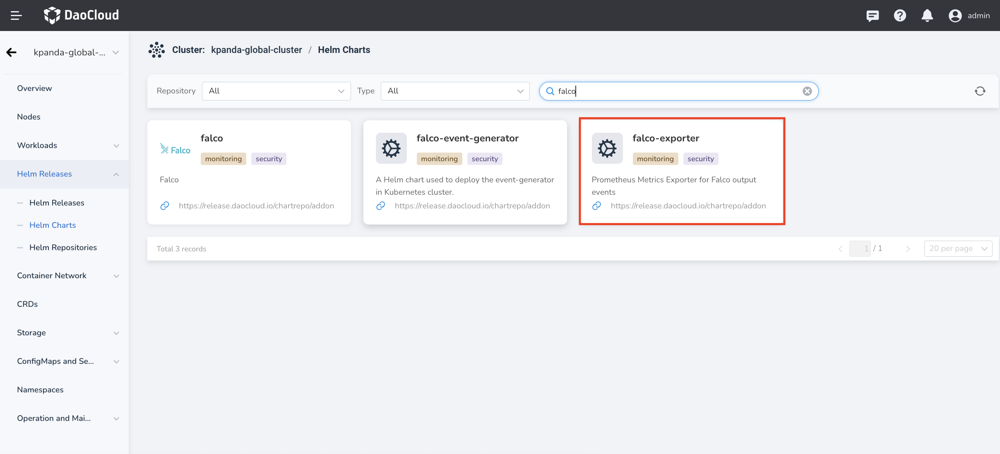
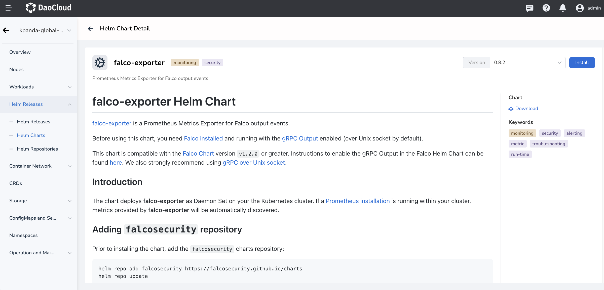
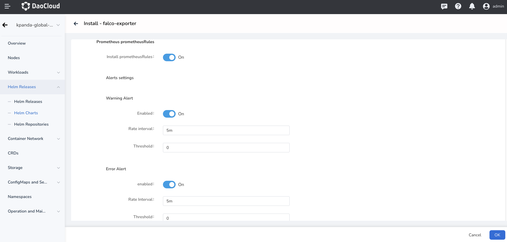

# Install Falco-exporter

This page describes how to install Falco-exporter.

!!! Note

    Before installing and using Falco-exporter, you need to [install](./falco/install.md) and run Falco with gRPC output enabled (enabled by via Unix sockets by default). For more information on enabling gRPC output in Falco Helm Chart, see [Enabling gRPC](https://github.com/falcosecurity/charts/tree/master/falco#enabling-grpc).

Please confirm that your cluster has successfully connected to the `Container Management` platform, and then perform the following steps to install Falco-exporter.

1. Click `Container Management`->`Cluster List` in the left navigation bar, then find the cluster name where you want to install Falco-exporter.

    

2. In the left navigation bar, select `Helm Applications` -> `Helm Templates`, and then find and click `falco-exporter`.

    

3. Select the version you want to install in `version selection` and click `install`.
    
    

4. On the installation screen, fill in the required installation parameters.

    

    In the screen as above, fill in `application name`, `namespace`, `version`, etc.

    

    In the screen as above, fill in the following parameters:

    - `Falco Prometheus Exporter` -> `Image Settings` -> `Registry`: set the repository address of the falco-exporter image, which is already filled with the available online repositories by default. If it is a private environment, you can change it to a private repository address.

    - `Falco Prometheus Exporter` -> `Prometheus ServiceMonitor Settings` -> `Repository`: set the falco-exporter image name.

    - `Falco Prometheus Exporter` -> `Prometheus ServiceMonitor Settings` -> `Install ServiceMonitor`: install Prometheus Operator service monitor. It is enabled by default.

    - `Falco Prometheus Exporter` -> `Prometheus ServiceMonitor Settings` -> `Scrape Interval`: user-defined interval; if not specified, the Prometheus default interval is used.

    - `Falco Prometheus Exporter` -> `Prometheus ServiceMonitor Settings` -> `Scrape Timeout`: user-defined scrape timeout; if not specified, the Prometheus default scrape timeout is used.

    

    

    In the screen as above, fill in the following parameters:

    - `Falco Prometheus Exporter` -> `Prometheus prometheusRules` -> `Install prometheusRules`: create PrometheusRules to alert on priority events. It is enabled by default.

    - `Falco Prometheus Exporter` -> `Prometheus prometheusRules` -> `Alerts settings`: set whether alerts are enabled for different levels of log events, the interval between alerts, and the threshold for alerts.

5. Click the `OK` button at the bottom right corner to complete the installation.
