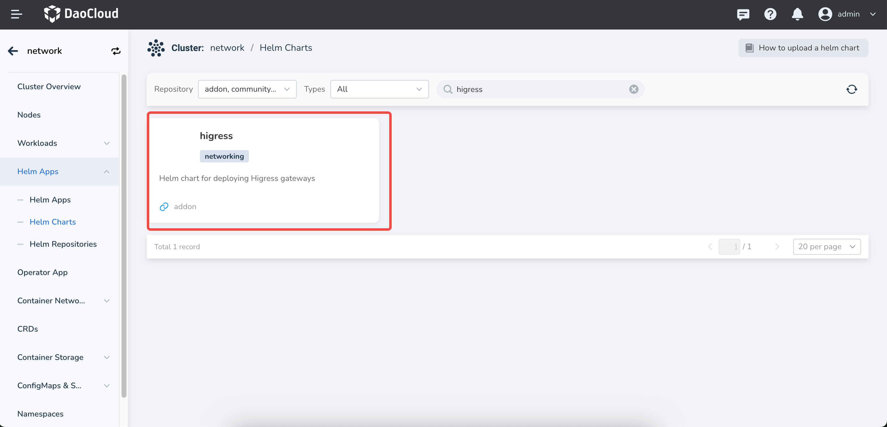
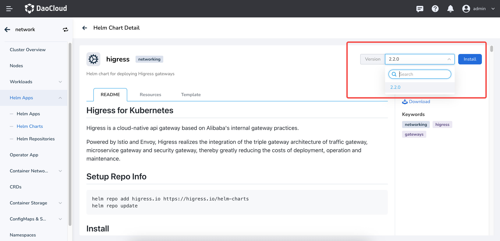
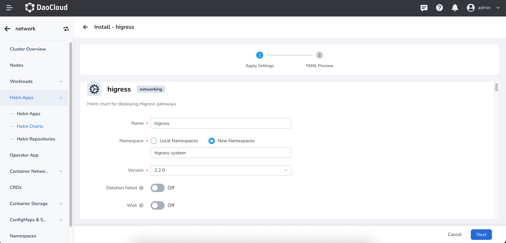
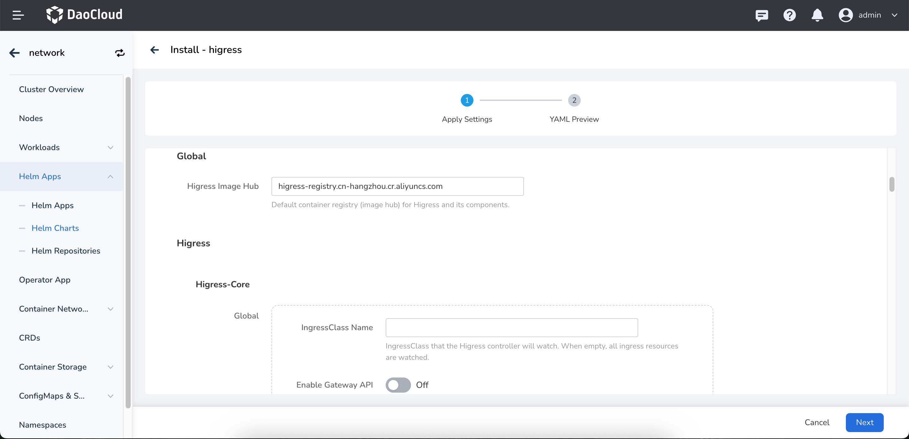
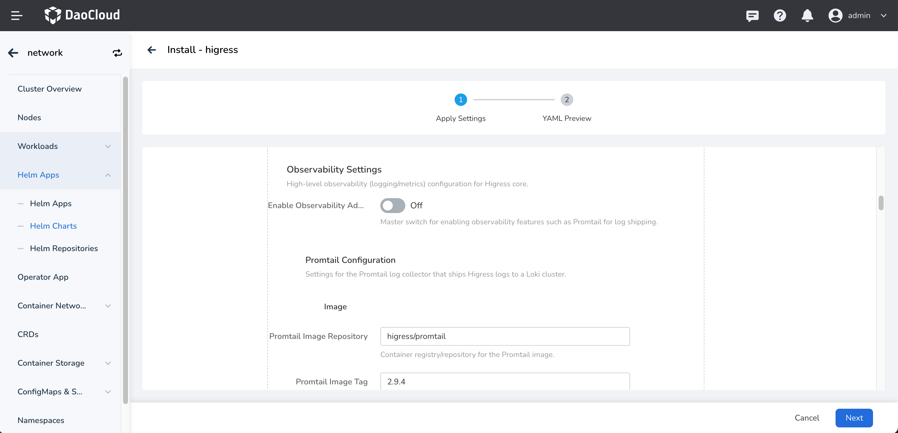
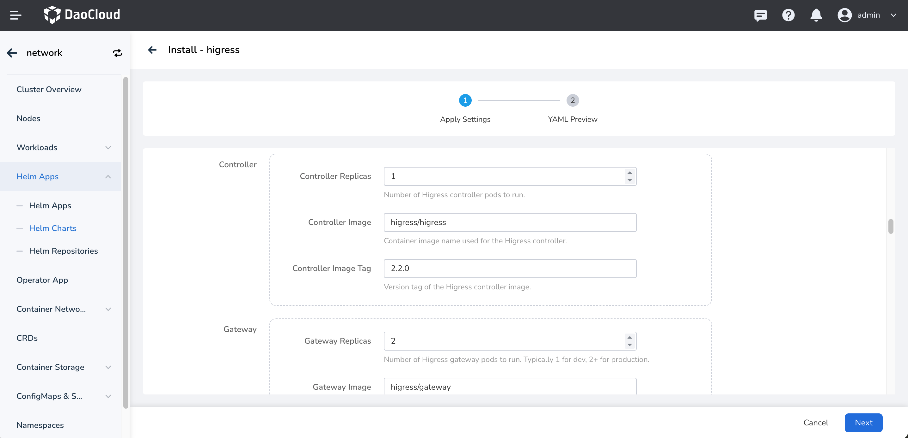
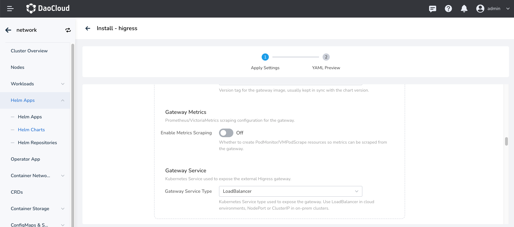
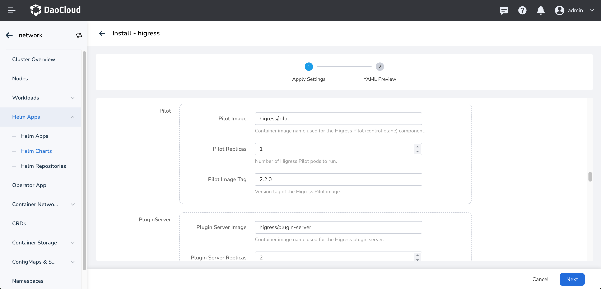
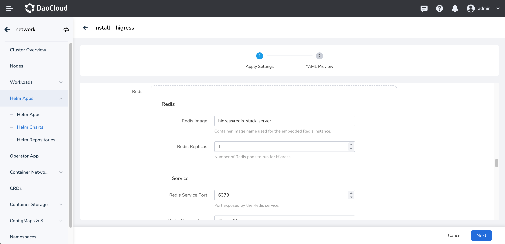
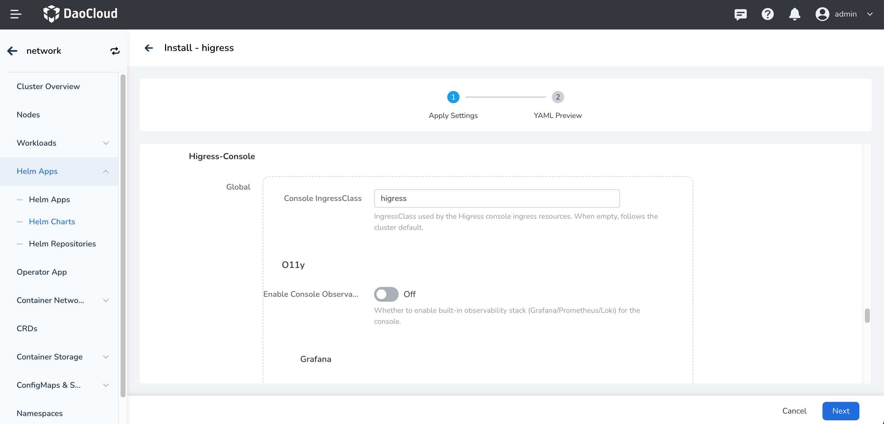

# Install Higress

This page describes how to install the Higress component.

Make sure your cluster has been successfully connected to the `Container Management` platform,
then perform the following steps to install Higress.

1. In the left navigation bar, click `Container Management` -> `Cluster List`, and then find the name
   of the cluster where you want to install Higress.

    

2. In the left navigation bar, select `Helm Apps` -> `Helm Templates`, find and click `higress`.

    

3. In `Version Selection`, select the version you want to install and click `Install`.

    

4. On the installation page, fill in the required installation parameters.

    

    On the page above, enter the application name, namespace, and deployment options.

    

    The parameters in the figure above are described as follows:

    - `global` -> `Higress Image Hub`: Configure the Higress global image repository address.
      The default value is `higress-registry.cn-hangzhou.cr.aliyuncs.com`.
    - `higress` -> `higress-core` -> `global.IngressClass Name`: Configure the Ingress Class name that
      Higress listens to. The default value is empty, which means Higress listens to and takes over all
      Ingress Classes in the cluster (for example, the nginx ingress class).
    - `higress` -> `higress-core` -> `global.Enable Gateway API`: Enable Gateway API support. If this
      option is enabled, Higress listens to and takes over the Gateway API resources in the cluster.
      The default value is false. Note: If [Gateway API](https://kubernetes.io/docs/concepts/services-networking/gateway/)
      is not installed in the cluster, do not enable this option; otherwise Higress cannot run properly.

    

    The parameters above are described as follows:

    - `higress` -> `higress-core` -> `global.Observability Settings`: Enable the observability settings
      of Higress. The default value is false.
    - `higress` -> `higress-core` -> `global.Promtail Configuration`: Used to configure the image settings
      of the Promtail log collector, which collects Higress logs.

    

    The parameters in the figure above are described as follows:

    - `Higress` -> `Higress Core` -> `Controller`: Set the number of replicas, image configuration, and
      tag of the Controller. These configurations generally do not need to be changed.
    - `Higress` -> `Higress Core` -> `Gateway`: Set the number of replicas, image configuration, and tag
      of the Gateway. These configurations generally do not need to be changed.

    

    The parameters in the figure above are described as follows:

    - `Higress` -> `Higress Core` -> `Gateway.Gateway Metrics`: Whether to enable the metrics collection
      configuration of the Gateway.
    - `Higress` -> `Higress Core` -> `Gateway.Gateway Service`: Set the service type of the Gateway.
      The default value is LoadBalancer, which means the Gateway is expected to be exposed through an LB.

    

    The parameters in the figure above are described as follows:

    - `Higress` -> `Higress Core` -> `pilot`: Configure the parameters of Istio Pilot, including the
      number of replicas and image configuration.
    - `Higress` -> `Higress Core` -> `pluginServer`: Configure the parameters of the plugin server,
      including the number of replicas and image configuration.

    

    The parameters in the figure above are described as follows:

    - `Higress` -> `Higress Core` -> `Redis`: Configure the parameters of Redis, including the number of
      replicas, image configuration, and service configuration. The defaults generally do not need to be changed.

    

    The parameters in the figure above are described as follows:

    These parameters are mainly about the configuration of Higress-console. Higress-console is the
    management console of Higress. You can manage Higress configurations in the web UI and view Higress
    metrics. Reference: [Higress Console](https://higress.ai/blog/console-dev)

    - `Higress` -> `Higress-Console`: Includes enabling the monitoring configuration, image configuration,
      and number of replicas. These generally do not need to be changed; the defaults are fine.

5. For more advanced configuration, click the `YAML` tab to configure through YAML.
   Click the `OK` button in the lower right corner to complete the creation.
