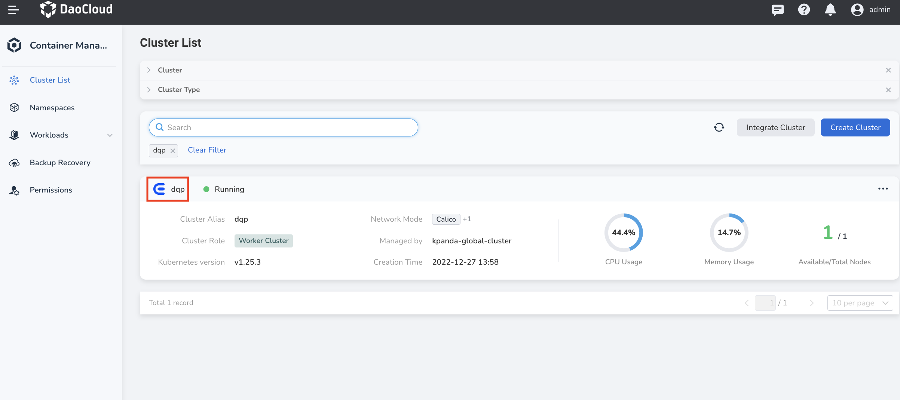
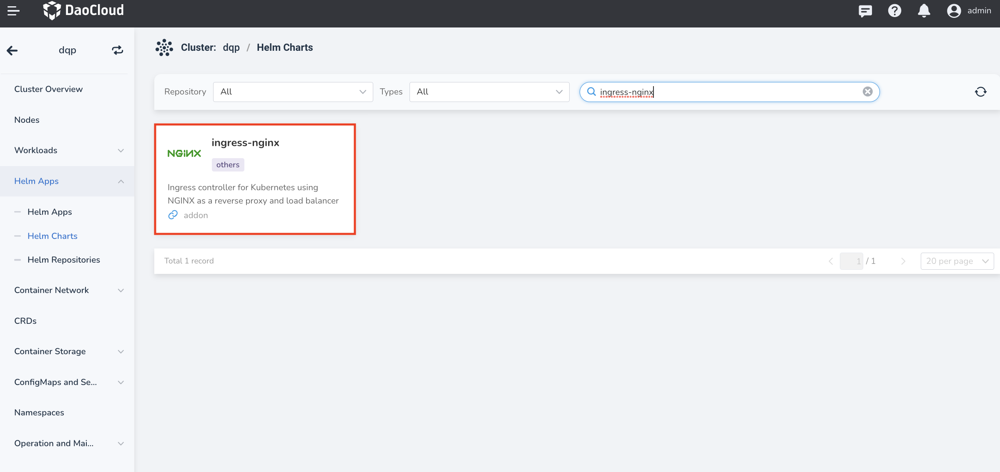
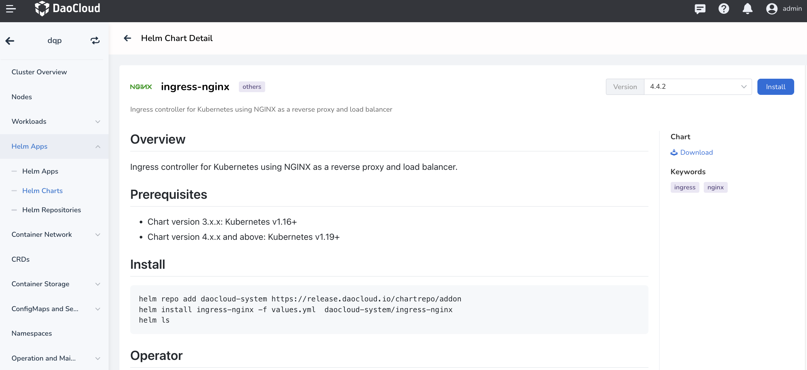
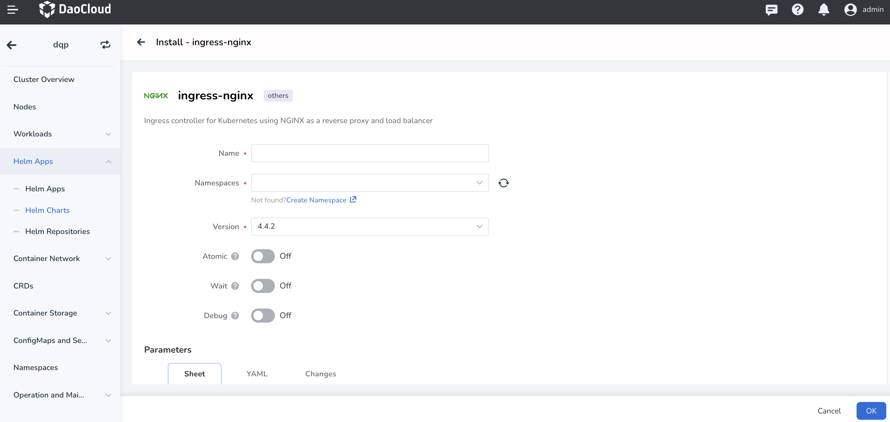
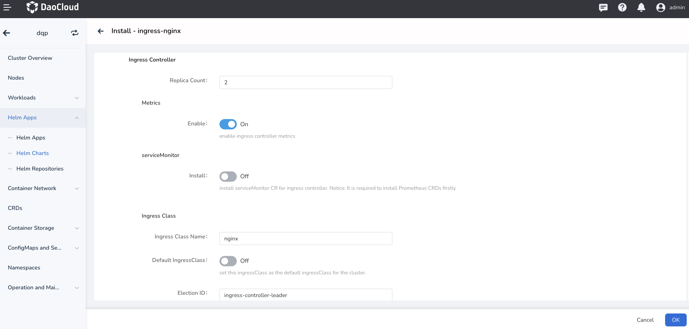
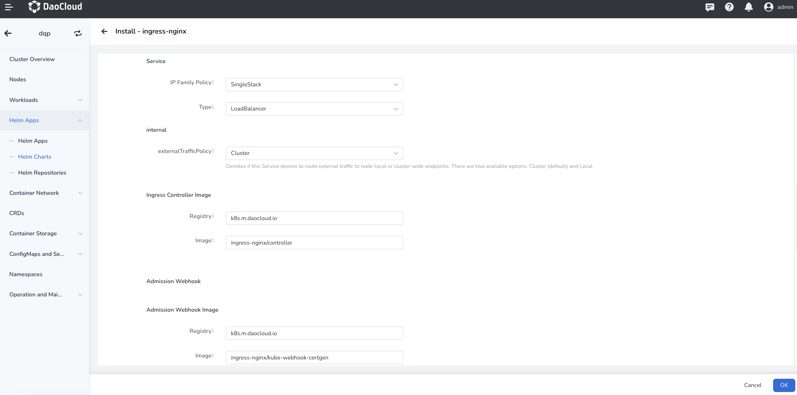
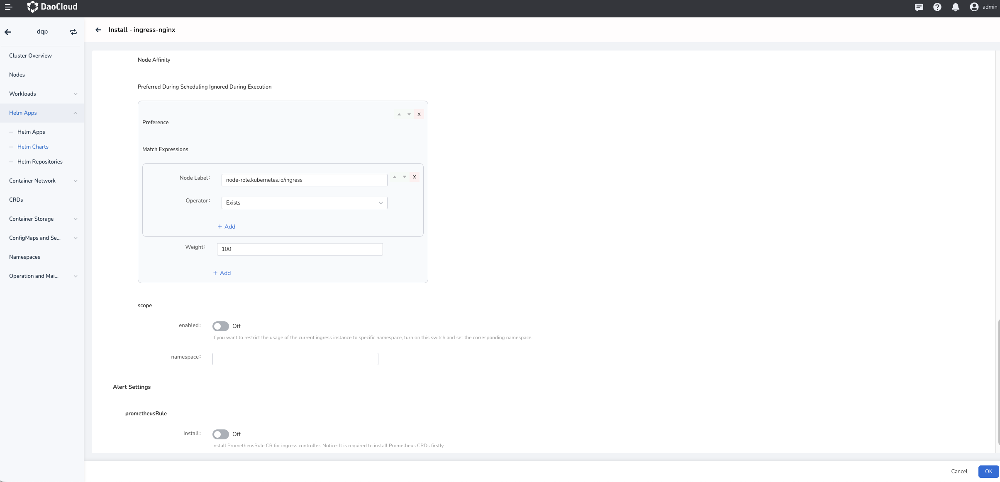

# Install ingress-nginx

This page describes how to install ingress-nginx.

Please confirm that your cluster has successfully connected to the `Container Management` platform, and then perform the following steps to install ingress-nginx.

1. Click `Container Management`->`Clusters` in the left navigation bar, and then find the cluster name where you want to install ingress-nginx.

    

2. In the left navigation bar, select `Helm Apps` -> `Helm Charts`, and find and click `ingress-nginx`.

    

3. Select the version you want to install and click `Install`.

    

4. In the installation page, fill in the required parameters.

    

    In the above screen, enter the name of the deployed application, the namespace, and the options for deployment.

    

    The parameters in the above screens are described as follows:

    - `Ingress Controller` -> `Replica Count`: configure [the number of replicas](https://kubernetes.io/docs/concepts/workloads/controllers/replicaset/). It is recommended to be 2 to improve availability. For POC experience it can be configured to 1 to reduce resource usage.
    - `Ingress Controller` -> `Metrics`: when enabled, the Controller Pod will expose the metrics interface, and the monitoring Agent can collect metrics data to improve business and service reliability through monitoring alerts.
    - `Ingress Controller` -> `ServiceMonitor`: require that the Insight component has already been deployed in the cluster, or the [Prometheus Operator](https://github.com/prometheus-operator/prometheus-operator). The corresponding ServiceMonitor CR will be created on the backend when it is enabled.
    - `Ingress Controller` -> `Ingress Class` -> `Ingress Class Name`: configure [Ingress Class](https://kubernetes.io/docs/concepts/services-networking/ingress/#ingress-class) name. Ingress CR can then specify the same Class name via the ingressClass field to use the set of Ingress instances to activate access route. When there are multiple Ingresses in a cluster, or even multiple Ingresses in the same tenant, it is convenient to distinguish between Ingresses by Ingress Class. For more details on how to use Ingress Class, please refer to: [How to use Ingress Class](ingressclass.md)
    - `Ingress Controller` -> `Ingress Class` -> `Default IngressClass`: set Ingress Class as the default class; you do not need to specify the ingressClass field when creating an Ingress CR with this option. Kubernetes automatically updates the Ingress fields to the default Class. There can only be one default Ingress Class for the same cluster.
    - `Ingress Controller` -> `Ingress Class` -> `Election ID`:when deploying multiple Ingress for the same tenant, you need to ensure that this name is not duplicated.

    

    The parameters in the above screen are described as follows:

    - `Ingress Controller` -> `Service` -> `IP Family Policy`: set IP [single and dual stack](https://kubernetes.io/docs/concepts/services-networking/dual-stack/#services) of the Service, which can be enabled according to the business requirements.
    - `Ingress Controller` -> `Service` -> `Type`: configure the Service type. If it is set to be [LoadBalancer](https://kubernetes.io/docs/concepts/services-networking/service/#loadbalancer), the corresponding LB component needs to be installed in the cluster, e.g. [MetalLB](https://metallb.universe.tf/).
    - `Ingress Controller` -> `Ingress Controller Image`: configure the container registry and name.
    - `Ingress Controller` -> `Admission Webhook Image`: customize the container registry and name for the Webhook Pod.

    

    The parameters in the above screen are described as follows:

    - `Ingress Controller` -> `Node Affinity` -> `Preferred During Scheduling Ignored During Execution`: specify scheduling rules by soft affinity.
    - `Ingress Controller` -> `scope`: when this option is enabled and Namespace is specified, the scope of the Ingress instance created is limited to the specified namespace. It is disabled by default and is a cluster-level Ingress. For more details, refer to: [Ingress Scope](scope.md).
    - `Alert Settings` -> `PrometheusRule`: configure the creation of the alert rule Prometheus CR. This option relies on the cluster deployed Prometheus Operator.

5. For more advanced configurations, you can configure your Ingress via YAML by clicking on the tab `YAML`.
Click the `OK` button in the bottom right corner to complete the creation.
