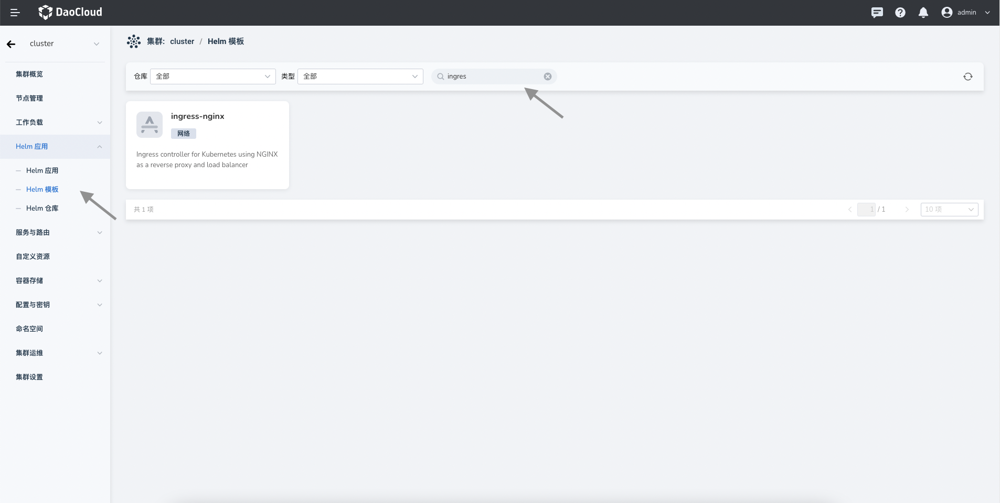
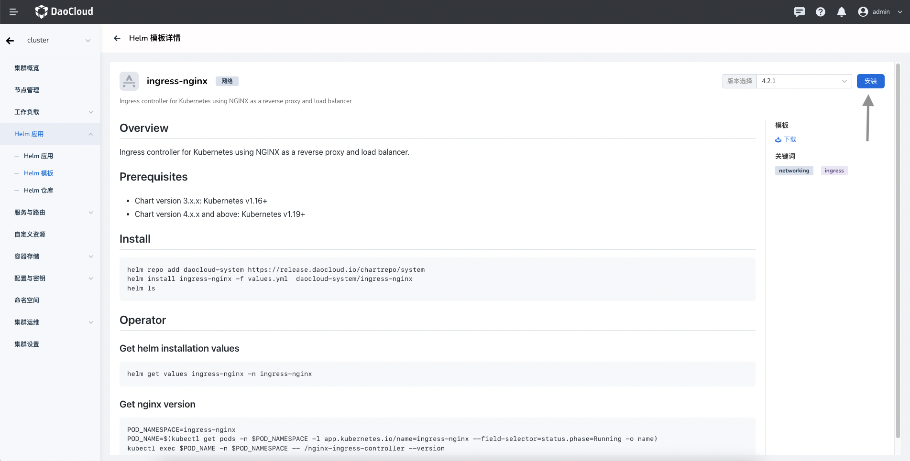
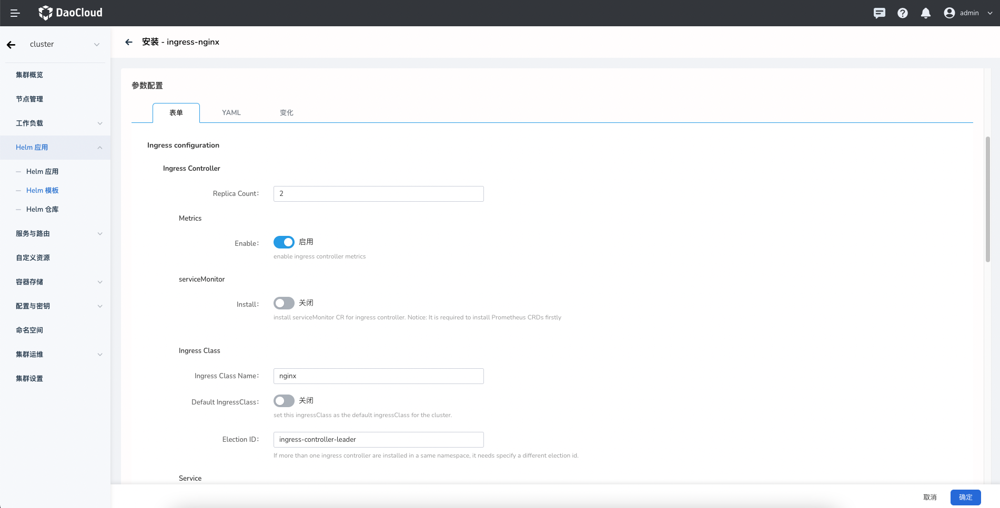
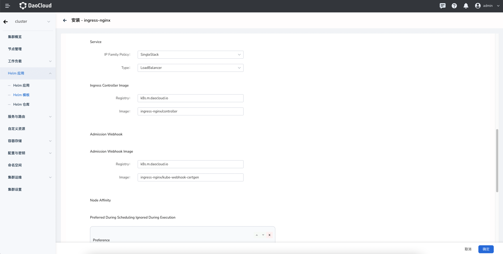

# Install

Open the cluster management interface in the browser, click "Helm Apps" in the sidebar navigation, and then click "Helm Charts", as shown below. 

Enter the keyword "ingress-nginx" in the search bar and click the "ingress-nginx" application card to enter the application preview screen, as shown below.

In the upper right corner, you can select the version by using the drop-down box, and then click the "Install" button. Then you will enter the installation configuration screen, as shown below.
Enter the name of the deployed application, the namespace, and the deployment options in order.

Configuration Description

* “Replica Count” Set [replica count](https://kubernetes.io/docs/concepts/workloads/controllers/replicaset/), the recommended configuration is 2 to improve availability. For the preview, it can be configured to 1 to reduce resource usage.
* “Metrics” When enabled, the Controller Pod exposes the metrics interface, and the monitoring agent can collect metrics data to improve service reliability.
* “ServiceMonitor” Create Service Monitor CR, required [Prometheus Operator](https://github.com/prometheus-operator/prometheus-operator).
* "Ingress Class" Set [Ingress Class](https://kubernetes.io/docs/concepts/services-networking/ingress/#ingress-class) name。The Ingress CR can specify the current Class name via the ingressClass field to select the current Ingress instance to be used to effect access routing. When there are multiple Ingress instances in a cluster, or even when a tenant has multiple Ingress instances, it is convenient to distinguish them by Ingress Class.
* “Default IngressClass” Set Default Ingress Class。Kubernetes automatically updates the Ingress fields to the default Class. A cluster can only have one default Ingress Class.
* “Election ID” When deploying multiple Ingress instance for the same namespace, you need to ensure that this name is not duplicated.

* “IP Family Policy” Set [IPv4/IPv6 dual-stack](https://kubernetes.io/docs/concepts/services-networking/dual-stack/#services) of Service。
* “Type” Set Service Type，If set to [LoadBalancer](https://kubernetes.io/docs/concepts/services-networking/service/#loadbalancer), requires LB components installed in the cluster, e.g. [MetalLB](https://metallb.universe.tf/)
* “Ingress Controller Image” Set Image registry of webhook.
* “Admission Webhook Image” Set Image Name of Webhook。

* “Preferred During Scheduling Ignored During Execution” Node affinity is conceptually similar to nodeSelector, allowing you to constrain which nodes your Pod can be scheduled on based on node labels.
* “PrometheusRule” Create Prometheus CR, required Prometheus Operator.

Click the tab YAML to perform advanced configuration through YAML. Click the "OK" button in the lower right corner to deploy it. 
