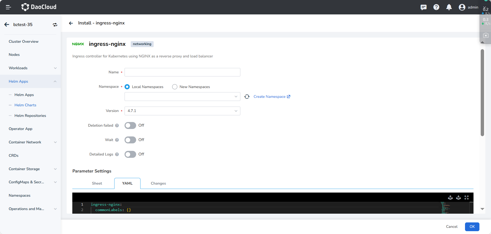

# Configure load balancing and traffic proxy

This page introduces how to configure load balancing and traffic proxy, including global load balancing as well as other different load balancing policies based on domain name, request paths, request headers, cookie, and consistent hashing.

## Load Balancing Global Configuration

The Ingress Nginx global configuration allows to specify the default load balancing algorithm, which supports both `round_robin` and `ewma`, with the default being `round_robin`.
Their main difference is how the back-end workloads are selected: the `round_robin` algorithm selects back-end workloads in a predefined order, distributing requests evenly to each workload.
If the performance of the back-end workloads varies widely, this may lead to load imbalance. This is where the `ewma` algorithm comes in to achieve load balancing. The `ewma` sends requests to the workload with the lowest weighted average load, and the weighted load index changes gradually as the requests come in.

You can refer to [Install ingress-nginx](install.md) and specify the following in the Helm installation configuration `.values.yaml`:

```yaml
ingress-nginx:
  controller:
    config:
      load-balance: ewma
```



## Domain-based traffic load

A domain name is a string that identifies a website or resource on the Internet, such as `www.example.com`. It is human readable.
While the IP address (e.g. 10.6.0.1) is machine-readable. A domain name is mapped to a corresponding IP address by a DNS server, allowing people to access a specific website through a browser.

Ingress Nginx supports forwarding traffic from different domain names. By mapping the DNS to the VIPs of Ingress Nginx
The mapping of domains to IPs is done by mapping the Domain Name System to the VIPs of Ingress Nginx.

Traffic from different domains can be forwarded to the corresponding backend service via the following configuration.
For example, traffic from domain A is forwarded to Service A, and traffic from domain B is forwarded to Service B.

```yaml
apiVersion: networking.k8s.io/v1
kind: Ingress
metadata:
  name: example-ingress
  annotations:
    nginx.ingress.kubernetes.io/rewrite-target: /
spec:
  rules:
  - host: host-a.example.com
    http:
      paths:
      - path: /
        pathType: Prefix
        backend:
          service:
            name: service-a
            port:
              name: http
  - host: host-b.example.com
    http:
      paths:
      - path: /
        pathType: Prefix
        backend:
          service:
            name: service-b
            port:
              name: http
```

## Request Path based load

The URL Request Path is the path specified in the URL to a specific page or resource from a domain name or IP address.
It is a string starting with /.
For example: `https://www.example.com/page-hello-world` where `/page-hello-world` is the URL request path.

Ingress Nginx supports different URL request paths directing to different services.

```yaml
apiVersion: networking.k8s.io/v1
kind: Ingress
metadata:
  name: example-ingress
  annotations:
    nginx.ingress.kubernetes.io/rewrite-target: /
spec:
  rules:
  - http:
      paths:
      - path: /path-a
        pathType: Prefix
        backend:
          service:
            name: service-a
            port:
              name: http
      - path: /path-b
        pathType: Prefix
        backend:
          service:
            name: service-b
            port:
              name: http
```

## Request header based load

The following is an example of using the `nginx.ingress.kubernetes.io/canary-by-header` annotation.
A version header can be added to the request to route traffic to the stable or canary version of the application.

```yaml
apiVersion: networking.k8s.io/v1
kind: Ingress
metadata:
  name: example-ingress
  annotations:
    nginx.ingress.kubernetes.io/canary: "true"
    nginx.ingress.kubernetes.io/canary-by-header: "version"
    nginx.ingress.kubernetes.io/canary-by-header-value: "v2"
spec:
  rules:
    - host: example.com
      http:
        paths:
          - path: /
            pathType: Prefix
            backend:
              service:
                name: example-service-v2
                port:
                  name: http
```

In this example, traffic to `example.com` will be split based on the `version` of request header.
For traffic with the `version` of `v2`, the request will be routed to `example-service-v2`.

## Cookie-based session load

A cookie-based load balancing policy binds the client to the backend service by using cookies. This approach ensures that each client request is always handled by the same backend service, thus making the service more stable.

Cookie load balancing works as follows:

1. When a client sends its first request, Ingress Nginx will use a load balancing algorithm to select a backend service to handle the request.
2. Ingress Nginx replys with a cookie named `example-cookie-name` back to the client. This cookie contains information that identifies the backend service.
3. When the client sends another request, it takes this cookie with it, and Ingress Nginx forwards the request to the corresponding backend service based on the identification information in the cookie.

The following is an example configuration:

```yaml
apiVersion: networking.k8s.io/v1
kind: Ingress
metadata:
  name: example-ingress
  annotations:
    nginx.ingress.kubernetes.io/affinity: "cookie"
    nginx.ingress.kubernetes.io/session-cookie-name: "example-cookie-name"
    nginx.ingress.kubernetes.io/session-cookie-expires: "172800"
    nginx.ingress.kubernetes.io/session-cookie-max-age: "172800"
spec:
  rules:
    - host: example.com
      http:
        paths:
          - path: /
            pathType: Prefix
            backend:
              service:
                name: example-service
                port:
                  name: http
```

## Consistent hashing based load balancing

Using the `nginx.ingress.kubernetes.io/upstream-hash-by` annotation, you can specify the hash value for client-server mapping.
For example, client IP-based mapping can be done using `$binary_remote_addr` or `$http_x_forwarded_for`.

Sometimes Ingress Nginx in a cluster proxies traffic behind multiple load balancers, and instead of getting the real client address, it gets the IP address of its front load balancer based on `$binary_remote_addr`. In this case you can use `$http_x_forwarded_for` to get the real IP.

You can also enable load balancing based on the request URI via `$request_uri`.

The above ways are mapped to a single upstream server, you can add the annotation `nginx.ingress.kubernetes.io/upstream-hash-by-subset: "true"` to enable subsets which will group the upstream workloads, and traffic will be randomly assigned to the workloads in the subset when it arrives. You can determine the number of workloads in each subset via `nginx.ingress.kubernetes.io/upstream-hash-by-subset-size`

```yaml
apiVersion: apps/v1
kind: Deployment
metadata:
  name: nginx-deployment
  labels:
    app: nginxhello
spec:
  replicas: 10
  selector:
    matchLabels:
      app: nginxhello
  template:
    metadata:
      labels:
        app: nginxhello
    spec:
      containers:
        - name: nginxhello
          image: registry.k8s.io/e2e-test-images/echoserver:2.3
          ports:
            - containerPort: 8080
          env:
            - name: NODE_NAME
              valueFrom:
                fieldRef:
                  fieldPath: spec.nodeName
            - name: POD_NAME
              valueFrom:
                fieldRef:
                  fieldPath: metadata.name
            - name: POD_NAMESPACE
              valueFrom:
                fieldRef:
                  fieldPath: metadata.namespace
            - name: POD_IP
              valueFrom:
                fieldRef:
                  fieldPath: status.podIP
---
kind: Service
apiVersion: v1
metadata:
  name: nginxhello
  labels:
    app: nginxhello
spec:
  selector:
    app: nginxhello
  ports:
    - name: http
      port: 80
      targetPort: 8080
---
apiVersion: networking.k8s.io/v1
kind: Ingress
metadata:
  annotations:
    nginx.ingress.kubernetes.io/upstream-hash-by: "$binary_remote_addr"
  name: nginxhello-ingress
  namespace: default
spec:
  ingressClassName: nginx
  rules:
  - host: foo.bar.com
    http:
      paths:
        - path: /
          pathType: Prefix
          backend:
            service:
              name: nginxhello
              port:
                number: 80
```
