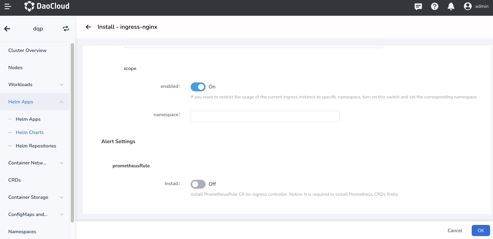
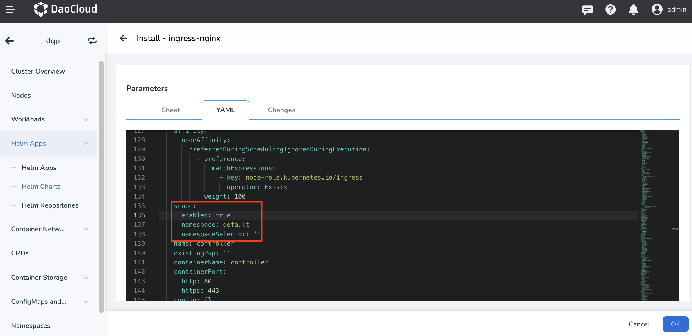

# Ingress scope

The IngressClass Scope can be used to specify whether the Ingress instance is limited to the cluster level or to the namespace level.

**Applicable scenarios**

* Cluster-level Ingress instances can be set up in the same cluster that shares the same Ingress instance
* When different namespaces in the same cluster use different Ingress instances for load isolation, you can set namespace-level Ingress instances

> If there are different applications in the same namespace in the same cluster that need to use different Ingress instances, please refer to [IngressClass](ingressclass.md).

## Cluster-level Ingress instances

When creating an Ingress instance with `Ingress Scope` enabled, the IngressClass resource is created with `cluster-level` Ingress instances in the following two cases.

1. Only `parameters` is set but `.spec.parameters.scope` is not set
2. `.spec.parameters.scope` is set to `cluster`

```yaml
# Example
apiVersion: networking.k8s.io/v1
kind: IngressClass
metadata:
  name: external-lb-1
spec:
  controller: example.com/ingress-controller
  parameters:
    scope: Cluster # Specify the scope of the Ingress instance as Cluster
    apiGroup: k8s.example.net
    kind: ClusterIngressParameter # Specify the Ingress instance Kind as ClusterIngressParameter
    name: external-config-1
```

## Namespace-level Ingress instances

When creating an Ingress instance, with  `Ingress Scope` enabled, and IngressClass set to `.spec.parameters`, and `.spec.parameters.scope` set to `Namespace`, then the Ingress Class of the Ingress instance is `namespace level` and the namespace to be used needs to be specified.

Namespace-level Ingress instances are equivalent to the fact that the admin delegates Ingress usage rights to a namespace, allowing for resource isolation.

```yaml
#Example
apiVersion: networking.k8s.io/v1
kind: IngressClass
metadata:
  name: external-lb-2
spec:
  controller: example.com/ingress-controller
  parameters:
    scope: Namespace # Specify the scope of the Ingress instance as Namespace
    apiGroup: k8s.example.com
    kind: IngressParameter # Specifies that the Ingress instance Kind is IngressParameter
    namespace: default # Specify the namespace to be used
    name: external-config
```

## How to enable and set up cluster/namespace level Ingress?

Different instances can watch different namespaces by specifying `--watch-namespace`.
If [ingress-nginx instances are installed via Helm](install.md), you need to enable and set cluster/namespace level Ingress by specifying `-controller.scope.enabled=true` and `-set controller.scope.namespace=$NAMESPACE`.

If the namespace is enabled and specified during installation, the Ingress instance created will be assigned to the namespace. Otherwise, it will be shared across the cluster.



Configuration information in the corresponding `value.yaml`:



For more information you can refer to [scope](https://kubernetes.github.io/ingress-nginx/deploy/#scope).
