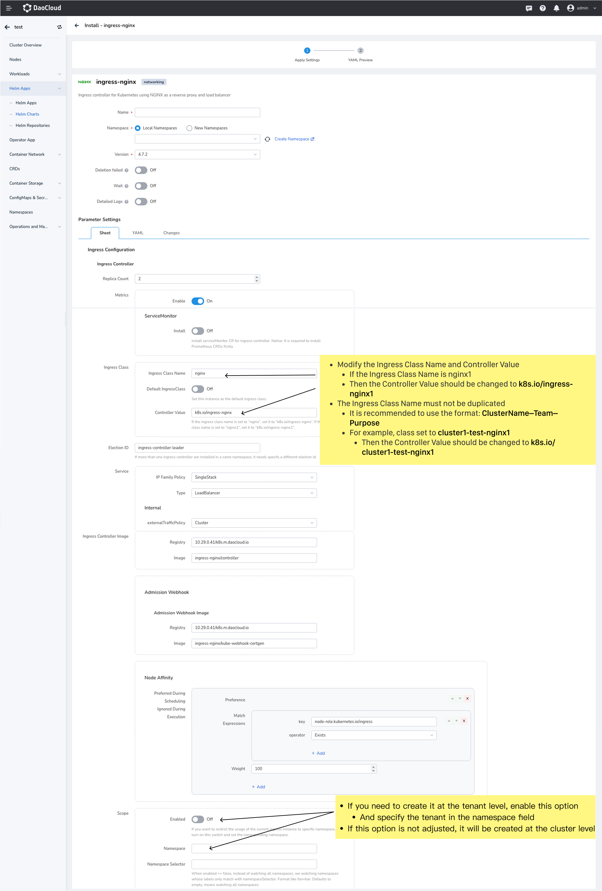

# Ingress Scope

The IngressClass Scope can be used to specify whether the Ingress instance is limited to the cluster level、the namespace level and the workspace level.

## Cluster Level / Namespace Level

You can refer to the diagram below to create a cluster-level or tenant-level ingress-nginx instance.



## Workspace-level Ingress instances

When creating an Ingress instance, if `Ingress Scope` is enabled, IngressClass is `.spec.parameters`, and `.spec.parameters.scope` is `namespaceSelector`, and the Label is `workspace.ghippo.io/id: '12345'` (where `12345` is the ID of the specified workspace `workspace01`), then the Ingress instance's Ingress Class is at `workspace-level`, which applies to all namespaces in `workspace01` that are in the current cluster.

An Ingress instance at the namesapce level is equivalent to an admin delegating rights to use Ingress to a workspace, thus achieving tenant resource isolation.

```yaml
#Example
apiVersion: networking.k8s.io/v1
kind: IngressClass
metadata.
  name: external-lb-2
spec.
  controller: example.com/ingress-controller
  parameters.
    scope: Namespace # Specify the scope of the Ingress instance as Namespace
    apiGroup: k8s.example.com
    kind: IngressParameter # Specify the Ingress instance Kind as IngressParameter
    namespaceSelector: workspace.ghippo.io/id: '1235' # Specify the workspace ID to be used
    name: external-config
```

## How to deploy platform/workspace/namespace-level Ingress instances?

Different instances can watch different namespaces by specifying `--watch-namespace`.
If [ingress-nginx instances are installed via Helm](install.md), you need to enable and set platform/workspace/namespace level Ingress by specifying `-controller.scope.enabled=true` and `-set controller.scope.namespace=$NAMESPACE`.

1. `Platform-level Ingress Instance`: If `scope` is disabled when creating an Ingress instance, the Ingress instance created is `platform-level`.
2. `Namespace-level Ingress instances`: If you create Ingress instances with `scope` disabled and specify the corresponding namespace in `namespace`, the Ingress created is `namespace-level`.

The following example creates Ingress-nginx as a Default exclusive:


Configuration information in the corresponding `value.yaml`:


3. `Workspace-level Ingress Instance`: When deploying Ingress-Ngnix, set the `scope` to `disabled` and specify `workspace.ghippo.io/id=12345` in the `Namespace Selector` to create an Ingress Instance with an `ID`  `12345` exclusive to the workspace.
     The corresponding configuration information in `value.yaml`: 

After the Ingress instance is deployed, you can [create Ingress rules](../../../kpanda/user-guide/network/create-ingress.md) in the corresponding namespace and select the Ingress Class for the corresponding instance to use.

For more information you can refer to [scope](https://kubernetes.github.io/ingress-nginx/deploy/#scope).
