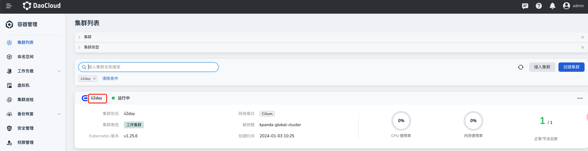
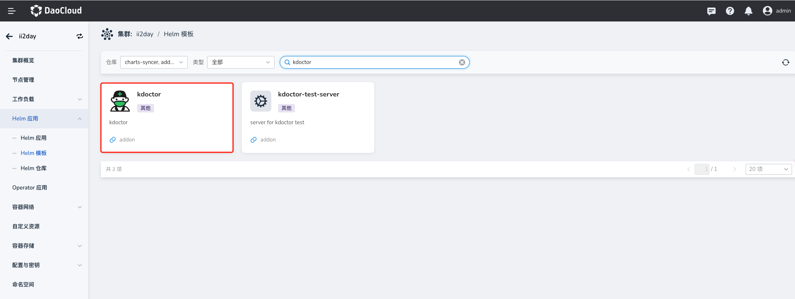
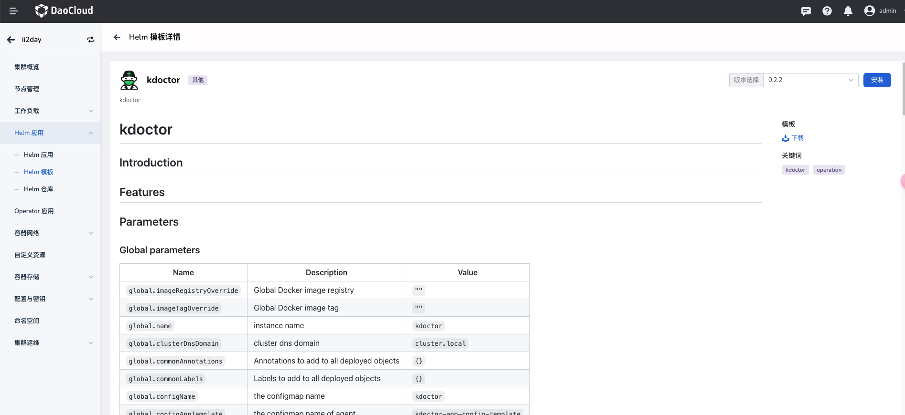
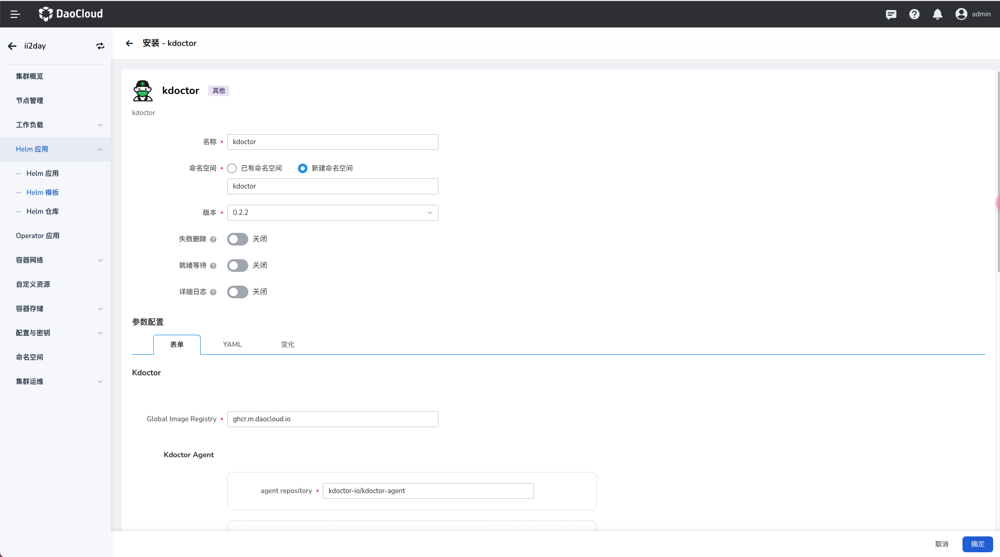
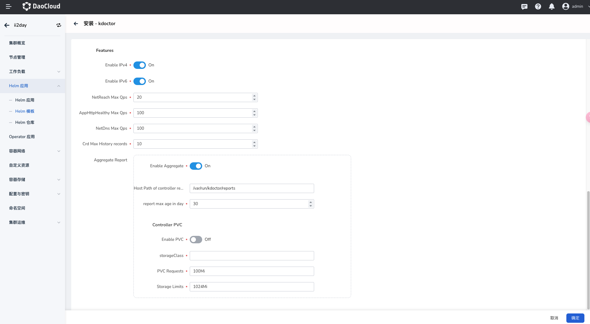

# Install kdoctor

This page describes how to install the kdoctor component.

Make sure your cluster has been successfully connected to the `Container Management` platform,
then perform the following steps to install kdoctor.

1. In the left navigation bar, click `Container Management` -> `Cluster List`, and then find the name
   of the cluster where you want to install kdoctor.

    

2. In the left navigation bar, select `Helm Apps` -> `Helm Templates`, find and click `kdoctor`.

    

3. In `Version Selection`, select the version you want to install and click `Install`.

    

4. On the installation page, fill in the required installation parameters.

    

    On the page above, enter the application name, namespace, and deployment options.

    

    The parameters in the figure above are described as follows:

    - `Features` -> `Enable IPv4`: If enabled, kdoctor enables IPv4-related network inspection functions.
    - `Features` -> `Enable IPv6`: If enabled, kdoctor enables IPv6-related network inspection functions.
    - `Features` -> `NetReach Max Qps`: The maximum QPS limit of a netreach task, to avoid excessive
      resource usage in the cluster caused by an overly large QPS.
    - `Features` -> `AppHttpHealthy Max Qps`: The maximum QPS limit of an AppHttpHealthy task, to avoid
      excessive resource usage in the cluster caused by an overly large QPS.
    - `Features` -> `NetDns Max Qps`: The maximum QPS limit of a NetDns task, to avoid excessive resource
      usage in the cluster caused by an overly large QPS.
    - `Features` -> `Crd Max History records`: The maximum number of historical records displayed
      when obtaining the task status.
    - `Features` -> `Aggregate Report` -> `Enable Aggregate`: If enabled, you can view kdoctor task
      reports through the Kubernetes aggregated API.
    - `Features` -> `Aggregate Report` -> `Host Path of controller report`: The host storage path of task reports.
    - `Features` -> `Aggregate Report` -> `report max age in day`: The maximum lifecycle of a report.
    - `Features` -> `Aggregate Report` -> `Controller PVC` -> `Enable PVC`: If enabled, a PVC is used
      to store kdoctor reports.
    - `Features` -> `Aggregate Report` -> `Controller PVC` -> `storageClass`: The storageClass name.
    - `Features` -> `Aggregate Report` -> `Controller PVC` -> `PVC Requests`: The required size and capacity of the PVC.
    - `Features` -> `Aggregate Report` -> `Controller PVC` -> `Storage Limits`: The maximum limit of Storage.

5. For more advanced configuration, click the `YAML` tab to configure through YAML.
   Click the `OK` button in the lower right corner to complete the creation.
