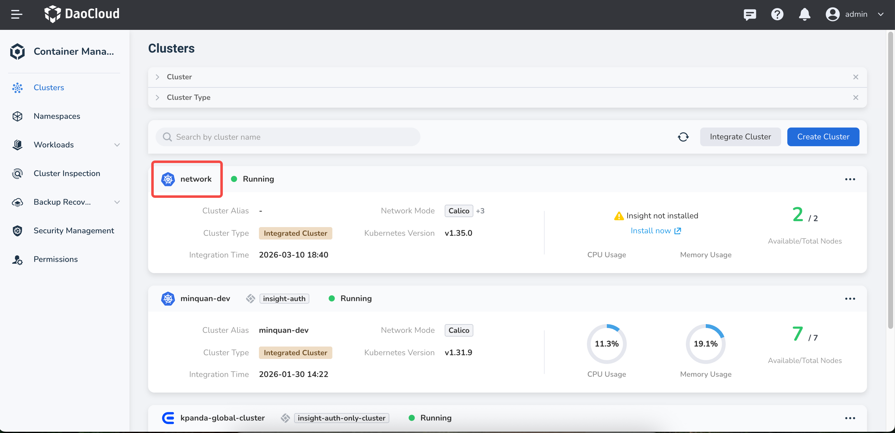
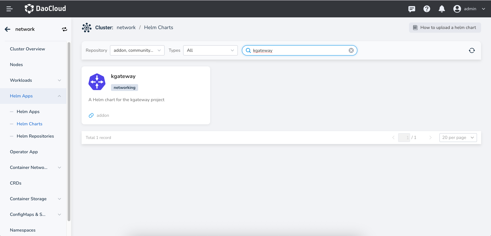
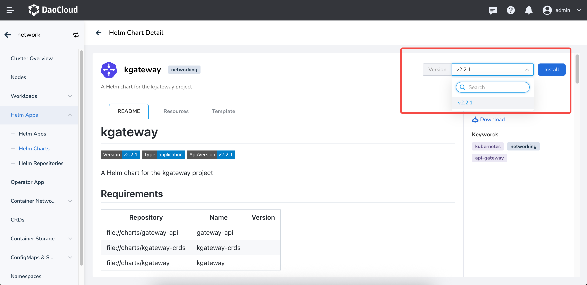
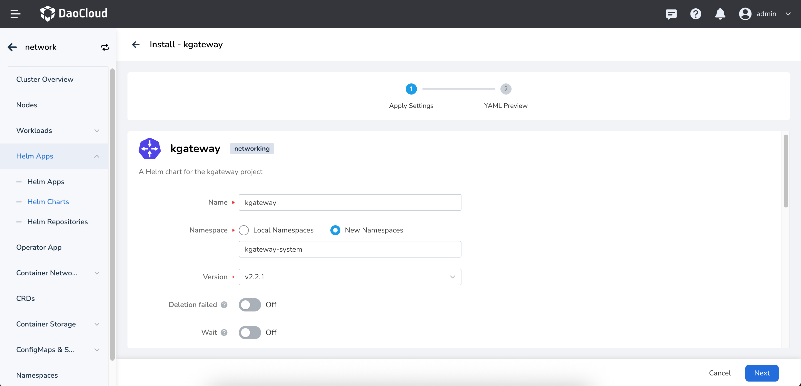
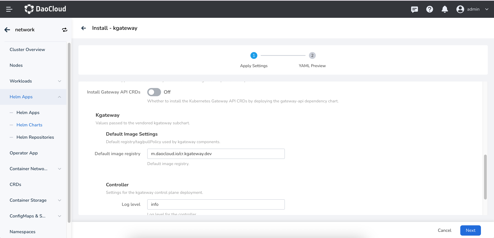

# Install kgateway

This page describes how to install the kgateway component.

Make sure your cluster has been successfully connected to the `Container Management` platform,
then perform the following steps to install kgateway.

1. In the left navigation bar, click `Container Management` -> `Cluster List`, and then find the name
   of the cluster where you want to install kgateway.

    

2. In the left navigation bar, select `Helm Apps` -> `Helm Templates`, find and click `kgateway`.

    

3. In `Version Selection`, select the version you want to install and click `Install`.

    

4. On the installation page, fill in the required installation parameters.

    

    On the page above, enter the application name, namespace, and deployment options.

    

    The parameters in the figure above are described as follows:

    - `Install Gateway API CRDs`: Whether to install
      [Gateway API CRDs](https://gateway-api.sigs.k8s.io/concepts/api-overview/). The default value is
      false. If the Gateway API is not installed in the cluster, enable this option; otherwise kgateway
      cannot work properly.
    - `Kgateway` -> `Default image settings`: Configure the default image repository address of kgateway.
      The default value is `m.daocloud.io/cr.kgateway.dev`.
    - `Kgateway` -> `Controller` -> `Log Level`: Configure the log level of the kgateway Controller.
      The default value is `info`.
    - `Kgateway` -> `Controller` -> `Replicas`: Configure the number of replicas of the kgateway Controller.
      The default value is `1`.

5. For more advanced configuration, click the `YAML` tab to configure through YAML.
   Click the `OK` button in the lower right corner to complete the creation.
