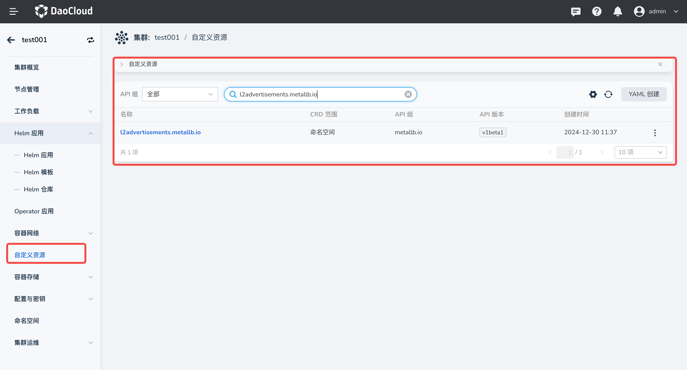
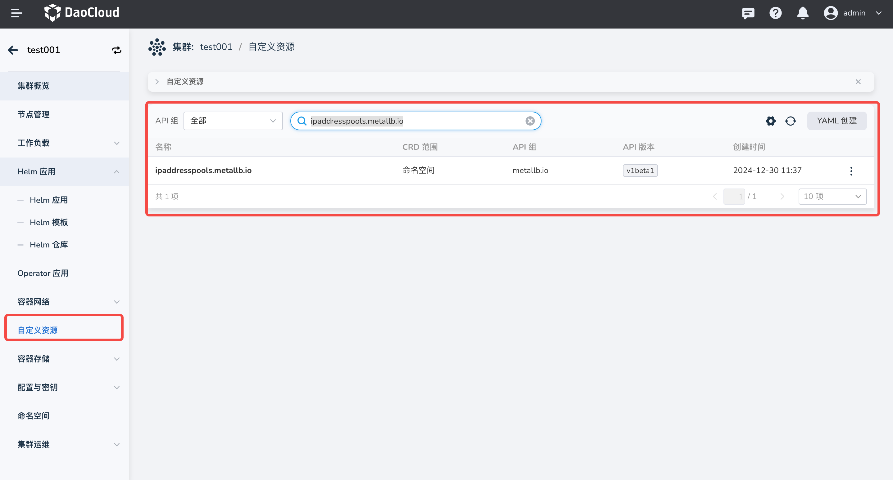

# Metallb Upgrade and Debug

- [Metallb Upgrade Issues](#metallb-upgrade-issues)
- [Metallb Debug](#metallb-debug)

## Metallb Upgrade Issues

If you did not enable Metallb ARP Mode when installing Metallb, be sure **not to upgrade Metallb by
clicking the upgrade button on the page**; otherwise Metallb will not work properly.

You need to manually enable Metallb ARP Mode through the following steps:

- Go to the custom resource module and create an L2Advertisement resource:



Click `Create via YAML`:

```yaml
apiVersion: metallb.io/v1beta1
kind: L2Advertisement
metadata:
  name: default
  namespace: metallb-system
```

The YAML above indicates that all Metallb IP pools are advertised through this L2Advertisement resource.
If your cluster runs both BGP and ARP modes, you can specify a specific pool for ARP advertisement
in the following way:

```yaml
apiVersion: metallb.io/v1beta1
kind: L2Advertisement
metadata:
  name: default
  namespace: metallb-system
spec:
  ipAddressPools:
  - default-pool
```

The configuration above indicates that only the IP pool `default-pool` is advertised through ARP by
this L2Advertisement resource.

- Go to the custom resource module and create an IPAddressPool resource:



Click `Create via YAML` and create the following content:

```yaml
apiVersion: metallb.io/v1beta1
kind: IPAddressPool
metadata:
  name: default
  namespace: metallb-system
spec:
  addresses:
  - 192.168.10.0/24
```

The YAML above creates an IP pool named `default` with the IP address `192.168.10.0/24`.

## Metallb Debug

If you encounter network connectivity issues when using Metallb, follow these steps to troubleshoot:

- Check whether the L2Advertisement resource exists. If the L2Advertisement resource has a NodeSelector
  configured, confirm whether any node in the cluster has that label configured.

    ```bash
    kubectl get l2advertisement -n metallb-system
    ```

- Confirm whether the LoadBalancer has a properly running Endpoint.

- Check whether the annotations of the LoadBalancer Service are correct.

- Check whether the IP pool used by the LoadBalancer Service has sufficient IP addresses.

- Get the events of your LoadBalancer Service to obtain key error information:

    ```bash
    kubectl describe svc -n <lb_service_ns> <lb_service_name>
    ```

    > If no event is obtained, recreate the service and then get the events again.

- Confirm whether you have a single-node cluster or all nodes are control plane nodes. If so,
  remove the label `node.kubernetes.io/exclude-from-external-load-balancers` from the control plane nodes:

    ```bash
    kubectl label nodes <Your_Control_Plane_Node> node.kubernetes.io/exclude-from-external-load-balancers-
    ```

- Filter the Metallb component logs by service name to check whether there is related error information.
  If there is no obvious log, edit the metallb-speaker DaemonSet and set its log level to Debug.

    ```bash
    kubectl logs -n metallb-system controller-xxxx | grep <lb_service_name>

    kubectl logs -n metallb-system speaker-xxxx | grep <lb_service_name>
    ```
