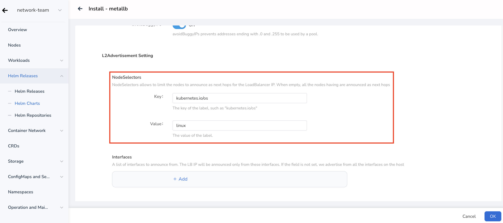

---
hide:
  - toc
---

# Install

To install ARP Pool, Helm needs to be enabled and put in a ready wait state. The specific installation steps are as follows:

1. Metallb Helm Chart is stored under system repo:

    

2. Install IP pool

    When installing Metallb, there is an option to install an IP pool. LoadBalancer Service will allocate IP addresses from this pool by default, and declare all IP addresses in this pool through APR.

    !!! note

        The address pool list can configure IPv4 and IPv6 addresses.
        The input format of each address segment can be a legal CIDR (such as 192.168.1.0/24) or an IP range (such as 1.1.1.1-1.1.1.20).
        Each address segment entered should belong to a certain network segment of the node, but be careful not to conflict with existing IP addresses.

    

3. Configure the next hop of LoadBalancer IP

    By default, all nodes will be the next hop of the LoadBalancer IP, but you can restrict only certain nodes to be the next hop of the LoadBalancer IP:

    

    As shown in the configuration above, only the Master and Worker1 nodes will serve as the next hop of the LoadBalancer IP.

4. The above configuration only initializes the Metallb ARP mode, and the configuration is relatively simple.
    This does not include initializing Metallb BGP mode. BGP mode configuration is complex and requires hardware support. To configure BGP mode,
    Please refer to [advanced_bgp_configuration](https://metallb.universe.tf/configuration/_advanced_bgp_configuration/).

5. The installation is complete

    