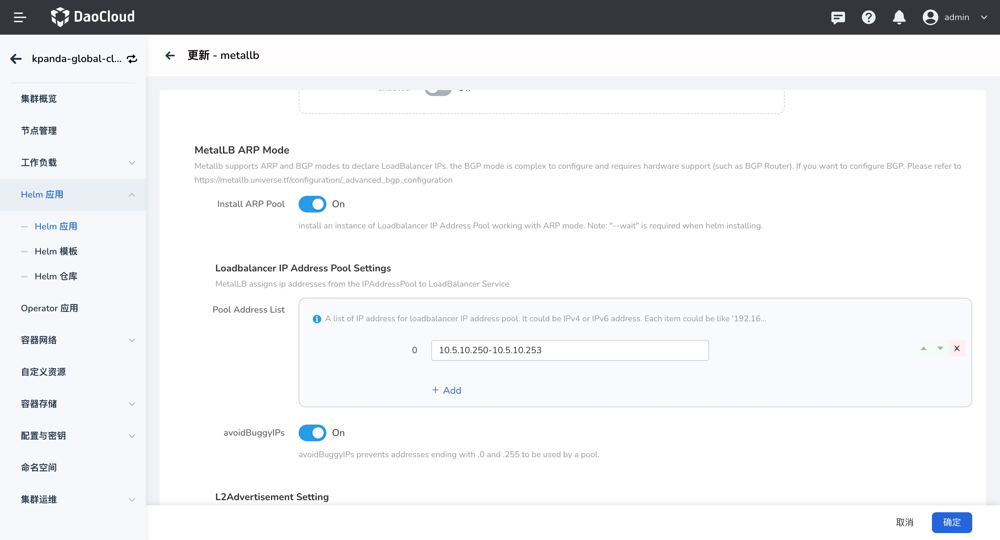
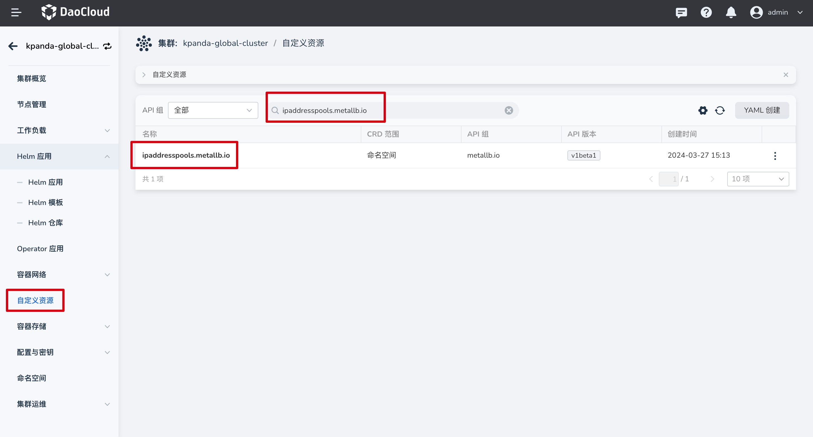
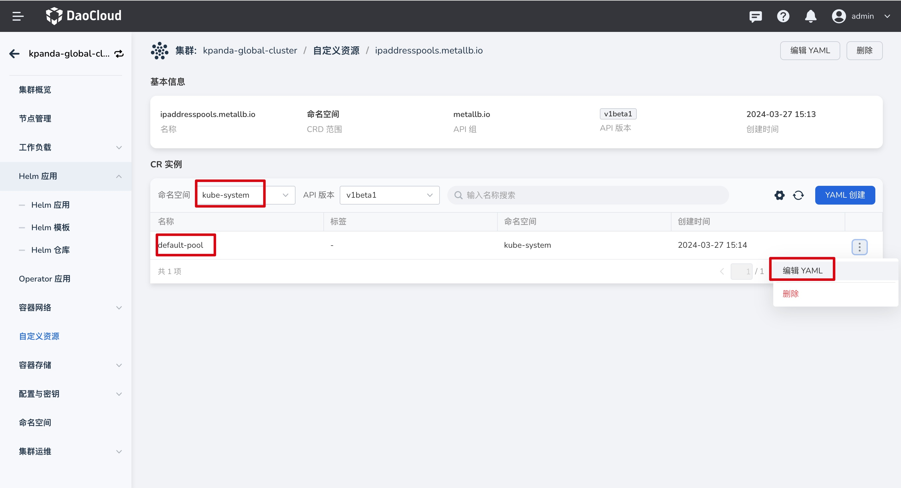
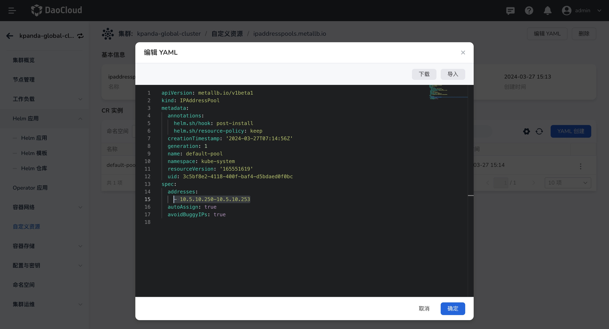
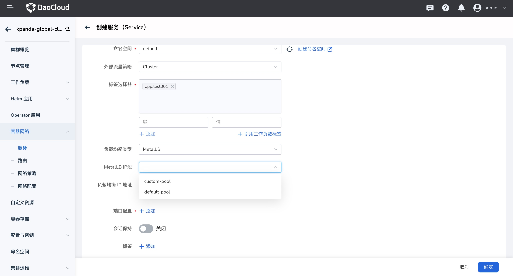

# IPPool Modify and Create

This section describes how to modify an existing IPPool or create a new IPPool after the Metallb
component is deployed.

## Prerequisites

- [Metallb has been deployed](install.md)

## Modify an IPPool

When creating Metallb, the ARP mode was enabled and an IP Pool was created. Now the information
in the IP Pool needs to be modified.



The modification method is as follows:

1. Click the corresponding cluster name to enter the details, select **Custom Resources**, search for
   `ipaddresspools.metallb.io`, and click the CRD resource name to enter the details.

    

2. Click the CRD name to enter the details, select the namespace where metallb is deployed (in the
   example, metallb is deployed in `kube-system`), and edit the CR instance (default-pool) YAML.

    

3. Modify the IP address and other information, and save.

    

## Create an IPPool

If creating a LoadBalancer Service requires a new IP Pool, create it as follows:

1. Click the corresponding cluster name to enter the details, select **Custom Resources**, search for
   `ipaddresspools.metallb.io`, and click the CRD resource name to enter the details.

2. Click the CRD name to enter the details, select the namespace where metallb is deployed (in the
   example, metallb is deployed in `kube-system`), click **Create via YAML**, and enter the following YAML.

    Example of creating an IP Pool through YAML:

    ```yaml
    apiVersion: metallb.io/v1beta1
    kind: IPAddressPool
    metadata:
      annotations:
        helm.sh/hook: post-install
        helm.sh/resource-policy: keep
      name: custom-pool # IP Pool name
      namespace: kube-system # Deployment namespace, the same namespace as the metallb instance
    spec:
      addresses:
        - 10.5.10.240-10.5.10.245 # The IP address must be in the same network segment as the specified NIC
      autoAssign: true
      avoidBuggyIPs: true
    ```

    When creating, note that the entered IP address must be in the same network segment as the NIC
    specified when [creating the metallb instance](install.md).

3. Click OK to complete the creation. After the creation succeeds, you can select the corresponding
   IP Pool when [creating a LoadBalancer Service](../../../kpanda/user-guide/network/create-services.md).

    

For more usage methods, refer to: [IPPool Usage](usage.md)
