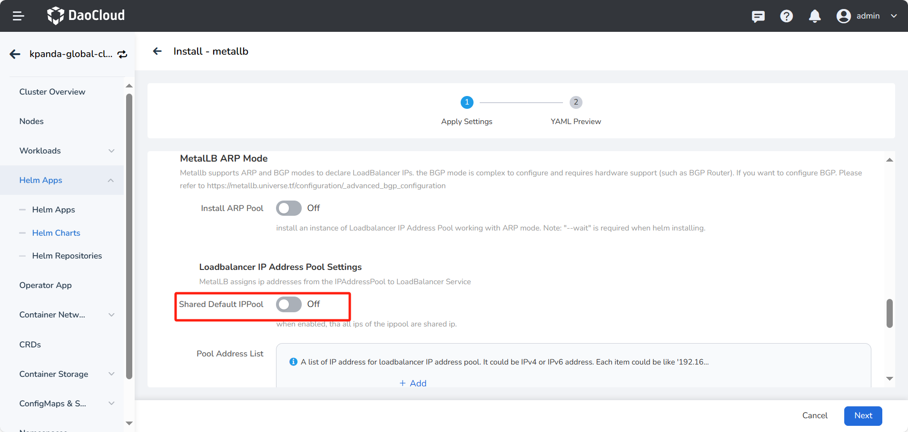
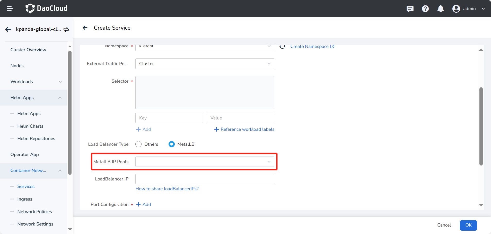

# Instructions for IPPool Use

## Cluster default IPPool

If the IPPool is not specified through Annotations: `metallb.universe.tf/address-pool` or Annotation: `metallb.universe.tf/loadBalancerIPs` when creating LoadBalancer Service, addresses will be allocated from the existing address pool with `autoAssign=true`.

!!! note

    The created IPPool must be in the same namespace as MetalLb component, otherwise MetalLb cannot recognize it.

## Specify IPPool

When creating LoadBalancer Service, you can specify the IPPool through Annotations: `metallb.universe.tf/address-pool`:

```yaml
apiVersion: v1
kind: Service
metadata:
  name: metallb-ippool3
  labels:
    name: metallb-ippool3
  annotations:
    metallb.universe.tf/address-pool: default # default must be in the same namespace as metallb components
spec:
  type: LoadBalancer
  ...
```

Create LoadBalancer Service, please refer to [creating Service](../../../kpanda/user-guide/network/create-services.md).

MetalLB IPPool: The IPs in the IPPool configured when deploying MetalLB are real and available physical IP addresses.
LoadBalancer IP: The LoadBalancer IP is an address randomly allocated or manually specified from the IPPool, used to expose services externally.


### Specify the IP address

When creating LoadBalancer Service, you can specify the IP through Annotations: `metallb.universe.tf/loadBalancerIPs`:

```yaml
apiVersion: v1
kind: Service
metadata:
  name: metallb-ippool3
  labels:
    name: metallb-ippool3
  annotations:
    metallb.universe.tf/loadBalancerIPs: 172.16.13.210 # This IP address must exist in an existing IPPool
spec:
  type: LoadBalancer
  ...
```


## Shared IP address

Before k8s v1.20, LoadBalancer Service does not support configuring multiple protocols (v1.24 supports it, it has become a Beta function), refer to [#issue 23880](https://github.com/kubernetes/kubernetes/issues/23880).

MetalLb indirectly supports this feature by creating different Services and sharing the Service IPs.

Create two Services:

```yaml
apiVersion: v1
kind: Service
metadata:
  name: dns-service-tcp
  namespace: default
  annotations:
    metallb.universe.tf/allow-shared-ip: "key-to-share-1.2.3.4"
spec:
  type: LoadBalancer
  loadBalancerIP: 1.2.3.4
  ports:
    - name: dnstcp
      protocol: TCP
      port: 53
      targetPort: 53
  selector:
    app: dns
---
apiVersion: v1
kind: Service
metadata:
  name: dns-service-udp
  namespace: default
  annotations:
    metallb.universe.tf/allow-shared-ip: "key-to-share-1.2.3.4"
spec:
  type: LoadBalancer
  loadBalancerIP: 1.2.3.4
  ports:
    - name: dnsudp
      protocol: UDP
      port: 53
      targetPort: 53
  selector:
    app: dns
```

!!! note

    As long as the key and value of Annotations(`metallb.universe.tf/allow-shared-ip`) are the same,
    different LoadBalancer Service will have the same IP address (ipv4/ipv6).
    Of course, you can also specify ipv4/ipv6 addresses through Annotations (`metallb.universe.tf/loadBalancerIPs`)
    or specify through `.spec.loadBalancerIP` (only supports ipv4).
    Editing an Annotation after creation has no effect.

Another feature of shared IP is that the LoadBalancer IP address is insufficient, and multiple Services need to share the same IP, but note that the protocols and ports of different Services should be different, otherwise the connection cannot be distinguished.

## Shared IPPool

When the shared IPPool is enabled, all IP addresses in the IPPool are shared IP addresses.

### Enabling Shared Default IPPool

1. Install MetalLB using a Helm template and enable the Shared Default IPPool option.

    

2. When creating a Service, select the shared MetalLB IPPool and specify the LoadBalancer IP address.

    

### Enabling Shared IPPool for Non-Default IPPool

Manually add the `annotations` to the Helm application for MetalLB:

```yaml
apiVersion: metallb.io/v1beta1  
kind: IPAddressPool  
metadata:  
  annotations:  
    metallb.universe.tf/share-address-pool: true  # Add this line
  generation: 1  
  name: test-2048-pool  
  namespace: metallb-system  
  resourceVersion: "1306403711"  
  uid: e50c8f73-688a-47f9-ac45-0cbbd5cfe878  
spec:  
  addresses:  
  - 10.6.202.90-10.6.202.100  
  autoAssign: false  
  avoidBuggyIPs: false
```

When creating a Service, select the shared MetalLB IPPool and specify the LoadBalancer IP address.


