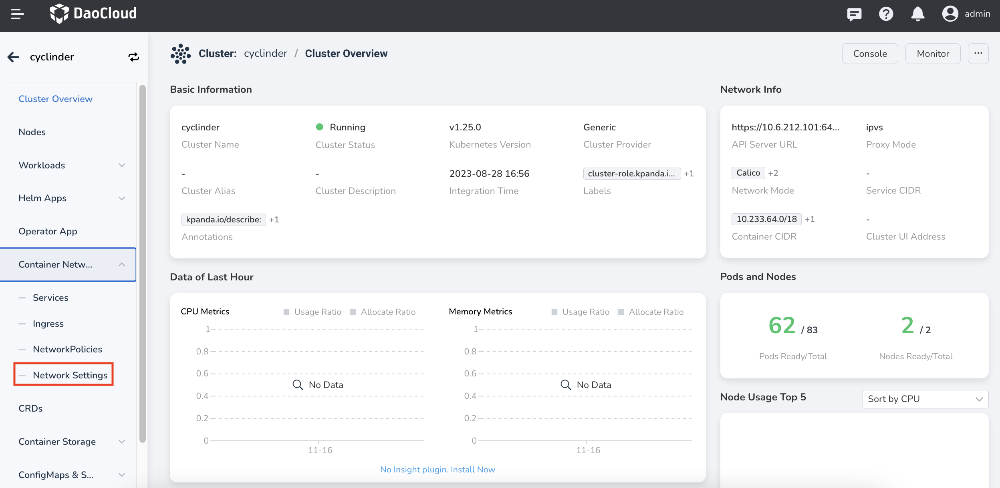
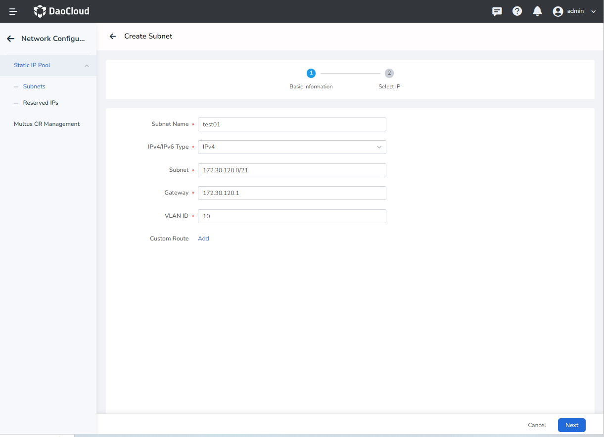
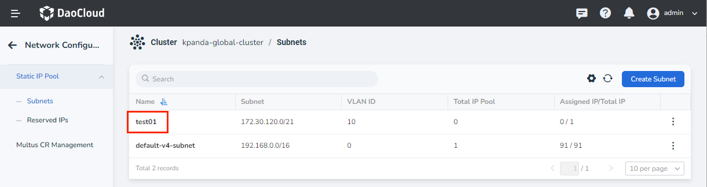
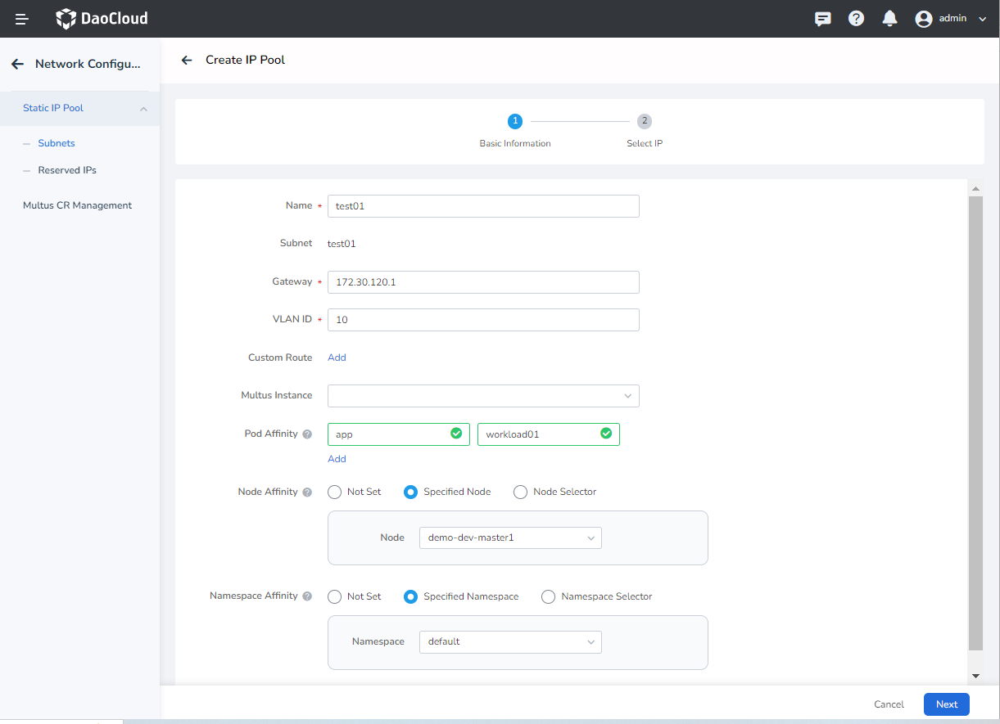
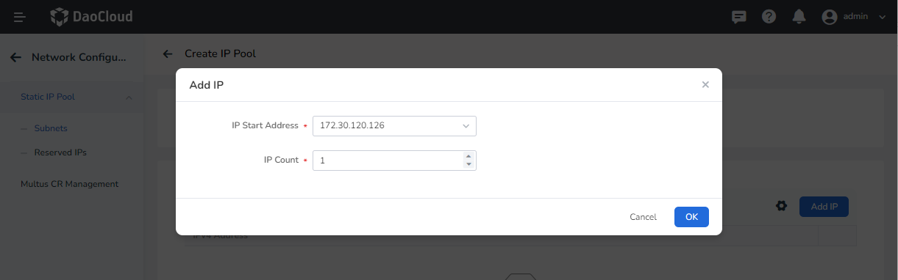

# Create Subnets and IP Pools

This page describes how to create subnets and IP pools before creating workloads to use IP pools.

- If you have already created subnets and IP pools when deploying SpiderPool components, you can directly [use IP pools](./usage.md).

- If you need to create new subnets and IP pools, refer to this document.

## Prerequisites

1. [SpiderPool successfully deployed.](../../modules/spiderpool/install.md)
2. [Multus with Macvlan/SR-IOV has been successfully deployed.](../../modules/multus-underlay/install.md)

## Interface operation

1. After login to DCE, click `Container Management` -> `Clusters` in the left navigation bar, and find the cluster. Then click `Container Network` -> `Network Settings` in the left navigation bar.

    

2. Enter `Network Configuration` to confirm whether the subnet to be used has been created.

    - If the subnet to be used has been created by default, you can directly create an IP pool.
    - If the subnet to be used is not created by default, you can enter the page and click `Create Subnet`.

    

    ​Parameter details:

    - `IPv4/IPv6 Type`: the subnet type of the subnet to be created.

    - `Subnet`: the subnet segment that has been planned. If used with Macvlan, please confirm the corresponding network interface/sub-interface with the network administrator in advance.

    - `Gateway`: the gateway corresponding to the subnet. Please confirm with your network colleagues in advance.
    ​
    - `VLAN ID`: the VLAN ID corresponding to the subnet.

3. Click `Next` to enter `Select IP`, enter the IP segment to be used (the above-mentioned IP in the subnet), and click `OK` to complete the creation of the subnet.

    

4. Click the subnet name to be used to enter the subnet details page.

    

5. On the subnet details page, click `Create IP Pool`.

    !!! note

        Creating an IP pool is optional.

        - If strict control of IP resources is adopted, you can complete the creation of IP pool in advance.
        - If coarse-grained control of IP resources is adopted, there is no need to create an IP pool in advance.

    On the `Create IP Pool` page, input the following parameters:

    

    - `Gateway`: `Gateway` inherits `Subnet Gateway` by default and can be modified.
    - `Custom Routing`: routes can be customized based on IP pool granularity for special needs.
    - `Workload Affinity`: a workload label (such as `app: workload01`). After the IP pool is created, it can only be selected by the corresponding workload to achieve the effect of a fixed IP pool.
    - `Node Affinity`: a node label (such as `node:controller-1`). After the IP pool is created, the workload Pod needs to be scheduled to the corresponding node to use the created IP pool.
    - `Namespace Affinity`: After enabling it, you can select the corresponding namespace. After selecting, only workloads in the corresponding namespace can use the created IP pool.

    !!! note

        If no affinity is added at creation time, the created IP pool will be a `shared IP pool`.

6. Click the IP pool name, and then click `Add IP` to select `IP start Address` and `IP number` to join the IP pool. Click `OK` to complete the IP addition, and click again to complete the creation of the IP pool.

    `Get IP rules`: obtain the corresponding number of IPs in turn from the `IP Start Address`. If the IP segments are not consecutive IPs, skip the intermediate IPs and obtain them sequentially.

    

7. After the creation is complete, [the workload can use the IP Pool](../../modules/spiderpool/usage.md)

## YAML creation

Subnets and IPPools can also be created directly via YAML.

### Create subnets via YAML

```yaml
apiVersion: spiderpool.spidernet.io/v1
kind: SpiderSubnet
metadata:
   name: default-v4-subnet
spec:
   gateway: 172.30.120.1
   ipVersion: 4
   ips:
   - 172.30.120.126-172.30.120.127 #The subnet IP has been planned, and the IP segment can be entered
       #Such as: 72.30.120.126-172.30.120.127 segment or a single IP such as: 172.30.120.126
   subnet: 172.30.120.0/21
   vlan: 0
```

### Create IPPool via YAML

```yaml
apiVersion: spiderpool.spidernet.io/v1
kind: SpiderIPPool
metadata:
   name: standard-ipv4-ippool
spec:
   ipVersion: 4
   subnet: 172.30.120.0/21
   ips:
   - 172.30.120.126-172.30.120.127 # Added to the IP in the subnet, you can enter the IP segment
          # Such as: 172.30.120.126-172.30.120.127 segment or a single IP such as: 172.30.120.126
```
