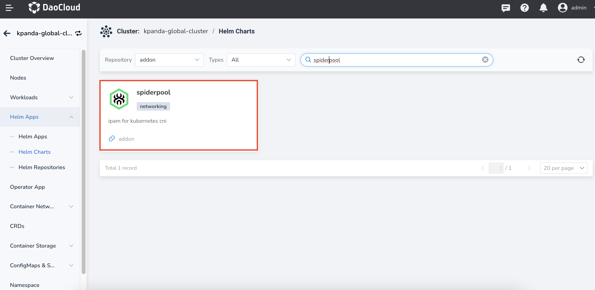
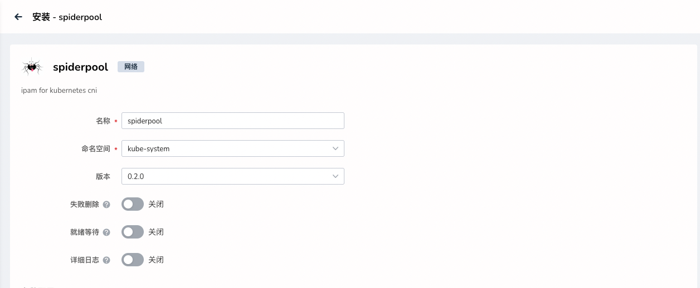
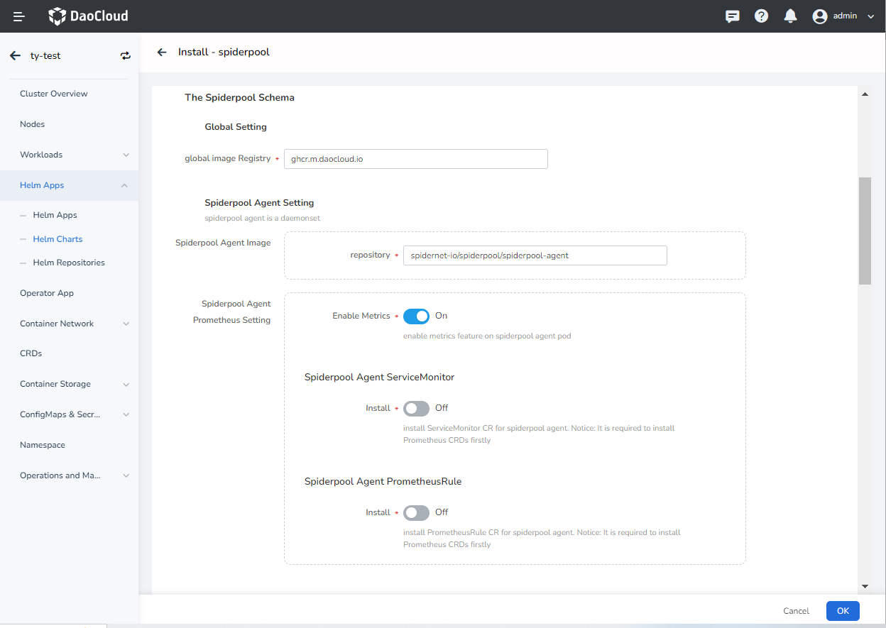
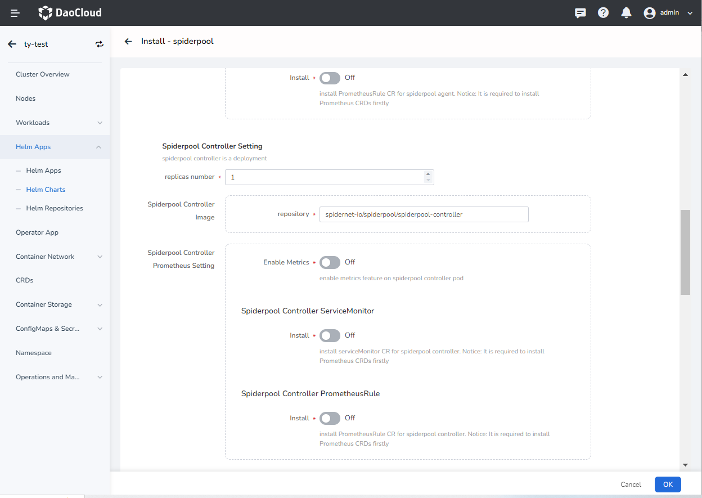
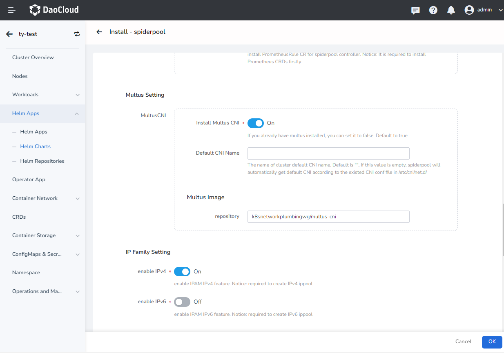

---
hide:
  - toc
---

# Install

This page describes how to production install Spiderpool components.

1. Have a DCE cluster, log in to the Web UI management interface of the global cluster, and log in to the cluster where you want to install Spiderpool in `Container Management` -> `Cluster List` in the navigation

2. In `Helm Application` -> `Helm Template`, select `system` repository and `network` component, click to install `spiderpool`.

    

3. In `Version Selection`, select the version you want to install, and click `Install`.

4. In the installation parameter interface, fill in the following parameter information:

    

    

    The meanings of the parameters in the above figure are:

    - `global image Registry`: Set the warehouse address of all images, the available online warehouse has been filled in by default, if it is a privatized environment, it can be modified to a private warehouse address

    - `Spiderpool Agent Image repository`: Set the image name and keep the default

    - `Spiderpool Agent Prometheus` -> `Enable Metrics`: If turned on, the Spiderpool Agent component will collect metrics information for external collection

    - `Spiderpool Agent ServiceMonitor` -> `Install`: Whether to install the ServiceMonitor object of Spiderpool Agent, which requires Promethues to be installed in the cluster, otherwise the creation will fail

    - `Spiderpool Agent PrometheusRule` -> `Install`: Whether to install the promethuesRule object of Spiderpool Agent, which requires Promethues to be installed in the cluster, otherwise the creation will fail

    

    The meanings of the parameters in the above figure are:
  
    - `Spiderpool Controller Setting` -> `replicas number`: Set the number of copies of the Spiderpool Controller, which is mainly responsible for the controller logic of the Spiderpool.
      Note that this Pod is in hostnetwork mode, and anti-affinity is set between Pods, so at most one Pod can be deployed on a Node. If you want to deploy a replica number greater than 1, please ensure that the number of nodes in the cluster is sufficient, otherwise some Pod scheduling will fail.

    - `Spiderpool Controller Image` -> `repository`: set the image name, keep the default

    - `Spiderpool Controller Prometheus` -> `Enable Metrics`: If turned on, the Spiderpool Controller component will collect metrics information for external collection

    - `Spiderpool Controller ServiceMonitor` -> `Install`: Whether to install the ServiceMonitor object of Spiderpool Controller, which requires Promethues to be installed in the cluster, otherwise the creation will fail

    - `Spiderpool Controller PrometheusRule` -> `Install`: Whether to install the promethuesRule object of the Spiderpool Controller, which requires Promethues to be installed in the cluster, otherwise the creation will fail

    - `IP Family Setting -> enable IPv4`: Whether to enable IPv4 support. Note that if it is enabled, when assigning an IP to a pod, it must try to assign an IPv4 address, otherwise it will cause the Pod to fail to start.
      Therefore, be sure to open the subsequent `Cluster Default Ippool Installation` -> `install IPv4 ippool` to create the default IPv4 pool for the cluster

    - `IP Family Setting -> enable IPv6`: Whether to enable IPv6 support. Note that if it is enabled, when assigning an IP to the pod, it must try to assign an IPv6 address, otherwise it will cause the Pod to fail to start
      Therefore, be sure to open the subsequent `Cluster Default Ippool Installation` -> `install IPv6 ippool` to create the default IPv6 pool for the cluster

    

    The meanings of the parameters in the above figure are:

    - `install IPv4 ippool`: whether to install IPv4 IP pool

    - `install IPv6 ippool`: whether to install IPv6 IP pool

    - `IPv4 subnet name`: The name of the IPv4 subnet. Ignore this option if `install IPv4 ippool` is not enabled.
    
    - `IPv4 ippool name`: The name of the IPv4 ippool. Ignore this option if `install IPv4 ippool` is not enabled.
    
    - `IPv6 subnet name`: The name of the IPv6 subnet. Ignore this option if `install IPv6 ippool` is not enabled.
    
    - `IPv6 ippool name`: The name of the IPv6 ippool. Ignore this option if `install IPv6 ippool` is not enabled.
    
    - `IPv4 ippool subnet`: Set the IPv4 subnet number in the default pool, e.g. `192.168.0.0/16`. Ignore this option if `install IPv4 ippool` is not enabled.

    - `IPv6 ippool subnet`: Set the IPv6 subnet number in the default pool, e.g. `fd00::/112`. Ignore this option if `install IPv6 ippool` is not enabled.

    - `IPv4 ippool gateway`: Set the IPv4 gateway, such as `192.168.0.1`, this IP address must belong to `IPv4 ippool subnet`. Ignore this option if `install IPv4 ippool` is not enabled.

    - `IPv6 ippool gateway`: Set the IPv6 gateway, such as `fd00::1`, the IP address must belong to `IPv6 ippool subnet`. Ignore this option if `install IPv6 ippool` is not enabled.

    - `IP Ranges for default IPv4 ippool`: Set which IP addresses can be assigned to Pods, and multiple members can be set, and each member only supports strings in 2 input formats.
      One is to set a continuous IP such as `192.168.0.10-192.168.0.100`, and the other is to set a single IP address such as `192.168.0.200`. Note that CIDR format is not supported for input.
      These IP addresses MUST belong to the `IPv4 ippool subnet`. Ignore this option if `install IPv4 ippool` is not enabled.

    - `IP Ranges for default IPv6 ippool`: Set which IP addresses can be assigned to Pods, and multiple members can be set, and each member only supports strings in 2 input formats.
      One is to set a continuous IP such as `fd00::10-fd00::100`, and the other is to set a single IP address such as `fd00::200`. Note that CIDR format is not supported for input.
      These IP addresses MUST belong to the `IPv6 ippool subnet`. Ignore this option if `install IPv6 ippool` is not enabled.

5. Finally click `Install`.

!!! note

    During the installation process, a single subnet and ippool can be created; after the installation is complete, more subnets and ippools can be created in the user interface.