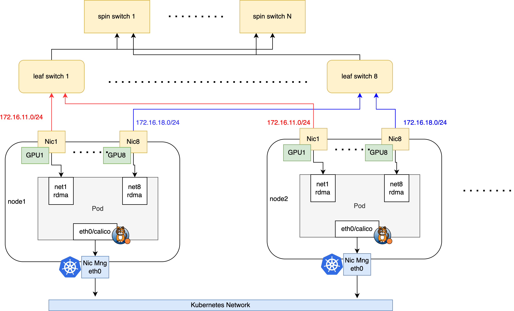

# Build AI Cluster with Macvlan

This page describes how to provide RDMA communication capabilities for containers based on the
Macvlan technology when building an AI cluster. It applies to RoCE network scenarios.

Based on the [RDMA shared device plugin](https://github.com/Mellanox/k8s-rdma-shared-dev-plugin),
a Macvlan interface is inserted into the container, and the RDMA device of the master interface can
be shared with the container. Therefore:

- The RDMA system needs to work in shared mode, and all containers share the RDMA device of the
  master NIC on the host. Its characteristic is that in each newly started container, the available
  GID index of its RDMA device is always incrementing, not a fixed value.

- Creating a Macvlan interface on an InfiniBand IPOIB NIC is not supported. Therefore, this
  solution only applies to RoCE network scenarios and cannot be used in InfiniBand network
  scenarios.

## Comparison with the SR-IOV CNI RDMA Solution

| Comparison dimension | Macvlan shared RDMA solution                            | SR-IOV CNI isolated RDMA solution                            |
| -------------------- | ------------------------------------------------------- | ------------------------------------------------------------ |
| Network isolation    | All containers share the RDMA device, poor isolation     | Each container has a dedicated RDMA device, better isolation   |
| Performance          | Relatively high performance                              | Hardware passthrough, the best performance                     |
| Resource utilization | High resource utilization                                | Low, limited by the number of VFs supported by the hardware     |
| Configuration        | Relatively simple configuration                          | Complex configuration, requires hardware support and setup      |
| Compatibility        | Good compatibility, works in most environments           | Depends on hardware support, poor compatibility                 |
| Applicable scenario  | Most scenarios, including bare metal and virtual machines | Bare metal only, not virtual machine scenarios                  |
| Cost                 | Low cost, no additional hardware support required         | High cost, requires SR-IOV-capable hardware                     |
| RDMA protocol        | Supports RoCE, does not support InfiniBand                | Supports both RoCE and InfiniBand                              |

## Solution

This page uses the following typical AI cluster topology as an example to describe how to set up
Spiderpool.



The network plan of the cluster is as follows:

1. Run Calico CNI on the eth0 NIC of the node to carry Kubernetes traffic. AI workloads are
   assigned a default Calico NIC for control-plane communication.

2. Use Mellanox ConnectX5 NICs with RDMA capabilities on the nodes to carry the RDMA traffic of AI
   computing, and connect the NICs to the rail optimized network. AI workloads are additionally
   assigned the Macvlan virtual interfaces of all RDMA NICs to ensure high-speed network
   communication for GPUs.

## Installation Requirements

- Refer to [Spiderpool installation requirements](./system-requirements.md).

- Prepare the Helm binary on the host.

- Install a Kubernetes cluster, with kubelet working on the host eth0 NIC shown in Figure 1.

- Install Calico as the default CNI of the cluster, using the host eth0 NIC as the traffic
  forwarding NIC of Calico. If it is not installed, refer to the
  [official documentation](https://docs.tigera.io/calico/latest/getting-started/kubernetes/) or
  install it with the following commands:

    ```shell
    kubectl apply -f https://github.com/projectcalico/calico/blob/master/manifests/calico.yaml
    kubectl wait --for=condition=ready -l k8s-app=calico-node  pod -n kube-system 
    # set calico to work on host eth0 
    kubectl set env daemonset -n kube-system calico-node IP_AUTODETECTION_METHOD=kubernetes-internal-ip
    # set calico to work on host eth0 
    kubectl set env daemonset -n kube-system calico-node IP6_AUTODETECTION_METHOD=kubernetes-internal-ip  
    ```

## Host Preparation

1. Install the RDMA NIC driver

    For Mellanox NICs, you can download the
    [NVIDIA OFED official driver](https://network.nvidia.com/products/infiniband-drivers/linux/mlnx_ofed/)
    and install it on the host with the following commands:

    ```shell
    mount /root/MLNX_OFED_LINUX-24.01-0.3.3.1-ubuntu22.04-x86_64.iso   /mnt
    /mnt/mlnxofedinstall --all
    ```

    For Mellanox NICs, you can also install the driver in a containerized way to batch install the
    driver for all Mellanox NICs on the cluster hosts. Run the following commands. Note that this
    process requires internet access to fetch some installation packages. When all ofed Pods enter
    the ready state, the OFED driver installation on the hosts is complete.

    ```shell
    helm repo add spiderchart https://spidernet-io.github.io/charts
    helm repo update
    helm search repo ofed

    # pelase replace the following values with your actual environment
    # for china user, it could set `--set image.registry=nvcr.m.daocloud.io` to use a domestic registry
    helm install ofed-driver spiderchart/ofed-driver -n kube-system \
            --set image.OSName="ubuntu" \
            --set image.OSVer="22.04" \
            --set image.Arch="amd64"
    ```

2. Set the RDMA subsystem on the host to shared mode. This is a requirement for providing RDMA
   devices to containers in Macvlan scenarios.

    ```shell
    # Check the current operating mode (the Linux RDMA subsystem operates in shared mode by default):
    $ rdma system
       netns shared copy-on-fork on
    ```

3. Set the RDMA working mode of the NIC (InfiniBand or Ethernet)

    1. Confirm the working modes supported by the NIC: in this example environment, the host is
       equipped with a Mellanox ConnectX 5 VPI NIC. Query the RDMA devices to confirm that the NIC
       driver is installed.

        ```shell
        $ rdma link
          link mlx5_0/1 state ACTIVE physical_state LINK_UP netdev ens6f0np0
          link mlx5_1/1 state ACTIVE physical_state LINK_UP netdev ens6f1np1
          ....... 
        ```

        Confirm the working mode of the NIC. The following output indicates that the NIC works in
        Ethernet mode and can implement RoCE communication.

        ```shell
        $ ibstat mlx5_0 | grep "Link layer"
          Link layer: Ethernet
        ```

        The following output indicates that the NIC works in InfiniBand mode and can implement
        InfiniBand communication.

        ```shell
        $ ibstat mlx5_0 | grep "Link layer"
          Link layer: InfiniBand
        ```

        If the NIC does not work in the expected mode, run the following commands to confirm that
        the NIC supports configuring the LINK_TYPE parameter. If this parameter is not available,
        replace the NIC with a supported model.

        ```shell
        $ mst start

        # check the card's PCIE 
        $ lspci -nn | grep Mellanox
            86:00.0 Infiniband controller [0207]: Mellanox Technologies MT27800 Family [ConnectX-5] [15b3:1017]
            86:00.1 Infiniband controller [0207]: Mellanox Technologies MT27800 Family [ConnectX-5] [15b3:1017]
            ....... 

        # check whether the network card supports parameters LINK_TYPE 
        $ mlxconfig -d 86:00.0  q | grep LINK_TYPE
            LINK_TYPE_P1                                IB(1)
        ```

    1. Batch set the working mode of the NICs: get the
       [batch setting script](https://github.com/spidernet-io/spiderpool/blob/main/tools/scripts/setNicRdmaMode.sh).

        ```shell
        chmod +x ./setNicRdmaMode.sh

        # Query in batch whether all RDMA NICs work in ib or eth mode
        ./setNicRdmaMode.sh q

        # Switch all RDMA NICs to eth mode
        RDMA_MODE="roce" ./setNicRdmaMode.sh

        # Switch all RDMA NICs to ib mode
        RDMA_MODE="infiniband" ./setNicRdmaMode.sh
        ```

4. Set the IP address, MTU, and policy routing for all RDMA NICs

    > In RDMA scenarios, both switches and host NICs usually work with larger MTU values to improve
    > performance.
    >
    > Because a Linux host has only one default route by default, in multi-NIC scenarios you need
    > to set policy default routes for different NICs to ensure that tasks in hostnetwork mode can
    > run All-to-All and other communication patterns properly.

    Get the [ubuntu NIC configuration script](https://github.com/spidernet-io/spiderpool/blob/main/tools/scripts/setNicAddr.sh)
    and run the following reference commands.

    ```shell
    $ chmod +x ./setNicAddr.sh

    # Configure the NIC
    $ INTERFACE="eno3np2" IPV4_IP="172.16.0.10/24"  IPV4_GATEWAY="172.16.0.1" \
          MTU="4200" ENABLE_POLICY_ROUTE="true" ./setNicAddr.sh

    # View the NIC IP and MTU
    $ ip a s eno3np2
      4: eno3np2: <BROADCAST,MULTICAST,UP,LOWER_UP> mtu 4200 qdisc mq state UP group default qlen 1000
        link/ether 38:68:dd:59:44:4a brd ff:ff:ff:ff:ff:ff
        altname enp8s0f2np2
        inet 172.16.0.10/24 brd 172.16.0.255 scope global eno3np2
          valid_lft forever preferred_lft forever
        inet6 fe80::3a68:ddff:fe59:444a/64 scope link proto kernel_ll
          valid_lft forever preferred_lft forever 

    # View the policy routing
    $ ip rule
    0:  from all lookup local
    32763:  from 172.16.0.10 lookup 152 proto static
    32766:  from all lookup main
    32767:  from all lookup default

    $ ip rou show table 152
    default via 172.16.0.1 dev eno3np2 proto static
    ```

5. Configure the host RDMA lossless network

    In high-performance network scenarios, the RDMA network is very sensitive to packet loss. Once
    packet loss and retransmission occur, performance drops sharply. Therefore, to keep RDMA network
    performance unaffected, the packet loss rate must be kept below 1e-05 (one in a hundred
    thousand), and zero packet loss is the best. For RoCE networks, you can use the PFC + ECN
    mechanism to ensure no packet loss during network transmission.

    Refer to [Configure the RDMA lossless network](https://spidernet-io.github.io/spiderpool/v1.1/usage/roce-qos/).

    > Configuring a lossless network requires an RDMA RoCE network environment, not InfiniBand.
    > Configuring a lossless network requires the switch to support the PFC + ECN mechanism, and the
    > configuration must be aligned with the host side, otherwise it will not work.

6. Enable [GPUDirect RMDA](https://docs.nvidia.com/cuda/gpudirect-rdma/)

    When installing or using [gpu-operator](https://github.com/NVIDIA/gpu-operator):

    1. Enable the Helm installation option: `--set driver.rdma.enabled=true --set driver.rdma.useHostMofed=true`.
       gpu-operator installs the [nvidia-peermem](https://network.nvidia.com/products/GPUDirect-RDMA/)
       kernel module and enables GPUDirect RMDA to accelerate the forwarding performance between the
       GPU and the RDMA NIC. Run the following command on the host to confirm that the kernel module
       is installed.

        ```shell
        $ lsmod | grep nvidia_peermem
          nvidia_peermem         16384  0
        ```

    1. Enable the Helm installation option: `--set gdrcopy.enabled=true`. gpu-operator installs the
       [gdrcopy](https://developer.nvidia.com/gdrcopy) kernel module to accelerate the forwarding
       performance between GPU memory and CPU memory. Run the following command on the host to
       confirm that the kernel module is installed.

        ```shell
        $ lsmod | grep gdrdrv
          gdrdrv                 24576  0
        ```

## Install Spiderpool

1. Install Spiderpool with Helm and enable the rdmaSharedDevicePlugin component

    ```shell
    helm repo add spiderpool https://spidernet-io.github.io/spiderpool
    helm repo update spiderpool
    kubectl create namespace spiderpool
    helm install spiderpool spiderpool/spiderpool -n spiderpool --set rdma.rdmaSharedDevicePlugin.install=true
    ```

    > If you are a user in China, you can specify the parameter `--set global.imageRegistryOverride=ghcr.m.daocloud.io`
    > to use a domestic image registry.
    > Setting the command line parameters `--set spiderpoolAgent.prometheus.enabled --set spiderpoolAgent.prometheus.enabledRdmaMetric=true`
    > and `--set grafanaDashboard.install=true` enables the RDMA metrics exporter and the Grafana
    > dashboard. For more information, see [RDMA metrics](../rdma-metrics.md).

    After completion, the installed components are as follows:

    ```shell
    $ kubectl get pod -n spiderpool
        spiderpool-agent-9sllh                         1/1     Running     0          1m
        spiderpool-agent-h92bv                         1/1     Running     0          1m
        spiderpool-controller-7df784cdb7-bsfwv         1/1     Running     0          1m
        spiderpool-init                                0/1     Completed   0          1m
        spiderpool-rdma-shared-device-plugin-9xsm9     1/1     Running     0          1m
        spiderpool-rdma-shared-device-plugin-nxvlx     1/1     Running     0          1m
    ```

2. Configure k8s-rdma-shared-dev-plugin to identify the RDMA shared device resources on each host

    Modify the following ConfigMap to create 8 RDMA shared devices, each of which is affine to one
    GPU device. For detailed ConfigMap configuration, refer to the
    [Mellanox official documentation](https://github.com/Mellanox/k8s-rdma-shared-dev-plugin?tab=readme-ov-file#rdma-shared-device-plugin-configurations).

    ```shell
    kubectl edit configmap -n spiderpool spiderpool-rdma-shared-device-plugin
    ```
    ```yaml
      ....
      config.json: |
        {
         "periodicUpdateInterval": 300,
         "configList": [
            {
             "resourcePrefix": "spidernet.io",
             "resourceName": "shared_cx5_gpu1",
             "rdmaHcaMax": 100,
             "selectors": { "ifNames": ["enp11s0f0np0"] }
           },
           ....
           {
             "resourcePrefix": "spidernet.io",
             "resourceName": "shared_cx5_gpu8",
             "rdmaHcaMax": 100,
             "selectors": { "ifNames": ["enp18s0f0np0"] }
           }
         ]
    ```

    After completing the configuration above, check the available resources of the nodes to confirm
    that each node correctly identifies and reports the 8 RDMA device resources.

    ```shell
    $ kubectl get no -o json | jq -r '[.items[] | {name:.metadata.name, allocable:.status.allocatable}]'
        [
          {
            "name": "ai-10-1-16-1",
            "allocable": {
              "cpu": "40",
              "pods": "110",
              "spidernet.io/shared_cx5_gpu1": "100",
              "spidernet.io/shared_cx5_gpu2": "100",
              ...
              "spidernet.io/shared_cx5_gpu8": "100",
              ...
            }
          },
          ...
        ]
    ```

    <a id="create-spiderpool-resource"></a>

3. Create the CNI configuration and the corresponding IPPool resources

    For Ethernet networks, configure all GPU-affine Macvlan NICs and create the corresponding IP
    address pools. The following example configures the NIC and IP address pool affine to GPU1.

    ```shell
    cat <<EOF | kubectl apply -f -

    apiVersion: spiderpool.spidernet.io/v2beta1
    kind: SpiderIPPool
    metadata:
      name: gpu1-net11
    spec:
      gateway: 172.16.11.254
      subnet: 172.16.11.0/16
      ips:
        - 172.16.11.1-172.16.11.200
    ---
    apiVersion: spiderpool.spidernet.io/v2beta1
    kind: SpiderMultusConfig
    metadata:
      name: gpu1-macvlan
      namespace: spiderpool
    spec:
      cniType: macvlan
      rdmaResourceName: spidernet.io/shared_cx5_gpu1
      macvlan:
        master: ["enp11s0f0np0"]
        ippools:
          ipv4: ["gpu1-net11"]
    EOF
    ```

    By default, the MTU of a Pod NIC is the same as the MTU of its Macvlan NIC. In some special
    communication scenarios, you need to customize the MTU of the Pod to meet the requirements of
    different data packets. You can customize the MTU of the Pod in the following way:

    ```yaml
    apiVersion: spiderpool.spidernet.io/v2beta1
    kind: SpiderMultusConfig
    metadata:
      name: gpu1-macvlan
      namespace: spiderpool
    spec:
      cniType: macvlan
      rdmaResourceName: spidernet.io/shared_cx5_gpu1
      macvlan:
        master: ["enp11s0f0np0"]
        mtu: 1480
        ippools:
          ipv4: ["gpu1-net11"]
    ```

    Note: the MTU value should not be greater than the MTU of the Macvlan master NIC, otherwise the
    Pod cannot be created.

## Create a Test Application

1. Create a group of DaemonSet applications on the specified nodes

    In the following example, the annotation `v1.multus-cni.io/default-network` specifies the use of
    the default Calico NIC for control-plane communication, and the annotation
    `k8s.v1.cni.cncf.io/networks` attaches the 8 GPU-affine NICs for RDMA communication and
    configures 8 RDMA resources.

    > Note: RDMA network resources can be automatically injected into applications. See
    > [Automatically inject RDMA resources based on Webhook](#webhook-rdma).

    ```shell
    helm repo add spiderchart https://spidernet-io.github.io/charts
    helm repo update
    helm search repo rdma-tools
   
    # run daemonset on worker1 and worker2
    cat <<EOF > values.yaml
    # for china user , it could add these to use a domestic registry
    #image:
    #  registry: ghcr.m.daocloud.io

    # just run daemonset in nodes 'worker1' and 'worker2'
    affinity:
      nodeAffinity:
        requiredDuringSchedulingIgnoredDuringExecution:
          nodeSelectorTerms:
          - matchExpressions:
            - key: kubernetes.io/hostname
              operator: In
              values:
              - worker1
              - worker2

    # macvlan interfaces
    extraAnnotations:
      k8s.v1.cni.cncf.io/networks: |-
        [{"name":"gpu1-macvlan","namespace":"spiderpool"},
        {"name":"gpu2-macvlan","namespace":"spiderpool"},
        {"name":"gpu3-macvlan","namespace":"spiderpool"},
        {"name":"gpu4-macvlan","namespace":"spiderpool"},
        {"name":"gpu5-macvlan","namespace":"spiderpool"},
        {"name":"gpu6-macvlan","namespace":"spiderpool"},
        {"name":"gpu7-macvlan","namespace":"spiderpool"},
        {"name":"gpu8-macvlan","namespace":"spiderpool"}]

    # macvlan resource
    resources:
      limits:
        spidernet.io/shared_cx5_gpu1: 1
        spidernet.io/shared_cx5_gpu2: 1
        spidernet.io/shared_cx5_gpu3: 1
        spidernet.io/shared_cx5_gpu4: 1
        spidernet.io/shared_cx5_gpu5: 1
        spidernet.io/shared_cx5_gpu6: 1
        spidernet.io/shared_cx5_gpu7: 1
        spidernet.io/shared_cx5_gpu8: 1
        #nvidia.com/gpu: 1
    EOF

    helm install rdma-tools spiderchart/rdma-tools -f ./values.yaml
    ```

    During the creation of the container network namespace, Spiderpool runs a connectivity test on
    the gateway of the Macvlan interface. If all Pods of the application above start successfully,
    it means the VF devices on each node are connected and normal RDMA communication is possible.

    <a id="checking-pod-network"></a>

2. Check the network namespace status of the container

    Enter the network namespace of any Pod and confirm that there are 9 NICs:

    ```shell
    kubectl exec -it rdma-tools-4v8t8  bash
    ```
    ```
    kubectl exec [POD] [COMMAND] is DEPRECATED and will be removed in a future version. Use kubectl exec [POD] -- [COMMAND] instead.
    root@rdma-tools-4v8t8:/# ip a
       1: lo: <LOOPBACK,UP,LOWER_UP> mtu 65536 qdisc noqueue state UNKNOWN group default qlen 1000
           link/loopback 00:00:00:00:00:00 brd 00:00:00:00:00:00
           inet 127.0.0.1/8 scope host lo
              valid_lft forever preferred_lft forever
           inet6 ::1/128 scope host
              valid_lft forever preferred_lft forever
       2: tunl0@NONE: <NOARP> mtu 1480 qdisc noop state DOWN group default qlen 1000
           link/ipip 0.0.0.0 brd 0.0.0.0
       3: eth0@if356: <BROADCAST,MULTICAST,UP,LOWER_UP> mtu 1480 qdisc noqueue state UP group default qlen 1000
           link/ether ca:39:52:fc:61:cd brd ff:ff:ff:ff:ff:ff link-netnsid 0
           inet 10.233.119.164/32 scope global eth0
              valid_lft forever preferred_lft forever
           inet6 fe80::c839:52ff:fefc:61cd/64 scope link
              valid_lft forever preferred_lft forever
       269: net1: <BROADCAST,MULTICAST,UP,LOWER_UP> mtu 1500 qdisc mq state UP group default qlen 1000
           link/ether 3a:97:49:35:79:95 brd ff:ff:ff:ff:ff:ff
           inet 172.16.11.10/24 brd 10.1.19.255 scope global net1
              valid_lft forever preferred_lft forever
           inet6 fe80::3897:49ff:fe35:7995/64 scope link
              valid_lft forever preferred_lft forever
       239: net2: <BROADCAST,MULTICAST,UP,LOWER_UP> mtu 1500 qdisc mq state UP group default qlen 1000
           link/ether 1e:b6:13:0e:2a:d5 brd ff:ff:ff:ff:ff:ff
           inet 172.16.12.10/24 brd 10.1.19.255 scope global net1
              valid_lft forever preferred_lft forever
           inet6 fe80::1cb6:13ff:fe0e:2ad5/64 scope link
              valid_lft forever preferred_lft forever
       .....
    ```

    Check the routing configuration. Spiderpool automatically reconciles policy routing for each
    NIC, ensuring that external requests received on a NIC return the reply traffic from that NIC:

    ```shell
    root@rdma-tools-4v8t8:/# ip rule
    0:  from all lookup local
    32762:  from 172.16.11.10 lookup 107
    32763:  from 172.16.12.10 lookup 106
    32764:  from 172.16.13.10 lookup 105
    32765:  from 172.16.14.10 lookup 104
    32765:  from 172.16.15.10 lookup 103
    32765:  from 172.16.16.10 lookup 102
    32765:  from 172.16.17.10 lookup 101
    32765:  from 172.16.18.10 lookup 100
    32766:  from all lookup main
    32767:  from all lookup default

    root@rdma-tools-4v8t8:/# ip route show table 100
        default via 172.16.11.254 dev net1
    ```

    The main routing table ensures that Calico network traffic, ClusterIP traffic, and local host
    communication traffic are all forwarded from the Calico NIC.

    ```shell
    root@rdma-tools-4v8t8:/# ip r show table main
        default via 169.254.1.1 dev eth0
        172.16.11.0/24 dev net1 proto kernel scope link src 172.16.11.10
        172.16.12.0/24 dev net2 proto kernel scope link src 172.16.12.10
        172.16.13.0/24 dev net3 proto kernel scope link src 172.16.13.10
        172.16.14.0/24 dev net4 proto kernel scope link src 172.16.14.10
        172.16.15.0/24 dev net5 proto kernel scope link src 172.16.15.10
        172.16.16.0/24 dev net6 proto kernel scope link src 172.16.16.10
        172.16.17.0/24 dev net7 proto kernel scope link src 172.16.17.10
        172.16.18.0/24 dev net8 proto kernel scope link src 172.16.18.10
        10.233.0.0/18 via 10.1.20.4 dev eth0 src 10.233.119.164
        10.233.64.0/18 via 10.1.20.4 dev eth0 src 10.233.119.164
        10.233.119.128 dev eth0 scope link src 10.233.119.164
        169.254.0.0/16 via 10.1.20.4 dev eth0 src 10.233.119.164
        169.254.1.1 dev eth0 scope link
    ```

    Confirm that there are 8 RDMA devices.

    ```shell
    root@rdma-tools-4v8t8:/# rdma link
        link mlx5_27/1 state ACTIVE physical_state LINK_UP netdev net2
        link mlx5_54/1 state ACTIVE physical_state LINK_UP netdev net1
        link mlx5_67/1 state ACTIVE physical_state LINK_UP netdev net4
        link mlx5_98/1 state ACTIVE physical_state LINK_UP netdev net3
        .....
    ```

3. Confirm that RDMA send and receive works properly between Pods across nodes

    Open a terminal, enter one Pod, and start the service:

    ```shell
    # see 8 RDMA devices assigned to the Pod
    rdma link

    # Start an RDMA service
    ib_read_lat
    ```

    Open another terminal, enter another Pod, and access the service:

    ```shell
    # You should be able to see all RDMA network cards on the host
    rdma link
        
    # Successfully access the RDMA service of the other Pod
    ib_read_lat 172.91.0.115
    ```

<a id="webhook-rdma"></a>

## Automatically Inject RDMA Network Resources Based on Webhook

In the steps above, we showed how to use the SR-IOV technology to provide RDMA communication
capabilities for containers in RoCE and InfiniBand network environments. However, configuring an AI
application with multiple NICs makes the process complex. To simplify this process, Spiderpool
supports classifying a group of NIC configurations through the annotations
(`cni.spidernet.io/rdma-resource-inject` or `cni.spidernet.io/network-resource-inject`). Users only
need to add the same annotation to the application as the NIC configuration, and Spiderpool
automatically injects all corresponding NICs and network resources with the same annotation into the
application through the webhook. `cni.spidernet.io/rdma-resource-inject` applies only to AI
scenarios and automatically injects RDMA NICs and RDMA resources;
`cni.spidernet.io/network-resource-inject` can be used not only in AI scenarios but also in Underlay
scenarios. In the future we hope to unify both scenarios with
`cni.spidernet.io/network-resource-inject`.

> This feature only supports NIC configurations with the cniTypes
> [macvlan, ipvlan, sriov, ib-sriov, ipoib].

1. Currently, the Spiderpool webhook for automatically injecting RDMA network resources is disabled
   by default and needs to be enabled manually.

    ```shell
    helm upgrade --install spiderpool spiderpool/spiderpool --namespace spiderpool --create-namespace --reuse-values --set spiderpoolController.podResourceInject.enabled=true
    ```

   > After enabling the webhook for automatically injecting network resources, you can update the
   > configuration by updating the podResourceInject field in the ConfigMap spiderpool-config.
   >
   > Use `podResourceInject.namespacesExclude` to specify the namespaces where RDMA network
   > resources are not injected.
   >
   > Use `podResourceInject.namespacesInclude` to specify the namespaces where RDMA network
   > resources are injected. If neither `podResourceInject.namespacesExclude` nor
   > `podResourceInject.namespacesInclude` is specified, RDMA network resources are injected into all
   > namespaces by default.
   >
   > Currently, after changing the configuration, you need to restart spiderpool-controller for the
   > configuration to take effect.

2. When creating all SpiderMultusConfig instances of the AI computing network, add an annotation
   with the key "cni.spidernet.io/rdma-resource-inject" or
   "cni.spidernet.io/network-resource-inject". The value can be customized.

    ```yaml
    apiVersion: spiderpool.spidernet.io/v2beta1
    kind: SpiderIPPool
    metadata:
      name: gpu1-net11
    spec:
      gateway: 172.16.11.254
      subnet: 172.16.11.0/16
      ips:
      - 172.16.11.1-172.16.11.200
    ---
    apiVersion: spiderpool.spidernet.io/v2beta1
    kind: SpiderMultusConfig
    metadata:
      name: gpu1-sriov
      namespace: spiderpool
      annotations:
        cni.spidernet.io/rdma-resource-inject: rdma-network
    spec:
      cniType: macvlan
      macvlan:
        master: ["enp11s0f0np0"]
        rdmaResourceName: spidernet.io/gpu1rdma
      ippools:
        ipv4: ["gpu1-net11"]
    ```

3. When creating an AI application, add the same annotation to the application:

    ```yaml
    ...
    spec:
      template:
        metadata:
          annotations:
            cni.spidernet.io/rdma-resource-inject: rdma-network
    ```

   > Note: when using the webhook to automatically inject network resources, do not add other
   > network configuration annotations to the application (such as `k8s.v1.cni.cncf.io/networks` and
   > `ipam.spidernet.io ippools`), otherwise the automatic resource injection will be affected.

4. After the Pod is created, you can observe that the Pod is automatically injected with the NIC
   annotation and the RDMA resources.

    ```yaml
    ...
    spec:
      template:
        metadata:
          annotations:
              k8s.v1.cni.cncf.io/networks: |-
                [{"name":"gpu1-sriov","namespace":"spiderpool"},
                {"name":"gpu2-sriov","namespace":"spiderpool"},
                {"name":"gpu3-sriov","namespace":"spiderpool"},
                {"name":"gpu4-sriov","namespace":"spiderpool"},
                {"name":"gpu5-sriov","namespace":"spiderpool"},
                {"name":"gpu6-sriov","namespace":"spiderpool"},
                {"name":"gpu7-sriov","namespace":"spiderpool"},
                {"name":"gpu8-sriov","namespace":"spiderpool"}]
         ....
         resources:
           limits:
             spidernet.io/gpu1rdma: 1
             spidernet.io/gpu2rdma: 1
             spidernet.io/gpu3rdma: 1
             spidernet.io/gpu4rdma: 1
             spidernet.io/gpu5rdma: 1
             spidernet.io/gpu6rdma: 1
             spidernet.io/gpu7rdma: 1
             spidernet.io/gpu8rdma: 1
    ```
