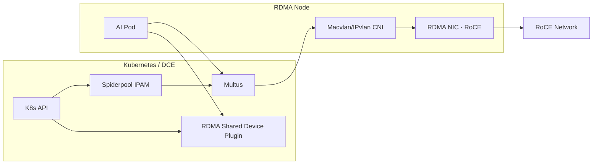

# Shared RDMA (Macvlan/IPvlan)

This page describes the recommended practice of providing RDMA capabilities for Pods in shared mode
through Macvlan/IPvlan in RoCE scenarios.

## Scope of Application

- Applies only to **RoCE** networks (Ethernet)
- Suitable for AI/computing scenarios that require high resource utilization and moderate isolation
- Can be used in bare metal or virtualized environments

## Prerequisites

- Spiderpool is installed (refer to [Install Spiderpool](install.md))
- The RDMA NIC driver is installed (refer to [Install the NVIDIA OFED Driver](ofed_driver.md))
- The RDMA subsystem is in **shared** mode
- The Underlay subnet and gateway are planned

> Shared mode supports only RoCE, not InfiniBand.

## Architecture



## Configuration Steps

### 0. Offline/Addon preparation (recommended)

In offline environments, it is recommended to prepare the Spiderpool Addon offline package first,
and then perform the installation and upgrade.

### 1. Host preparation (shared mode)

Confirm that the RDMA subsystem is in shared mode on the RDMA node:

```bash
rdma system
rdma system set netns shared
```

### 2. Enable shared RDMA components

The following options are recommended when installing Spiderpool:

- **RdmaSharedDevicePlugin**: Used to expose shared RDMA resources
- **AutoInjectRdmaResource**: Automatically inject RDMA resources for AI workloads (optional)

For detailed parameters, refer to [RDMA Environment Preparation and Installation](rdmapara.md).

**Key parameter recommendations:**

| Parameter | Recommended Value | Description |
| --- | --- | --- |
| RdmaSharedDevicePlugin.install | true | Enable the shared RDMA plugin |
| rdmaSharedDevicePlugin.deviceConfig.resourceName | hca_shared_devices | RDMA resource name |
| rdmaSharedDevicePlugin.deviceConfig.vendors | 15b3 | RDMA NIC vendor |
| rdmaSharedDevicePlugin.deviceConfig.deviceIDs | 1017 | RDMA NIC deviceID |

### 3. Create the Multus configuration

Create the corresponding Multus configuration for the RDMA NIC. For examples and configuration
descriptions, refer to [Manage Multus CR](../../../config/multus-cr.md).

### 4. Create an IP pool

Create an IPPool based on the service network segment. Refer to
[Create Subnet and IP Pool](../../../config/ippool/createpool.md).

### 5. Create a workload and inject RDMA resources

Example of adding an RDMA annotation for an AI workload:

```yaml
metadata:
  annotations:
    cni.spidernet.io/rdma-resource-inject: "rdma-class-a"
```

> The annotation value must be consistent with the RDMA resource class in Spiderpool.

## Verification

- Confirm that the Pod has been allocated the expected Underlay IP
- Check whether the RDMA device is visible inside the Pod (for example, using rdma tools)
- Check whether the RDMA resources on the node are reported correctly

Example:

```bash
kubectl get node -o json | jq -r '[.items[] | {name:.metadata.name, rdma:.status.allocatable}]'
```

## O&M Recommendations

- View RDMA metrics: [RDMA Metrics](../rdma-metrics.md)
- Use the visualization dashboard: [RDMA Dashboard](../rdma-dashboard.md)

## Notes

- In shared mode, multiple Pods share the RDMA device of the host, so isolation is weaker
- For RoCE scenarios, complete the lossless network and MTU configuration in advance
- If you need stronger isolation and performance, the SR-IOV solution is recommended
