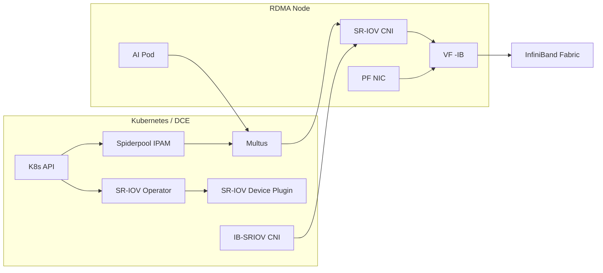

# Dedicated RDMA (SR-IOV InfiniBand)

This page describes the recommended practice of providing dedicated RDMA resources for Pods through
SR-IOV in InfiniBand Fabric scenarios.

## Scope of Application

- Applies only to **InfiniBand** networks
- AI/HPC scenarios that require high performance, low latency, and strong isolation
- Depends on the IB Fabric and Subnet Manager

## Prerequisites

- The InfiniBand Fabric is deployed in the cluster and the Subnet Manager (such as OpenSM) works properly
- The RDMA NIC supports SR-IOV and VFs are enabled
- The RDMA subsystem is in **exclusive** mode
- Spiderpool is installed (refer to [Install Spiderpool](install.md))

## Architecture



## Configuration Steps

### 0. Offline/Addon preparation (recommended)

In offline environments, it is recommended to prepare the Spiderpool Addon offline package first,
and then perform the installation and upgrade.

### 1. Host preparation (exclusive mode)

Set the exclusive mode and enable SR-IOV VFs on the RDMA node:

```bash
rdma system
rdma system set netns exclusive
```

### 2. Install and enable IB SR-IOV components

The following are recommended when installing Spiderpool:

- **Sriov-Operator** (used to install the SR-IOV CNI and device plugin)
- **IB-SRIOV CNI** (for InfiniBand scenarios)

**Key parameter recommendations:**

| Parameter | Recommended Value | Description |
| --- | --- | --- |
| SriovOperator.install | true | Enable the SR-IOV Operator |
| sriovDevicePlugin.resourceName | rdma_ib_sriov | SR-IOV resource name |
| ibSriovCni.install | true | Enable the IB-SRIOV CNI |

### 3. Configure the SR-IOV node policy

Create an SR-IOV node policy for the IB NIC to define the VFs and resource names.
Refer to [SR-IOV Node Policy](../../../config/sriov-node-policy.md).

### 4. Create the Multus configuration

Create a Multus configuration for the IB network.
Refer to [Manage Multus CR](../../../config/multus-cr.md).

### 5. Create an IP pool

Create an IPPool based on the service network segment.
Refer to [Create Subnet and IP Pool](../../../config/ippool/createpool.md).

### 6. Create a workload

Bind the IB resources and network configuration as needed to ensure that the Pod obtains
the expected IB resources.

## Verification

- Whether the Pod has obtained the expected Underlay IP
- Whether the IB device and RDMA resources are visible inside the Pod
- Whether the Subnet Manager works stably

Example:

```bash
kubectl get sriovnetworknodepolicy -n kube-system
kubectl get node -o json | jq -r '[.items[] | {name:.metadata.name, rdma:.status.allocatable}]'
```

## O&M Recommendations

- View RDMA metrics: [RDMA Metrics](../rdma-metrics.md)
- Use the visualization dashboard: [RDMA Dashboard](../rdma-dashboard.md)

## Notes

- IB scenarios have higher requirements on hardware and the network environment
- Avoid mixing with the shared RDMA plugin
- You can continuously observe RDMA metrics through the monitoring dashboards
