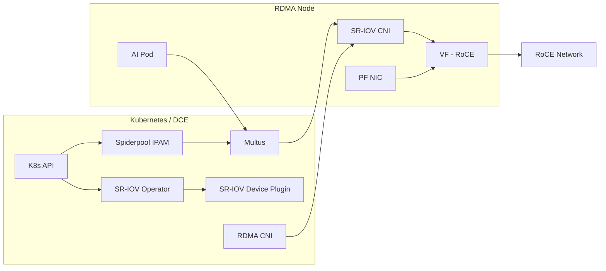

# Dedicated RDMA (SR-IOV RoCE)

This page describes the recommended practice of providing dedicated RDMA resources for Pods through
SR-IOV in RoCE scenarios.

## Scope of Application

- Applies only to **RoCE** networks (Ethernet)
- AI/computing scenarios that require stronger isolation and higher performance
- Depends on the NIC SR-IOV capability and bare metal deployment

## Prerequisites

- The RDMA NIC supports SR-IOV and VFs are enabled
- The RDMA subsystem is in **exclusive** mode
- Spiderpool is installed (refer to [Install Spiderpool](install.md))
- The Underlay subnet and gateway are planned

## Architecture



## Configuration Steps

### 0. Offline/Addon preparation (recommended)

In offline environments, it is recommended to prepare the Spiderpool Addon offline package first,
and then perform the installation and upgrade.

### 1. Host preparation (exclusive mode)

Set the exclusive mode and enable SR-IOV VFs on the RDMA node:

```bash
rdma system
rdma system set netns exclusive
```

To make it persistent, configure the `ib_core` parameter according to the host operating system
specifications and restart for it to take effect.

### 2. Install and enable SR-IOV components

The following are recommended when installing Spiderpool:

- **Sriov-Operator** (used to install the SR-IOV CNI and device plugin)
- **RDMA CNI** (used for RDMA device isolation)

> Note: The SR-IOV solution is not recommended to be enabled together with the shared RDMA plugin.

**Key parameter recommendations:**

| Parameter | Recommended Value | Description |
| --- | --- | --- |
| SriovOperator.install | true | Enable the SR-IOV Operator |
| sriovDevicePlugin.resourceName | rdma_sriov | SR-IOV resource name |
| rdmaCNI.install | true | Enable the RDMA CNI |

### 3. Configure the SR-IOV node policy

Create an SR-IOV node policy for the node to define the available VFs and resource names.
Refer to [SR-IOV Node Policy](../../../config/sriov-node-policy.md).

### 4. Create the Multus configuration

Create a Multus configuration for the SR-IOV network.
Refer to [Manage Multus CR](../../../config/multus-cr.md).

### 5. Create an IP pool

Create an IPPool based on the service network segment.
Refer to [Create Subnet and IP Pool](../../../config/ippool/createpool.md).

### 6. Create a workload and bind SR-IOV resources

Specify the corresponding network and resource configuration for the workload
(see the Multus and SR-IOV documentation for examples).

## Verification

- Whether the Pod has obtained the expected Underlay IP
- Whether the dedicated RDMA device is visible inside the Pod
- Whether the VF and resource reporting on the node meets expectations

Example:

```bash
kubectl get sriovnetworknodepolicy -n kube-system
kubectl get node -o json | jq -r '[.items[] | {name:.metadata.name, rdma:.status.allocatable}]'
```

## O&M Recommendations

- View RDMA metrics: [RDMA Metrics](../rdma-metrics.md)
- Use the visualization dashboard: [RDMA Dashboard](../rdma-dashboard.md)

## Notes

- The SR-IOV solution depends on hardware and BIOS configuration
- For RoCE, complete the lossless network and MTU planning in advance
- If you need higher resource utilization, prefer the shared RDMA solution
