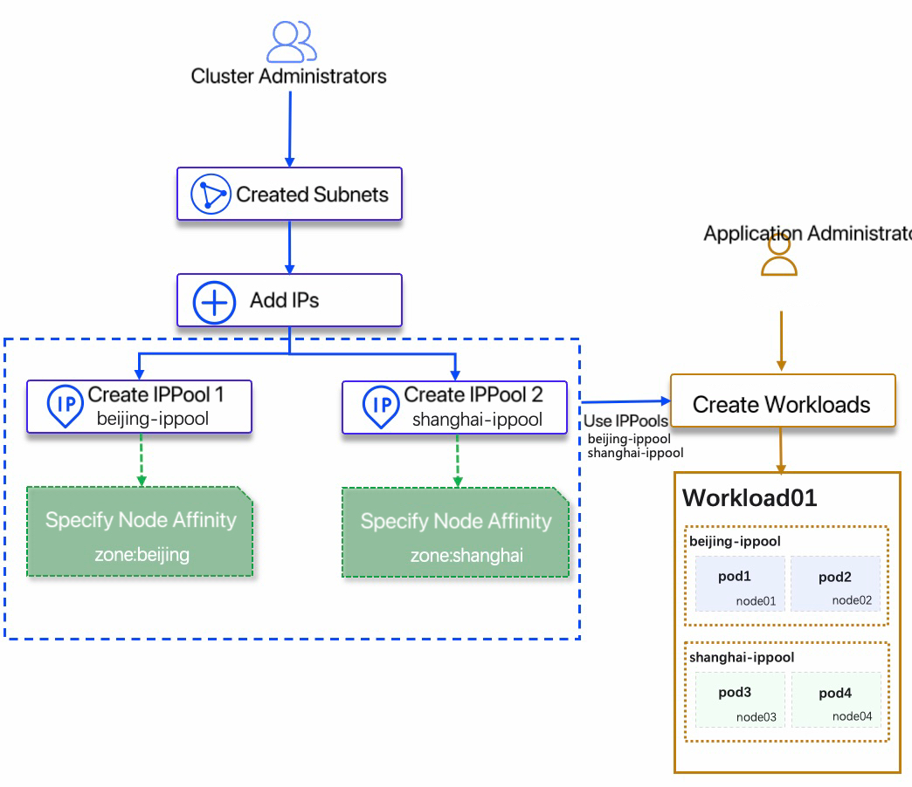
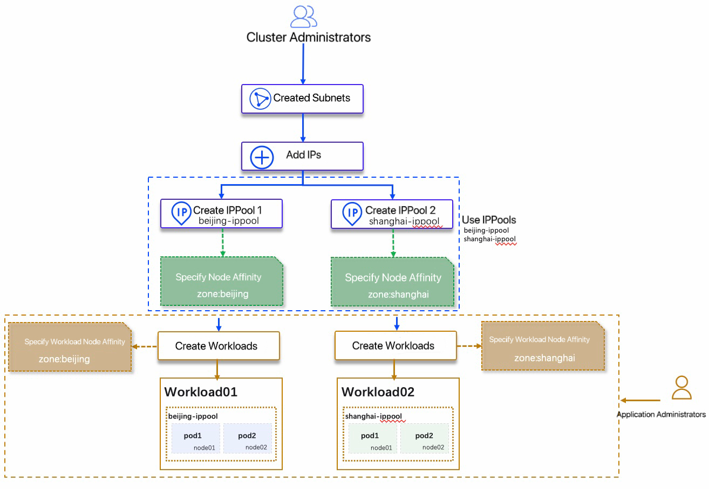

# Instructions for using the IPPool

This page introduces IP allocation and management based on Spiderpool, and describes different usage scenarios of IPPools. Please make sure that [SpiderPool has been installed correctly](install.md) before use.

## Fixed workload IP

Spiderpool provides two ways to use fixed IP for workloads:

1. `Manually create a fixed IPPool`, specify the workload affinity of the IPPool to be used, and select the corresponding fixed IPPool when creating the workload.

    **Applicable Scenarios**: This method is applicable to the scenario of strong IP control. It is necessary to apply for opening the firewall in advance for IP release. After the release, the workload can use the corresponding fixed IP. For the operation method, please refer to: [Create subnet and IPPool](createpool.md) and [Workload use IPPool](usage.md)

2. `Automatically create a fixed IPPool`, after creating a subnet and adding an IP to be used, the application administrator will automatically create a fixed IPPool based on the created subnet, and the created IPPool will only be used exclusively by this application load.

    **Applicable Scenarios**: IP coarse-grained management scenario, the firewall can be released based on a large range of IP (such as: 10.6.124.10~10.6.124.200), after the release, the workload can automatically obtain an IP based on this IP segment and create a corresponding fixed IPPool. For the operation method, please refer to [Create Subnet and IPPool](createpool.md) and [Workload Uses IPPool](usage.md).

    

## Node affinity for IPPool

**Applicable scene**:

When the cluster nodes are across subnets or across data centers, the subnets available on different Nodes are different, for example:

1. In the same data center, the nodes connected to the cluster belong to different subnets
2. In a single cluster, nodes span different data centers

At the same time when the workload is created:

1. The same workload needs to be scheduled to **cross-subnet** or **cross-data center** nodes. The usage process is as follows:

    

2. Different workloads need to be scheduled on **different nodes** and use **different subnets**, such as: [Mixed use of SRI-OV and Macvlan CNI](../../plans/ethplan.md ), the specific usage process is as follows:

    

## Namespace affinity for IPPools

**Applicable scene**:

If the created IPPool is only assigned to a certain namespace, the IP in this IPPool can be used when the workload in this namespace is created, and the IPPool with namespace affinity is added as a share in the specified namespace. For the operation method, please refer to [Create subnet and IPPool](createpool.md).

## FAQ

1. Question: What is the final effect of adding namespace affinity and adding workload affinity, or node affinity?

    Answer: The effect is the superposition of multiple affinities, and all affinities must be met before this IPPool can be used.

2. Question: Can the IPPool with namespace affinity be subdivided based on the namespace IPPool, and then allocated to the application as a fixed IPPool?

    For example: `ippool01` belongs to subnet 10.6.124.0/24, there are 100 (10.6.124.10~109) IPs in `ippool01`, and namespace affinity is added: `kubernetes.io/metadata.name: default`, is it possible to convert:

    1. 10.6.124.10~19 is assigned to the workload01 under the `default` namespace and **fixed**
    2. 10.6.124.20~29 is assigned to the workload02 under the `default` namespace and **fixed**
    3. ...

    Answer: No, it cannot. It only can be used for **one** application workload and **fixed** workload. The usage method is to: add the affinity of the corresponding workload to the IPPool at the same time.
