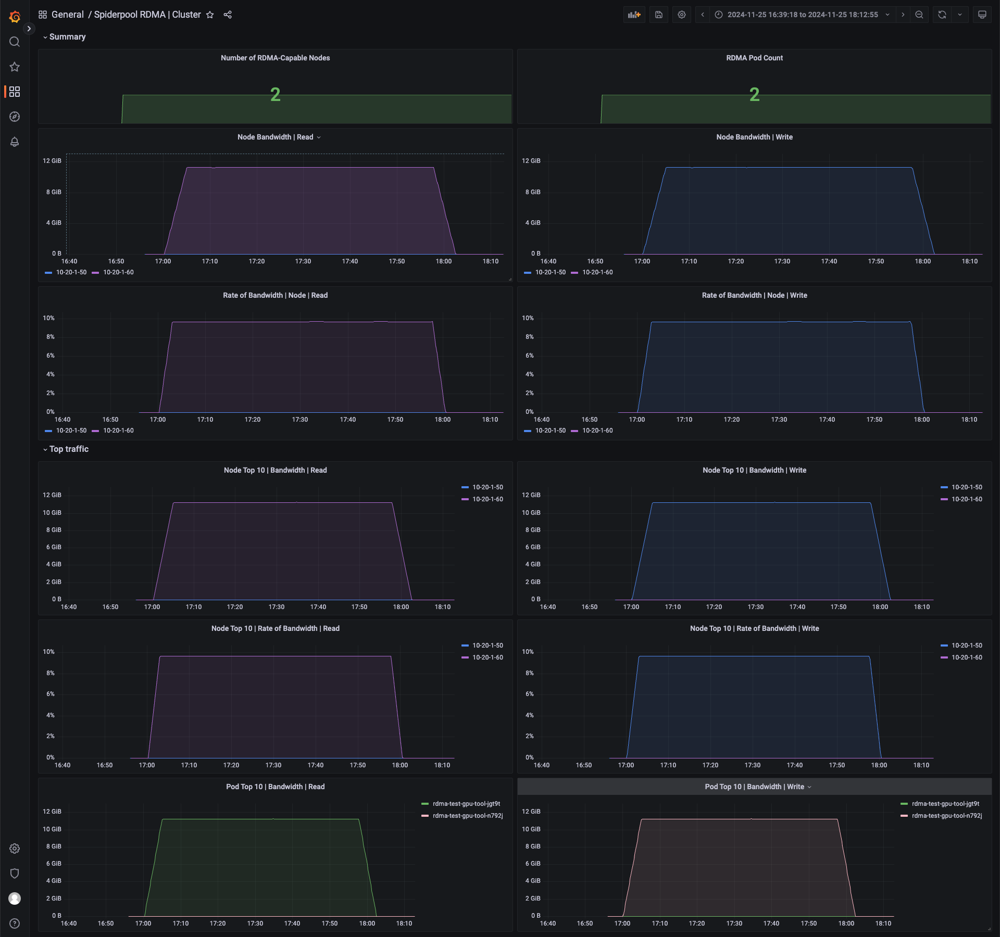
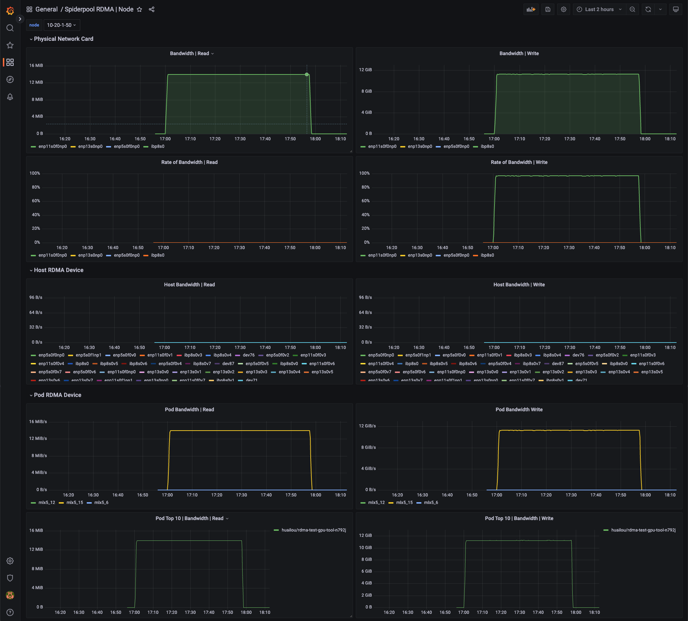
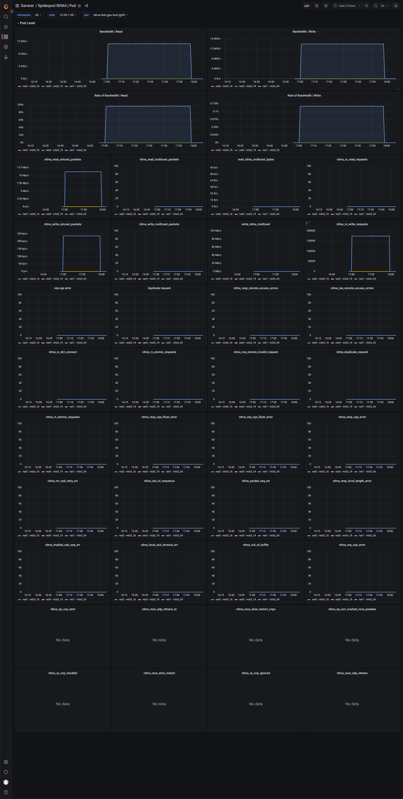
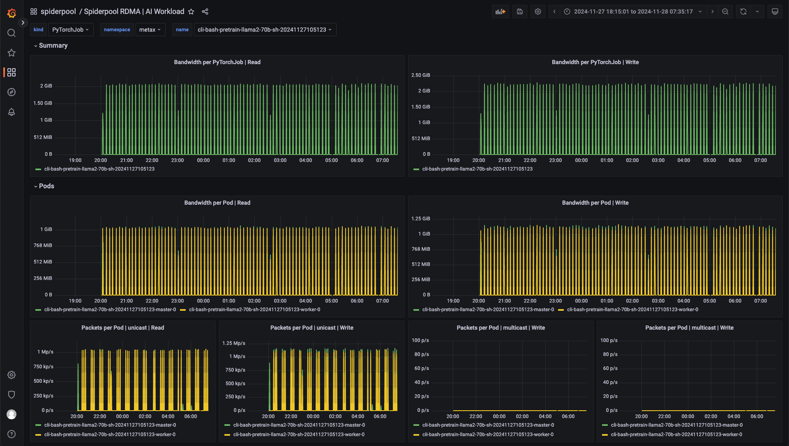

# RDMA Metrics

RDMA is an efficient network communication technology that allows one computer to directly access the
memory of another computer without operating system involvement, thereby reducing latency and improving
data transfer speed and efficiency. RDMA supports high-speed data transfer and reduces CPU load,
making it well suited for scenarios that require high-speed network communication.

In a Kubernetes cluster, Spiderpool CNI supports two RDMA scenarios: RoCE and IB. Pods can use RDMA NICs
in shared or exclusive mode, and users can choose the appropriate way to use RDMA NICs based on their needs.

Spiderpool also provides an RDMA exporter and Grafana monitoring dashboards. By monitoring the performance
of Pod/Node RDMA networks in real time, including throughput, latency, and packet loss rate, problems can
be detected in time and measures can be taken to resolve them, improving network reliability and performance.

## Common Scenarios of RDMA Metrics

1. Performance monitoring:

    - Throughput: Measures the amount of data transmitted over the network.
    - Out-of-order: Monitors out-of-order statistics in the network.
    - Packet loss rate: Monitors the number of packets lost during transmission.

2. Error detection:

    - Transmission errors: Detects errors in data transmission.
    - Connection failures: Monitors failed connection attempts and disconnections.

3. Network health:

    - Congestion: Detects network congestion and bottlenecks.

## How to Enable

```shell
helm upgrade --install spiderpool spiderpool/spiderpool --reuse-values --wait --namespace spiderpool --create-namespace \
  --set sriov.install=true \
  --set spiderpoolAgent.prometheus.enabled=true \
  --set spiderpoolAgent.prometheus.enabledRdmaMetric=true \
  --set grafanaDashboard.install=true \
  --set spiderpoolAgent.prometheus.serviceMonitor.install=true
```

| Parameter | Description |
|------|------|
| `--reuse-values` | Reuse the existing configuration |
| `--wait` | Wait for all Pods to be running |
| `--namespace` | Specify the namespace for the Helm installation |
| `--set sriov.install=true` | Enable SR-IOV. For more information, refer to "Create a Cluster - Providing RDMA Communication Capabilities for Containers Based on SR-IOV" |
| `--set spiderpoolAgent.prometheus.enabled=true` | Enable Prometheus monitoring |
| `--set spiderpoolAgent.prometheus.enabledRdmaMetric=true` | Enable the RDMA metrics exporter |
| `--set grafanaDashboard.install=true` | Enable the GrafanaDashboard dashboard (the cluster must have grafana-operator installed; if the operator is not used, manually import the dashboards from `charts/spiderpool/files`) |

## Metrics Reference

Visit [Metrics reference](https://spidernet-io.github.io/spiderpool/v1.0/reference/metrics/) for
detailed information about the metrics.

## Grafana Dashboards

Among the following four dashboards, the RDMA Pod dashboard shows only the monitoring data of SR-IOV Pods
from the RDMA isolation subsystem. For macvlan Pods that use RDMA in shared mode, the RDMA NIC data is
not included in this dashboard.

The Grafana RDMA Cluster dashboard shows the RDMA monitoring of each node in the current cluster.



The Grafana RDMA Node dashboard shows the RDMA monitoring of each physical NIC and the bandwidth
utilization of that physical NIC. It also provides statistics of the VF NICs on the host of that node
and the monitoring of the RDMA NICs used by Pods on that node.



The Grafana RDMA Pod dashboard shows the RDMA monitoring of each NIC in a Pod, and provides NIC error
statistics that can be used to troubleshoot problems.



The Grafana RDMA Workload dashboard. During AI inference and training, top-level resources such as Job,
Deployment, and KServer are often used to deliver CRs to start a group of Pods for training. This dashboard
shows the RDMA monitoring of each top-level resource.



## Metrics Description

| Name | Description | Source |
|-----|-----|------|
| rx_write_requests | Number of WRITE requests received | rdma cli |
| rx_read_requests | Number of READ requests received | rdma cli |
| rx_atomic_requests | Number of atomic operation requests received | rdma cli |
| rx_dct_connect | Number of DCT connection requests received | rdma cli |
| out_of_buffer | Number of errors caused by insufficient buffer | rdma cli |
| out_of_sequence | Number of out-of-order packets received | rdma cli |
| duplicate_request | Number of duplicate requests received | rdma cli |
| rnr_nak_retry_err | Number of times the received RNR NAK packets exceeded the QP retry limit | rdma cli |
| packet_seq_err | Number of packet sequence errors | rdma cli |
| implied_nak_seq_err | Number of implied NAK sequence errors | rdma cli |
| local_ack_timeout_err | Number of sender QP ACK timer timeouts (for RC, XRC, and DCT QPs) | rdma cli |
| resp_local_length_error | Number of local length errors detected by the responder | rdma cli |
| resp_cqe_error | Number of responder CQE errors | rdma cli |
| req_cqe_error | Number of CQE completion errors detected by the requester | rdma cli |
| req_remote_invalid_request | Number of remote invalid request errors detected by the requester | rdma cli |
| req_remote_access_errors | Number of requester remote access errors | rdma cli |
| resp_remote_access_errors | Number of responder remote access errors | rdma cli |
| resp_cqe_flush_error | Number of responder CQE flush errors | rdma cli |
| req_cqe_flush_error | Number of requester CQE flush errors | rdma cli |
| roce_adp_retrans | Number of RoCE adaptive retransmissions | rdma cli |
| roce_adp_retrans_to | Number of RoCE adaptive retransmission timeouts | rdma cli |
| roce_slow_restart | Number of times RoCE slow restart was triggered | rdma cli |
| roce_slow_restart_cnps | Number of CNP packets sent in RoCE slow restart mode | rdma cli |
| roce_slow_restart_trans | Number of times RoCE switched to the slow restart state | rdma cli |
| rp_cnp_ignored | Number of CNP packets received but ignored by the Reaction Point HCA | rdma cli |
| rp_cnp_handled | Number of CNP packets processed by the Reaction Point HCA for rate adjustment | rdma cli |
| np_ecn_marked_roce_packets | Number of ECN-marked RoCEv2 congestion packets received by the Notification Point | rdma cli |
| np_cnp_sent | Number of CNP packets sent by the Notification Point due to detected congestion | rdma cli |
| rx_icrc_encapsulated | Number of RoCE packets received with ICRC check errors | rdma cli |
| vport_speed_mbps | Virtual port speed (Mbps) | ethtool cli |
| rx_discards | Number of received packets discarded by the device | ethtool cli |
| tx_discards | Number of transmitted packets discarded by the device | ethtool cli |
| rx_pause | Number of received pause packets discarded by the device | ethtool cli |
| tx_pause | Number of transmitted pause packets discarded by the device | ethtool cli |
