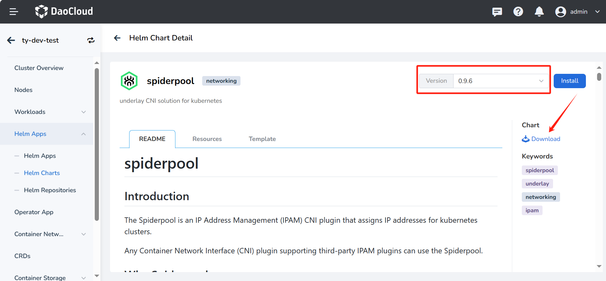
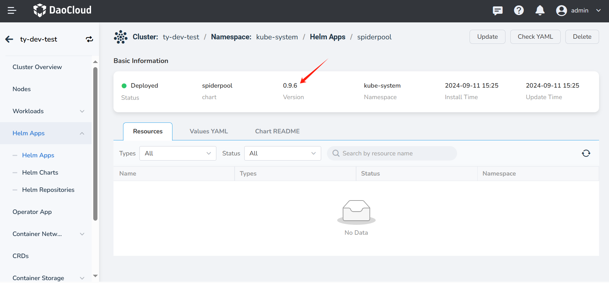
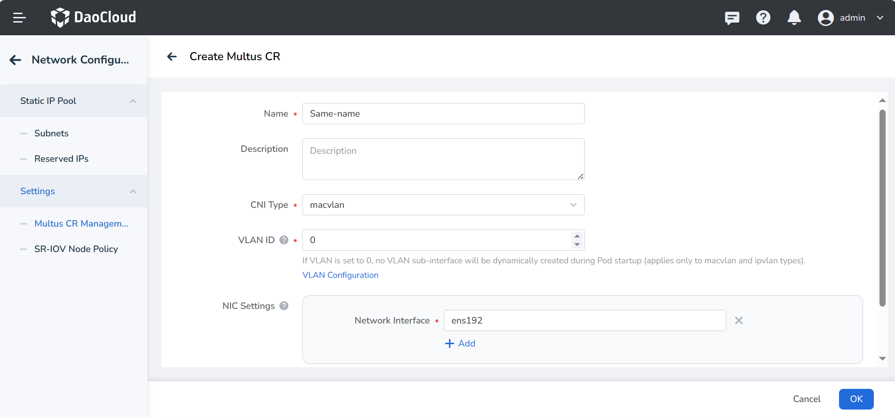

# Upgrade Spiderpool

This page explains how to upgrade an old version of Spiderpool in DCE 5.0 to a newer version. This document
uses the upgrade to Spiderpool v0.9.6 as an example.

## Prerequisites

1. A Kubernetes cluster
2. [Helm](https://helm.sh/docs/intro/install/) installed

## Obtain Chart Package and Image

You can sync the image package and Chart package to the offline repository in one of the following two ways.

### Method 1: Upgrade the Addon offline package and sync Spiderpool Chart and image

The Spiderpool offline package is stored in Addon. You can refer to
[download Addon offline package](../../../download/addon/history.md) to download the latest Addon offline package.
After downloading, open the `clusterConfig.yaml`, modify the `addonOfflinePackagePath` field to specify the path
where Addon is located, and complete the upgrade of the Addon offline package.

1. After upgrading Addon, you can obtain the Chart package as follows:

    Download the v0.9.6 Chart package through the DCE 5.0 UI as follows:

    

2. Upload and unzip the Chart package to the environment

    ```bash
    tar -xvf spiderpool-0.9.6.tgz -C /root/spiderpool
    ```

### Method 2: Manually upgrade Spiderpool

1. Get the Chart package

    Obtain the Chart package in the environment using the following Helm commands.

    ```bash
    $ helm repo add spiderpool https://spidernet-io.github.io/spiderpool
    $ helm repo update spiderpool

    $ helm search repo spiderpool/spiderpool --versions
    NAME                   CHART VERSION   APP VERSION  DESCRIPTION
    spiderpool/spiderpool  0.9.6           0.9.6        ipam for kubernetes cni
    ...

    $ helm fetch spiderpool/spiderpool --version 0.9.6

    $ ls spiderpool-0.9.6.tgz
    spiderpool-0.9.6.tgz
    ```

    Upload the Chart package to the offline repository.

    ```shell
    # Upload Chart package
    helm repo add [addon] http://10.5.10.210:8081 # Replace [Addon] with offline repo name, and replace with your image repository URL
    helm cm-push -u rootuser -p rootpass123 --insecure {Chart directory or tar package} # Replace with your image repo username and password
    ```

2. Get the offline image package

    On any internet-connected environment with Docker installed,
    run the following commands to get the Spiderpool images.

    ```shell
    docker pull ghcr.m.daocloud.io/spidernet-io/spiderpool/spiderpool-controller:v0.9.6
    docker pull ghcr.m.daocloud.io/spidernet-io/spiderpool/spiderpool-agent:v0.9.6
    ```

    Save as offline image tar packages using `docker save` and upload to the offline environment.

    ```shell
    docker save -o spiderpool-0.9.6.tar ghcr.m.daocloud.io/spidernet-io/spiderpool/spiderpool-controller:v0.9.6 ghcr.m.daocloud.io/spidernet-io/spiderpool/spiderpool-agent:v0.9.6
    ```

3. Load images into Docker or containerd in the upgrade environment.
  
    === "Docker"

        ```shell
        docker load -i spiderpool-0.9.6.tar
        ```

    === "containerd"

        ```shell
        ctr -n k8s.io image import spiderpool-0.9.6.tar
        ```

!!! note

    Every node needs to load images into Docker or containerd.
    After loading, tag the images to keep the Registry and Repository
    consistent with the installation time.

## Delete spiderpool-init

- Starting from v0.9.5, Spiderpool has changed the spiderpool-init component from a Pod to a Job, making upgrades
  more flexible. When upgrading from v0.9.5 to a higher version, there is no need to delete the spiderpool-init Job.

- When upgrading from any version below v0.9.5 to a version higher than v0.9.5, please delete the spiderpool-init
  Pod before upgrading Spiderpool. If it is not deleted, it may lead to some update conflicts. Additionally, after
  performing `helm upgrade`, the spiderpool-init Job will be automatically created, but at that point, the spiderpool-init
  Pod may still remain.

    ```bash
    [root@controller-node-1 ~]# kubectl get po -n kube-system spiderpool-init
    NAME              READY   STATUS      RESTARTS   AGE
    spiderpool-init   0/1     Completed   0          49m

    [root@controller-node-1 ~]# kubectl delete po -n kube-system spiderpool-init
    pod "spiderpool-init" deleted
    ```

## Update CRD

Since updating CRDs through Helm is not possible via UI,
update the Spiderpool CRDs on the Master node using `kubectl apply`.

```bash
[root@controller-node-1 crds]# ls
spiderpool.spidernet.io_spidercoordinators.yaml  spiderpool.spidernet.io_spiderippools.yaml        spiderpool.spidernet.io_spiderreservedips.yaml
spiderpool.spidernet.io_spiderendpoints.yaml     spiderpool.spidernet.io_spidermultusconfigs.yaml  spiderpool.spidernet.io_spidersubnets.yaml

[root@controller-node-1 crds]# ls | grep '\.yaml$' | xargs -I {} kubectl apply -f {}
customresourcedefinition.apiextensions.k8s.io/spidercoordinators.spiderpool.spidernet.io created
customresourcedefinition.apiextensions.k8s.io/spiderendpoints.spiderpool.spidernet.io configured
customresourcedefinition.apiextensions.k8s.io/spiderippools.spiderpool.spidernet.io configured
customresourcedefinition.apiextensions.k8s.io/spidermultusconfigs.spiderpool.spidernet.io created
customresourcedefinition.apiextensions.k8s.io/spiderreservedips.spiderpool.spidernet.io configured
customresourcedefinition.apiextensions.k8s.io/spidersubnets.spiderpool.spidernet.io configured
```

## Upgrade via DCE 5.0 UI

After correctly uploading the offline Chart and image packages to the offline environment
in the previous steps, you can now perform the upgrade via the 5.0 UI.
In versions below v0.7.0, Spiderpool was used in conjunction with the Multus-underlay plugin,
while the new version of Spiderpool has integrated the Multus plugin.
When updating via UI, turn off the **Install Multus CNI** button to avoid redundant
installation. As shown in the image below, click **Update** and wait for the update to complete.


- __Multus Setting__ -> __MultusCNI__ -> __Default CNI Name__ : Cluster default CNI name.  When updating,
  this value should be consistent with the one filled in during installation. If the value is empty during
  installation, Spiderpool will automatically obtain the default CNI based on the existing CNI conf file
  in /etc/cni/net.d/. At this time Update Spiderpool. Fill in the value corresponding to the field in
  the /etc/cni/net.d/00-multus.config file: `clusterNetwork`, such as calico.

## Verification

After the upgrade, check that the version is correct.



In Spiderpool versions 0.7.0 and above, the SpiderMultusConfig CR is provided to automatically
manage the Multus NetworkAttachmentDefinition CR. If your cluster has old Multus CRs,
the new version, due to different creation mechanisms, will not display your old Multus CRs in the UI.
You can create a Multus CR with the same name through UI to manage it,
and it will not affect the use of your original features.
Note that the values filled in UI, such as `Vlan ID` and `network interface`,
you need to be completely consistent with those in your original Multus CR.


