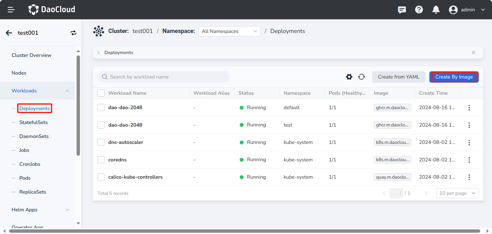
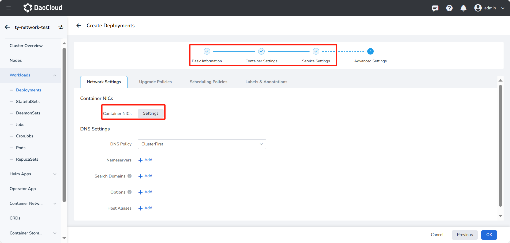
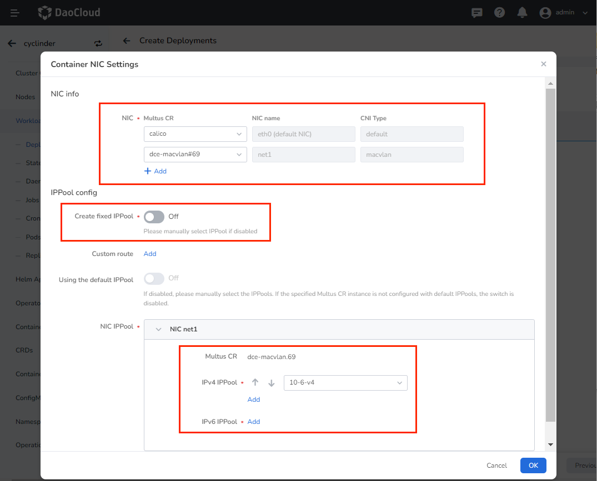
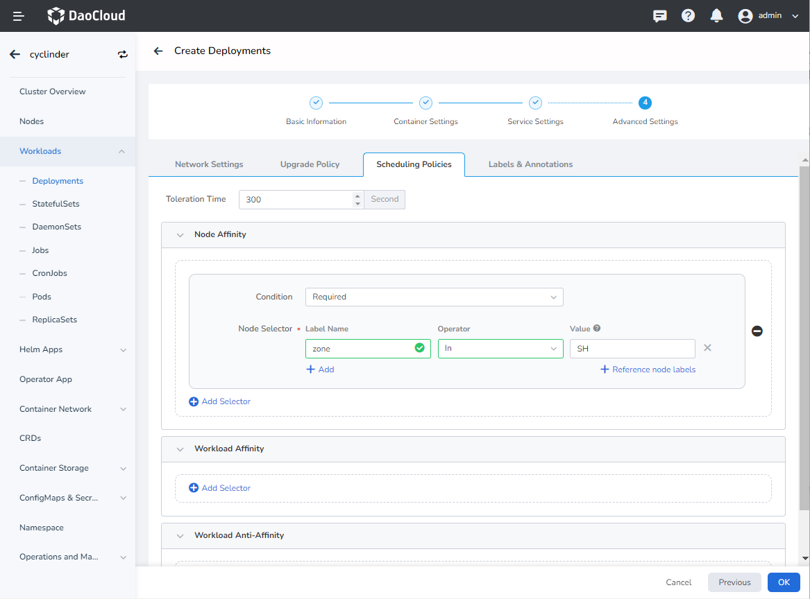
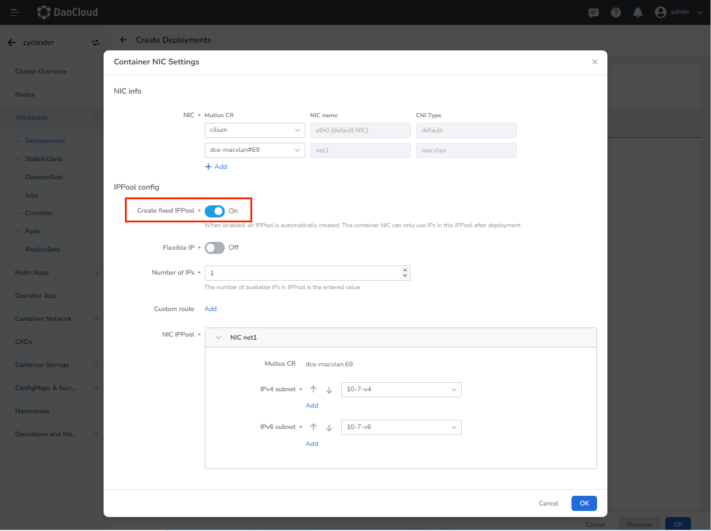
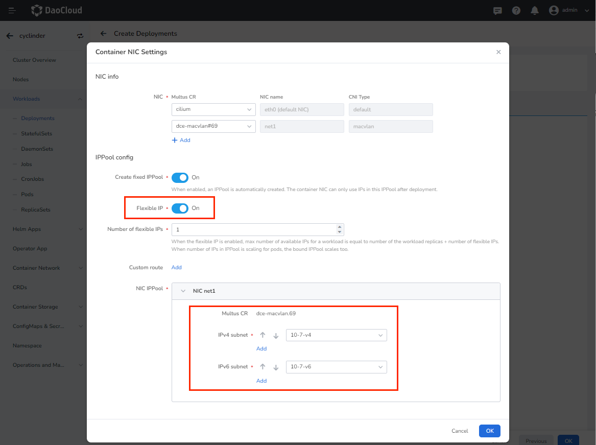
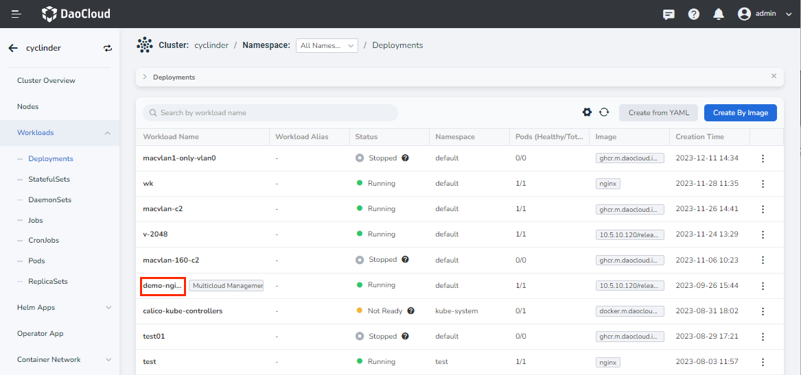
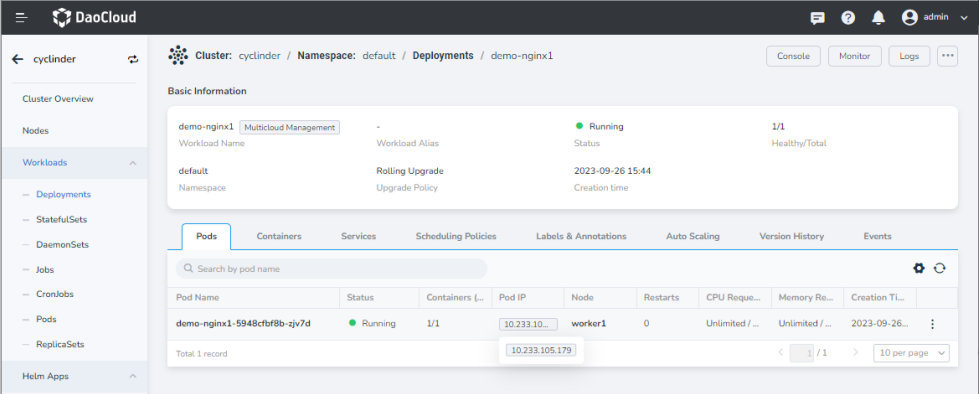

# Use IP Pool by Workload

This page describes how to configure multiple NICs for workload Pods in combination with Multus and Underlay CNI, and how to allocate and fix IPs of the Underlay network through Spiderpool. Mainly include:

- Multi-container NIC for Pods
- Workloads use IP pools
- Workloads use fixed IP pools
- Workloads use auto-created fixed IP pools

## Prerequisites

1. [Install SpiderPool](../../modules/spiderpool/install.md).
2. [Install Multus with Macvlan/SR-IOV](../../modules/multus-underlay/install.md).
3. If you use manual selection of IP pool, [Create IP Subnet and IP Pool](../../modules/spiderpool/createpool.md) in advance. If you use automatic creation of a fixed IP pool, [Create  IP Pool](../../modules/spiderpool/createpool.md) in advance.

## Steps

1. Log in to the platform UI, click `Container Management`->`Cluster List` in the left navigation bar, and find the corresponding cluster. Then, select `Deployments` in the left navigation bar and click `Create from an Image`.

    

2. On the `Deployments` page, complete the infor,ation input of `Basic Information`, `Container Settings`, and `Service Settings`. Then, go to `Advanced Settings` and click `Container Network Card` —> `Configuration`.

    

3. On `Container Network Card Configuration` page, enter following arguments:

    - `NIC info`: If the created application container needs to use multiple NICs, such as one for east-west traffic and another for north-south traffic.

        - eth0 (default NIC): Overlay CNI, Calico/Cilium is the default.

        - net1: Underlay CNI configuration is optiional, such as Macvlan/SR-IOV. The example here is Macvlan.

    - `IPPool config`: Rules for Underlay CNI IP allocation.

        - `Create fixed IPPool`: When enabled, you only need to select the corresponding subnet for the new container NICs (net1, net2, net3), and the workload will automatically create a fixed IP pool when it is deployed. The container NICs can only use the addresses in this IP pool after deployment.
        - `Flexible IP`: When enabled, the number of IPs in the IP pool will change according to the number of elastic IPs set. The maximum number of available IPs is equal to the number of Pod copies + the number of resilient IPs. The IP pool will be expanded when the Pod is expanded.
        - `Custom route`: Custom routes can be added when applications are created with special routing needs.
        - `NIC IPPool`:  Select the subnet to be used by the corresponding NIC or the corresponding IP pool.

    **Manually select an existing IP pool**

    To manually select an IP pool, you need to create an IP pool in advance. You can select the range of the IP pool as `shared IP pool`, add the current `application affinity IP pool`, and add the current `namespace affinity IP pool`.

    

    Note: If the chosen [IP Pool Creation Time](\createpool.md) has added node affinity like: `zone:beijing`, please add the corresponding label `zone:beijing` when creating the workload. For use cases, please refer to: [Instructions for Use of IP Pool](ippoolusage.md)

    **Automatically create fixed IP pool**

    You only need to select the corresponding subnet to automatically create a fixed IP pool

    

    **Use the default IP pool**
    Create an IP pool in advance, and in the Multus CNI configuration, select the network card with the default IP pool to use the default IP pool function. For details, please refer to: [Creating a Multus CR](../../config/multus-cr.md)
    

4. After creating the workload, you can click the corresponding workload `workload01` to view the IP used by the workload Pod.

    

    

## YAML usage

1. Use the Pod annotation `ipam.spidernet.io/ippool` to allocate IP from the IP pool `testingippool` to create the following Deployment:

    ```yaml
    apiVersion: apps/v1
    kind: Deployment
    metadata:
      name: workload01
    spec:
      replicas: 3
      selector:
        matchLabels:
          app: workload01
      template:
        metadata:
          annotations:
            ipam.spidernet.io/ippool: |-
              {
                "ipv4": ["testingippool"]
              }
          labels:
            app: workload01
        spec:
          containers:
          -name: workload01
            image: busybox
            imagePullPolicy: IfNotPresent
            command: ["/bin/sh", "-c", "trap : TERM INT; sleep infinity & wait"]
    ```

2. The Pods controlled by the Deployment `workload01` are assigned IP addresses from the IP pool `testingippool` and run successfully.

    ```bash
    kubectl get se
    NAME                                      INTERFACE   IPV4POOL               IPV4              IPV6POOL   IPV6   NODE            CREATETION TIME
    workload01-6967dcd8df-8b6zp   eth0        standard-ipv4-ippool   172.18.41.47/24                     spider-worker   7s
    standard-ippool-deploy-6967dcd8df-cvq79   eth0        standard-ipv4-ippool   172.18.41.50/24                     spider-worker   7s
    standard-ippool-deploy-6967dcd8df-s58x9   eth0        standard-ipv4-ippool   172.18.41.41/24                     spider-worker   7s
    ```
