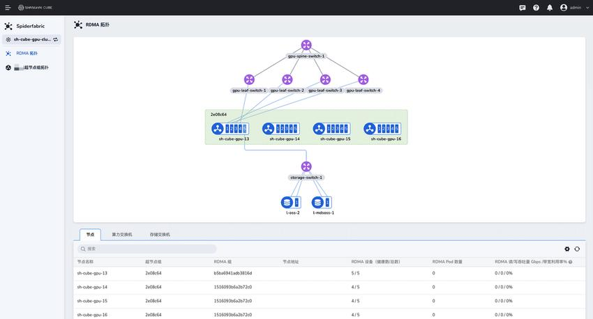

# RDMA Topology Discovery

## Feature Overview

The RDMA network neighbor discovery feature of Unifabric is a comprehensive network topology
discovery system designed specifically for RDMA networks. This feature performs underlying
neighbor discovery based on the LLDP protocol and, on that basis, provides various upper-layer
network management capabilities. Core capabilities include:

- **LLDP neighbor discovery:** Underlying network topology discovery based on the LLDP protocol,
  supporting all types of switch devices
- **Dedicated to RDMA networks:** Currently designed specifically for RDMA network environments
  based on the RoCE protocol
- **NIC classification management:** Distinguishes the GPU compute network (computeNics) from the
  storage network (storageNics)
- **rdmaNeighbor grouping:** An automatic grouping feature designed specifically for the GPU
  compute network, used for node topology management in scale-out scenarios
- **Kubernetes native:** Deeply integrated into the Kubernetes environment, managing network
  status through the FabricNode CRD

Among these, **rdmaNeighbor** is an upper-layer feature built on LLDP neighbor discovery. It is
designed specifically for topology grouping of the GPU compute network and is unrelated to the
storage network. By analyzing the GPU compute network connections between nodes, it automatically
groups nodes that have the same network topology, providing intelligent node management
capabilities for scale-out computing scenarios.

- [LLDP neighbor discovery](#lldp-neighbor-discovery)
- [Switch neighbor discovery](#_7)
- [ScaleoutLeafGroup automatic grouping](#scaleoutleafgroup-automatic-grouping)
- [Storage host neighbor reporting](#_6)

Concepts of GPU network classification:

- **GPU compute network (computeNics):** The high-speed RDMA network used for inter-GPU
  communication, model training, and inference computing
- **GPU storage network (storageNics):** The dedicated RDMA network used for data transmission
  between GPUs and the storage system



### Architecture Design

The neighbor discovery feature uses a layered architecture:

```
__________________________________________________________________________________
|                                                                                  |
|                            RDMA Network Neighbor Discovery                        |
|__________________________________________________________________________________|
|  LLDP Neighbor Discovery |  Switch Neighbor Report     |  External Storage Neighbor Report |
|  (Host Neighbor)         |  (Switch Neighbor)         |  (Storage Neighbor)            |
|                          |                            |                                |
|  • GPU compute network    |  • Switch topology         |  • Storage cluster discovery   |
|  • GPU storage network    |  • gnmi integration        |  • Cross-cluster connection    |
|  • LLDP protocol          |  • LLDP protocol           |  • Storage path optimization   |
|__________________________|____________________________|________________________________|

```

### LLDP Neighbor Discovery

LLDP neighbor discovery: Unifabric runs the lldpd daemon to automatically discover neighbor
devices in the GPU compute network and GPU storage network through the LLDP protocol, and
synchronizes them to the Status field of the FabricNode CRD for use in topology display in RDMA
networks.

#### Enable RDMA Network Neighbor Discovery

Note: This feature requires the LLDP protocol to be enabled on the switch; otherwise, neighbor
devices cannot be discovered.

The best-practice configuration is enabled by default. See [Install](../install.md). The
following describes the Helm values parameters involved in this feature in detail:

```yaml
features:
  rdmaNeighbor:
    # Enable the extended neighbor discovery feature
    enabled: true

    # The interval at which FabricNode synchronizes LLDP neighbors
    timeToWaitSyncLLDPToFabricNode: 1m

    # NIC filtering rule for the GPU compute network
    # Used to filter which RDMA NICs of the node belong to computeNics
    # Supports interface name wildcards (interface=) or subnets (cidr=)
    # Example: gpuRdmaNicFilter: "cidr=172.16.0.0/16"
    gpuRdmaNicFilter: "interface=ens16*"

    # NIC filtering rule for the GPU storage network
    # Used to filter which RDMA NICs of the node belong to storageNics
    storageRdmaNicFilter: "interface=ens17*"
    # Example: storageRdmaNicFilter: "cidr=172.17.0.0/16"

    # LLDP daemon configuration
    lldpd:
      # LLDP packet transmission interval (seconds)
      txInterval: 30

      # Management IP configuration mode. The default is empty, which uses the Kubelet NodeIP
      # as the management IP.
      # Supported: a list of IP addresses | an interface name | automatic selection (leave empty)
      managementIPPattern: ""

      # Interfaces on which LLDP is enabled. If empty, all RDMA NICs are used.
      # Supported: specific interfaces | pattern matching | all interfaces (leave empty)
      interfaces: "ens*"
```

Description of the `gpuRdmaNicFilter` and `storageRdmaNicFilter` configuration:

These configurations affect which RDMA physical NICs of the host are counted into computeNics and
storageNics in FabricNode.status:

- NIC classification priority: `storageRdmaNicFilter` is checked first, and unmatched NICs are
  counted into computeNics in FabricNode.status.
- If neither `gpuRdmaNicFilter` nor `storageRdmaNicFilter` is configured, all physical NICs of the
  host are counted into computeNics in FabricNode.status.
- If both `gpuRdmaNicFilter` and `storageRdmaNicFilter` are configured, NICs are filtered
  normally by the wildcard values and counted into computeNics and storageNics in
  FabricNode.status respectively.

**Recommended configuration**: Set `storageRdmaNicFilter` first; RDMA NICs that do not match are
automatically counted into computeNics in FabricNode.status.

Description of the `agent.config.rdmaNeighbor.lldpd.interfaces` configuration:

- **Specific interfaces:**

    ```yaml
    interfaces: "eth0,eth1,eth2"
    ```

- **Pattern matching:**

    ```yaml
    interfaces: "eth*" # All interfaces starting with eth
    ```

- **Exclusion pattern:**

    ```yaml
    interfaces: "eth*,!eth2" # All eth interfaces, excluding eth2
    ```

- **All interfaces** (default):

    ```yaml
    interfaces: "" # Use all RDMA NICs to enable LLDP
    ```

1. Deploy or update Unifabric using Helm

    ```bash
    helm upgrade --install unifabric -n unifabric --create-namespace ./chart --values values.yaml
    ```

1. Verify that the RDMA network neighbor discovery feature works properly

- Check whether the unifabric components (especially the lldpd container) are running properly.
  The lldpd log runs as an independent container in the unifabric-agent pod:

    ```bash
    kubectl get po -n unifabric
    NAME                         READY   STATUS    RESTARTS      AGE
    unifabric-746d4f8d75-qbknh   1/1     Running   1             12m
    unifabric-agent-4rpbw        2/2     Running   0             12m
    unifabric-agent-fgpkc        2/2     Running   0             12m
    ```

- Check whether the lldpNeighbor field of all NICs in computeNics and storageNics in the
  FabricNode CRD contains neighbor information:

Note: Because LLDP neighbor collection takes some time, by default unifabric-agent waits for one
minute before synchronizing LLDP neighbor information to the Status field of the FabricNode CRD.

If you need to adjust the waiting time, modify the Helm parameter
`agent.config.rdmaNeighbor.timeToWaitSyncLLDPToFabricNode`. The default is 1 minute.

```bash
~# kubectl get fabricnodes.unifabric.io sh-cube-master-3 -o yaml
apiVersion: unifabric.io/v1beta1
kind: FabricNode
metadata:
  creationTimestamp: "2025-06-19T07:02:08Z"
  generation: 1
  name: sh-cube-master-3
  resourceVersion: "48723802"
  uid: aa85f55f-d87f-4fbe-8dbc-e3c9cc089943
spec: {}
status:
  gpuNics:
  - ipv4: 172.17.3.143/24
    ipv6: ""
    lldpNeighbor:
      description: 'SONiC Software Version: SONiC.CuOS_4.0-0.R_X86_64_ztp - HwSku:
        ds730-32d - Distribution: 10.13 - Kernel: 4.19.0-12-2-amd64'
      hostname: LEAF03
      mac: 70:06:92:6e:32:1c
      mgmtIP: 10.193.77.203
      port: Ethernet208
    name: ens841np0
    rdma: true
    state: up
  - ipv4: 172.17.4.143/24
    ipv6: ""
    lldpNeighbor:
      description: 'SONiC Software Version: SONiC.CuOS_4.0-0.R_X86_64_ztp - HwSku:
        ds730-32d - Distribution: 10.13 - Kernel: 4.19.0-12-2-amd64'
      hostname: LEAF04
      mac: 70:06:92:6e:34:5c
      mgmtIP: 10.193.77.204
      port: Ethernet208
    name: ens842np0
    rdma: true
    state: up
  - ipv4: 172.17.2.143/24
    ipv6: ""
    lldpNeighbor:
      description: 'SONiC Software Version: SONiC.CuOS_4.0-0.R_X86_64_ztp - HwSku:
        ds730-32d - Distribution: 10.13 - Kernel: 4.19.0-12-2-amd64'
      hostname: LEAF02
      mac: 70:06:92:6e:34:80
      mgmtIP: 10.193.77.202
      port: Ethernet200
    name: ens835np0
    rdma: true
    state: up
  - ipv4: 172.17.1.143/24
    ipv6: ""
    lldpNeighbor:
      description: 'SONiC Software Version: SONiC.CuOS_4.0-0.R_X86_64_ztp - HwSku:
        ds730-32d - Distribution: 10.13 - Kernel: 4.19.0-12-2-amd64'
      hostname: LEAF01
      mac: 70:06:92:6e:33:18
      mgmtIP: 10.193.77.201
      port: Ethernet208
    name: ens834np0
    rdma: true
    state: up
  rdmaHealthy: true
  totalNics: 5
  storageNics:
  - ipv4: 172.16.1.143/24
    ipv6: ""
    lldpNeighbor:
      description: 'SONiC Software Version: SONiC.CuOS_4.0-0.R_X86_64_ztp - HwSku:
        ds730-32d - Distribution: 10.13 - Kernel: 4.19.0-12-2-amd64'
      hostname: StorageSW
      mac: 70:06:92:6e:32:64
      mgmtIP: 10.193.77.211
      port: Ethernet144
    name: ens1np0
    rdma: true
    state: up
```

Points to check:

- Whether gpuNics includes every GPU compute NIC of the host, whether their IP addresses and
  status are as expected, and whether lldpNeighbor accurately contains the detailed information
  of the neighbor devices.

- Whether storageNics includes every storage NIC of the host, whether their IP addresses and
  status are as expected, and whether lldpNeighbor also accurately contains the detailed
  information of the neighbor devices.

- rdmaHealthy indicates whether all RDMA NICs are ready (including the NIC status and normal LLDP
  neighbor discovery). If so, this field is true; otherwise, it is false.

- totalNics indicates the total number of all RDMA NICs of the host, including gpuNics and
  storageNics.

## ScaleoutLeafGroup Automatic Grouping

ScaleoutLeafGroup automatically groups and manages nodes that have the same GPU compute network
topology based on the LLDP neighbor discovery information described above, synchronizes the
grouping information to the Status field of the ScaleoutLeafGroup CRD, and adds the same set of
labels to nodes that belong to the same ScaleoutLeafGroup (the default label key is
`dce.unifabric.io/scaleout-group`, which can be customized through the Helm parameter
`features.rdmaNeighbor.nodeTopoZoneLabelKey`, and the value is the group name). This feature
provides intelligent node grouping and network topology management for scale-out scenarios.

### How It Works

The ScaleoutLeafGroup automatic grouping feature depends on the LLDP neighbor discovery
information in the Status field of the FabricNode CRD. Therefore, you must ensure that LLDP
neighbor discovery in the Status.computeNics field of the FabricNode CRD is reported normally and
that the information is correct. By default, unifabric-agent waits for one minute before
synchronizing LLDP neighbor information to the Status field of the FabricNode CRD. If you need to
adjust the waiting time, modify the Helm parameter
`features.rdmaNeighbor.timeToWaitSyncLLDPToFabricNode`. The default is 1 minute.


### Configuration Example

This configuration is enabled by default in install.md. If you disabled it accidentally or
encounter any problems, refer to the following content to reconfigure it:

Enable the ScaleoutLeafGroup automatic grouping feature in the Controller component:

```yaml
features:
  rdmaNeighbor:
    # Enable the RDMA neighbor discovery feature
    enabled: true
    # Enable the ScaleoutLeafGroup automatic grouping feature
    enableScaleOutLeafGroup: true
    # ScaleoutLeafGroup automatic grouping label key
    nodeTopoZoneLabelKey: dce.unifabric.io/scaleoutleaf-group
```

> Note: `features.rdmaNeighbor.enabled` must be enabled for
> `features.rdmaNeighbor.enableScaleOutLeafGroup` to take effect.

Run the installation:

```bash
helm upgrade --install unifabric unifabric/unifabric -n unifabric -f values.yaml
```

### Verify the Installation

1. Check whether the unifabric components are running properly:

    ```bash
    kubectl get po -n unifabric
    NAME                         READY   STATUS    RESTARTS      AGE
    unifabric-746d4f8d75-qbknh   1/1     Running   1             12m
    unifabric-agent-4rpbw        2/2     Running   0             12m
    unifabric-agent-fgpkc        2/2     Running   0             12m
    ```

2. Check whether the ScaleoutLeafGroup CRD is normal. One ScaleoutLeafGroup object represents a
   group of nodes with the same GPU network topology.

    ```bash
    ~# kubectl get scaleoutleafgroups.unifabric.io
    NAME              healthyNodes   totalNodes   healthy   AGE
    409bf491f7136a8a  4              4            true      6h1m
    ```

    The above information indicates:

    - NAME is the name of the ScaleoutLeafGroup, obtained by applying a hash algorithm to the
      names of all switches in the group.
    - healthyNodes is the number of healthy nodes in the group.
    - totalNodes is the total number of nodes in the group.
    - healthy indicates whether the group is healthy. If one node in the group is unhealthy, the
      group is unhealthy.
    - AGE is the creation time of the group.

The following is an example of a ScaleoutLeafGroup CRD:

```bash
~# kubectl get scaleoutleafgroups.unifabric.io 409bf491f7136a8a -o yaml
apiVersion: unifabric.io/v1beta1
kind: ScaleoutLeafGroup
metadata:
  creationTimestamp: "2025-09-18T03:37:59Z"
  generation: 1
  name: 409bf491f7136a8a
  resourceVersion: "85472900"
  uid: e8d34e3a-d73f-4587-b39a-9f80a72631c0
spec: {}
status:
  healthy: true
  nodes:
  - healthy: true
    name: sh-cube-master-1
  - healthy: true
    name: sh-cube-master-2
  - healthy: true
    name: sh-cube-master-3
  - healthy: true
    name: sh-inf-worker-1
  healthyNodes: 4
  totalNodes: 4
  switches:
  - LEAF01
  - LEAF02
  - LEAF03
  - LEAF04
```

The above status output indicates:

- healthy: Whether the group is healthy. If one node in the group is unhealthy, the group is
  unhealthy.
- nodes: The list of nodes contained in the group. Each node has a healthy field indicating
  whether the RDMA link of that node is normal.
- healthyNodes: The number of healthy nodes in the group.
- totalNodes: The total number of nodes in the group.
- switches: The list of switches connected to all nodes contained in the group.

When a node is in the group and its RDMA link is normal (healthy is true), unifabric labels the
node with `dce.unifabric.io/scaleoutleaf-group`, and the value is the name of the group.

```bash
~# kubectl get nodes -l dce.unifabric.io/scaleoutleaf-group=409bf491f7136a8a
NAME               STATUS   ROLES                      AGE    VERSION
sh-cube-master-1   Ready    control-plane,fluent,gpu    130d   v1.30.5
sh-cube-master-2   Ready    control-plane,gpu          130d   v1.30.5
sh-cube-master-3   Ready    control-plane,gpu          130d   v1.30.5
sh-inf-worker-1    Ready    gpu                        130d   v1.30.5
```

If a node is removed from the group, or its RDMA link is abnormal (healthy is false), unifabric
removes the `dce.unifabric.io/scaleoutleaf-group` label from the node.

## Storage Host Neighbor Reporting

The storage host neighbor reporting feature monitors the status of RDMA links to implement
topology discovery and status monitoring of storage host devices, providing critical
infrastructure-layer information for building a complete network topology view.

> **Note:** This feature is planned for a future release.

## Switch Neighbor Reporting

> **Note:** This feature is planned for a future release. The following is the current feature
> planning and design description.

The switch neighbor reporting feature will use the gnmi protocol and the switch management
interface to implement topology discovery and status monitoring of RDMA switch devices, providing
critical infrastructure-layer information for building a complete network topology view.

### Troubleshooting

See [Troubleshooting](../troubleshooting.md).
