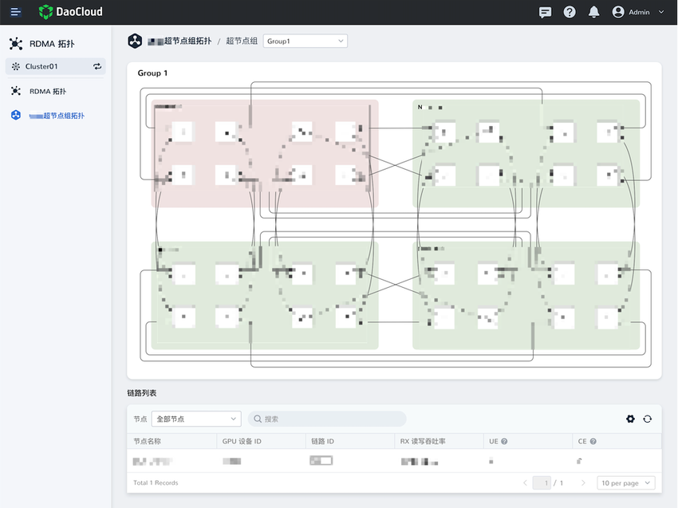
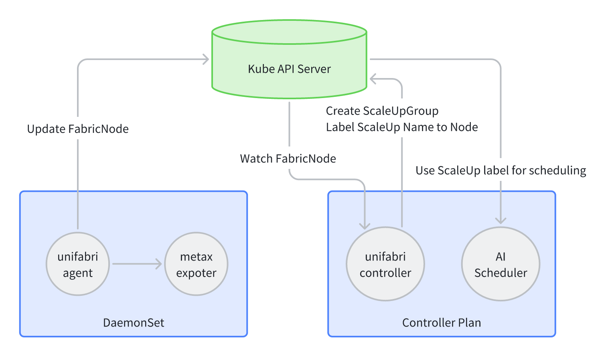

# ScaleUP Usage Guide

## Feature Introduction

Unifabric provides the ScaleUP network topology identification feature. Once this option is
enabled, you can view the super node (ScaleUP) group information in the cluster through the
`ScaleUpGroup` CRD.
At the same time, nodes are automatically labeled with `dce.unifabric.io/scaleup-group`, and the
label value is the name of the ScaleUP group to which the node belongs. In this way, when
scheduling machine learning jobs, you can make better use of ScaleUP groups through this label.



## Basic Requirements

1. Currently, only Metax is supported as the data source for ScaleUP.
2. Ensure that the Metax metrics collector (metax-mx-exporter) is correctly deployed and running.
   The MXMACA version must be later than MXMACA‑C500‑Driver‑2.31.1.17, and mx-exporter must be
   later than 0.11.1.

    ```shell
    # 1. Ensure that the metax-mx-exporter Pod is running;
    kubectl get pods -A | grep metax-mx-exporter

    # 2. Confirm that the response contains the `mx_server_info` metric
    curl 10.233.98.214:8000/metrics -s | grep mx_server_info`, and confirm that the response
    contains `mx_server_info`

    # If this metric is not found, check the running status of the metax-mx-exporter Pod and
    # ensure that the Metax metrics endpoint can be accessed normally.
    ```

3. Check the Unifabric Helm installation parameters to ensure that ScaleUP discovery for Unifabric
   is configured. The default Helm chart disables this feature.

    ```yaml
    agent:
      config:
        scaleUpDiscovery:
          metax:
            # -- Set to true
            enable: ture
            # -- Fill in the URL of the Metax exporter
            metricsURL: http://127.0.0.1:30089/metrics
    ```

## Workflow



1. The Agent reports neighbor information. The Agent on each node periodically collects Metax
   neighbor metrics and updates the corresponding FabricNode
   `status.scaleUp.metaxNeighbors` neighbor information.
    1. For Metax, each node reports 2 neighbors, and 4 interconnected nodes form one ScaleUP.
    1. If the Metax neighbor metric is empty (that is, the request to the Metax exporter
       succeeds but returns empty), the neighbor information of the FabricNode is cleared.
2. The Controller watches all FabricNodes, calculates the neighbor relationships, and identifies
   the super node ScaleUP.
    1. For a Metax topology that satisfies 4 nodes, a ScaleUpGroup is created and the Node label
       is updated.
    1. For a topology whose nodes do not satisfy the Metax node requirement, no ScaleUpGroup is
       created, and the Controller keeps waiting for the nodes to become ready.
3. For an already created ScaleUpGroup:
    1. If a node goes offline, the corresponding member is removed from the ScaleUpGroup and the
       ScaleUpGroup status is updated. The name of the ScaleUpGroup does not change.
    1. If a node is updated and the node name does not change, the topology recovers, and the
       ScaleUpGroup status is updated. The name of the ScaleUpGroup does not change.
    1. If a node is updated and the node name changes, the topology recovers, and the ScaleUpGroup
       status is updated. The name of the ScaleUpGroup changes.
4. The name of a ScaleUpGroup is calculated by hashing `hash(node1,node2,...)`.

## How to Use

1. Confirm that all nodes have been grouped into ScaleUpGroups according to the physical
   topology.

    ```shell
    $ kubectl get scaleupgroups.unifabric.io
    NAME      NODES                                                         HEALTHY    Total
    2e08c64   sh-cube-gpu-13,sh-cube-gpu-14,sh-cube-gpu-15,sh-cube-gpu-16   true       4
    ```

    For a ScaleUpGroup on a Metax link, you need to confirm that HEALTHY is true and Total is 4.
    If these conditions are not met, the nodes in the ScaleUpGroup are not connected according to
    the physical topology, and the neighbor information of the FabricNode may be incorrect. Check
    whether the Metax metrics collector is running correctly, or whether the Metax connection of
    the node is correct. For details, see the [Troubleshooting](#troubleshooting) section.

2. For nodes in the same ScaleUpGroup, confirm that the Node has been labeled with
   `dce.unifabric.io/scaleup-group`.

    ```shell
    kubectl get nodes --show-labels | grep scaleup
    ```

    Only nodes in a ScaleUpGroup whose healthy status is true are labeled. If a node is not
    labeled, the nodes in the ScaleUpGroup are not connected according to the physical topology,
    and the neighbor information of the FabricNode may be incorrect. Check whether the Metax
    metrics collector is running correctly, or whether the Metax connection of the node is
    correct. For details, see [Troubleshooting](#troubleshooting).

3. When scheduling machine learning jobs, use the label `dce.unifabric.io/scaleup-group` to make
   better use of ScaleUpGroups.

## Troubleshooting

1. Check the `status` field of the `FabricNode` resource to confirm whether the Metax neighbor
   information has been collected correctly.

    ```shell
    $ kubectl get fabricnodes -o yaml
    apiVersion: unifabric.io/v1beta1
    kind: FabricNode
    metadata:
      creationTimestamp: "2025-09-15T12:06:30Z"
      generation: 1
      name: sh-cube-gpu-13
      resourceVersion: "15140810"
      uid: 6a48faa0-1234-47fa-811a-202c169187df
    spec: {}
    status:
      scaleUp:
        metaxNeighbors:
        - direction: "Y"
          kind: local
          uuid: 1b0c2fa6-1dd2-11b2-01cc-b51e3bd74330
        - direction: X
          kind: remote
          uuid: 1ad2e412-1dd2-11b2-01cc-cb1e3bd74330
        - direction: "Y"
          kind: remote
          uuid: 1ae13bca-1dd2-11b2-01cc-1b8b3bd74330
        scaleUpHealthy: true
    ```

    Each FabricNode should contain 2 pieces of Metax neighbor information (with directions X and Y
    respectively). If not, the Metax metrics collector may not be running correctly, or the Metax
    connection of the node may have a problem.

2. Check mx-exporter to ensure that the metric data is correct.

    ```shell
    curl <metax-exporter-url>/metrics | grep mx_server_info
    ```

3. Check the mx-exporter logs to confirm whether there is any error information.

    ```shell
    kubectl logs <metax-exporter-pod-name> -n <namespace>
    ```
