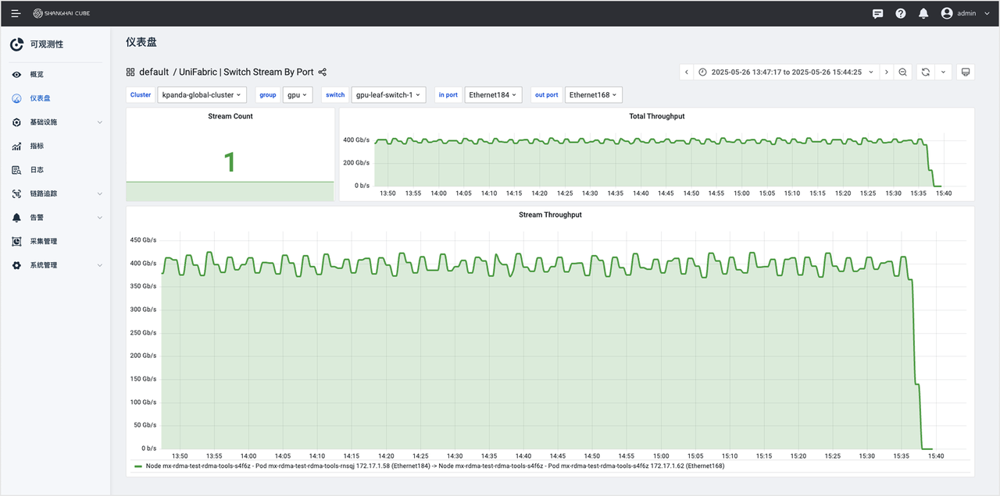

---
hide:
  - toc
---

# Unifabric Overview

**Unifabric** is an **RDMA network observability and automated O&M platform** for
**high-performance computing (HPC) and AI cloud platforms**. It is designed for RDMA network
environments (such as RoCE) and helps users achieve **network topology visualization, performance
monitoring and analysis, and intelligent diagnosis** from the underlying links to the upper-layer
compute nodes.

Unifabric is dedicated to solving the pain points of RDMA networks being "invisible, undiagnosable,
and hard to tune", helping users:

- Gain a global view of the network topology structure and real-time status
- Quickly locate performance bottlenecks such as latency, packet loss, and congestion
- Build a stable, efficient, and scalable RDMA network infrastructure

## Quick Deployment

Unifabric is based on the Kubernetes native architecture and provides a standard Helm Chart,
supporting rapid deployment in any compatible Kubernetes cluster.

The platform consists of two parts:

| Component | Responsibility |
|------|------|
| **Controller** | Responsible for topology construction and switch data collection |
| **Agent** | Deployed on each host to collect node RDMA status and link information |

## Core Capabilities at a Glance

### 1. RDMA Network Full-View Topology

- **Automatically build a hierarchical Spine-Leaf-node topology**
- Dynamically display the connection relationships among switches, compute nodes, and storage devices
- Support real-time changes of link health status, with automatic detection of link interruption

### 2. Super Node Group Visualization

- Support displaying the internal structure of a GPU compute cluster grouped by logical super nodes
- Display the GPU RDMA network topology among nodes within a group
- Support clicking a link to view performance metrics, assisting problem location

### 3. Network Monitoring and Link Analysis

- Collect switch port status, bandwidth, utilization, error codes, and other metrics in real time
- Support viewing link RX/TX bandwidth, congestion (CE), error (UE), and other data
- Provide a link performance analysis view, supporting link historical trend analysis

### 4. Automatic Grouping and Intelligent Diagnosis

- Based on LLDP + RDMA topology, automatically group nodes with consistent network structures
- Detect link anomalies, NIC status anomalies, link inconsistency between nodes, and other problems
- Support node health assessment and labeling, helping the scheduling system optimize resource usage

### 5. Network-Aware Intelligent Scheduling

- Based on the automatically identified network topology and super node group information,
  intelligently schedule workloads to the optimal node combination.
- When a network fault occurs in the cluster (such as a link interruption, NIC failure, or switch failure),
  automatically adjust the scheduling policy to avoid placing new tasks in the faulty area.
- Expose scheduling capabilities to upper-layer applications and scheduling frameworks through
  standardized API interfaces.

## Feature Highlights

| Module | Capability Description |
|------|-----------|
| **Topology Visualization** | Hierarchically display the Spine / Leaf / compute node / storage device topology |
| **Automatic Link Status Detection** | Update network connection status in real time; broken links are hidden automatically |
| **Node Monitoring** | Display GPU node status, the number of RDMA NICs, and bandwidth usage |
| **Switch Monitoring** | Display the port status, bandwidth, and utilization of compute switches and storage switches |
| **Link Performance Analysis** | View the real-time bandwidth, CE/UE errors, and interconnected GPU information of any link |
| **Super Node Group View** | Display the interconnection structure of nodes within a group; click to view link details |
| **Multi-Cluster Support** | Support unified access of multiple Kubernetes clusters and cross-cluster network views |
| **Grafana Integration** | Built-in monitoring dashboards, supporting custom charts and metric queries |
| **Automatic Grouping** | Automatically divide nodes into schedulable groups based on the network topology |
| **Fault Diagnosis Assistance** | Detect link anomalies, switch port anomalies, and node connection inconsistencies |
| **Intelligent Scheduling** | Recommend the optimal node combination based on the automatically identified topology and super node information |
| **Standard Interfaces** | Provide API interfaces for seamless integration with K8s plugins, enabling rapid exposure of capabilities to upper-layer architectures |

## Scenarios

Unifabric applies to the following typical scenarios:

- **AI model training platforms**: Monitor the communication links between GPU nodes to improve training efficiency
- **High-performance computing (HPC) clusters**: Detect network bottlenecks in time to ensure stable operation of computing tasks
- **RDMA storage access scenarios**: Monitor the health of the RDMA channel between GPUs and storage devices
- **Multi-tenant AI cloud platforms**: Support synchronized access of multi-cluster resources and unified display of network status

## Why Choose Unifabric?

- **Built for RDMA networks**, supporting the RoCE protocol and LLDP topology discovery
- **Full-lifecycle observability**: From nodes, links, and switches to automatic topology identification
- **Kubernetes native integration**: Support CRD management and automated O&M
- **Rich monitoring metrics**: Built-in Prometheus & Grafana support
- **Intelligent grouping and diagnosis engine**: Help optimize network performance and resource scheduling

## Next Steps

**Want to learn how to deploy it?**
See [Install Unifabric](./install.md)

**Want to learn how to collect and monitor link metrics?**
See [RDMA Latency Monitoring Usage Guide](./features/RdmaLatencyDetection.md)
