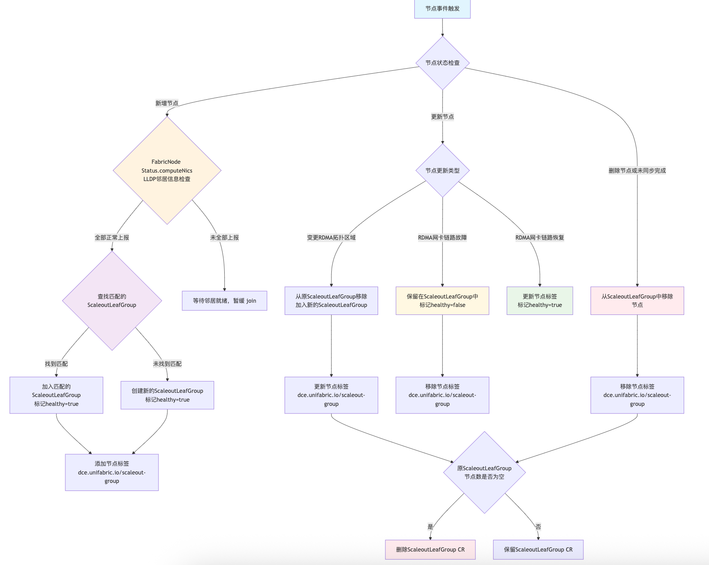

# Install Unifabric

## Part 1: Installing the Unifabric Core Components

### Install Unifabric

#### Prerequisites

1. **Kubernetes cluster**: Make sure you have a running Kubernetes cluster
2. **Helm 3.x**: Used to install Unifabric
3. **RDMA network environment**: An RDMA network environment is required and the RoCE protocol is supported
4. **Switch LLDP support**: Make sure the LLDP protocol is enabled on the network switches

#### Recommended Versions

| Component | Recommended Version |
|------|----------|
| Kubernetes | v1.22+ |
| Helm | v0.0.3+ |

#### Installation Steps

> If you need to use the RDMA neighbor detection feature, make sure the LLDP protocol is enabled
> on the network switches

1. Configure node labels

    The Unifabric Controller runs only on nodes with `unifabric.io/deploy=true`. Add this label to
    the nodes that run the Unifabric Controller:

    ```bash
    kubectl label node <node-name> unifabric.io/deploy=true
    ```

    The Unifabric Agent should run only on nodes with RDMA network capability. For nodes or virtual
    machine nodes that do not support RDMA, set the label `unifabric.io/deploy=false` to prevent the
    Unifabric Agent from running on them.

    ```bash
    kubectl label node <node-name> unifabric.io/deploy=false
    ```

2. Add the Helm repository

    ```bash
    helm repo add unifabric https://release.daocloud.io/chartrepo/unifabric
    helm repo update
    ```

3. Configure the installation parameters

    ```shell
    helm upgrade --install unifabric unifabric/unifabric \
      --namespace unifabric \
      --create-namespace \
      --set features.rdmaNeighbor.storageRdmaNicFilter="interface=ens2f0*"
    ```

    `storageRdmaNicFilter` specifies which RDMA NICs on the node are used as RDMA storage NICs.
    Other RDMA NICs are used as GPU compute network NICs. If this field is not configured,
    all RDMA NICs are used as GPU compute network NICs.

4. Verify the installation

    - Check the Pod status:

        ```bash
        kubectl get pods -n unifabric -o wide
        ```

        Expected output:

        ```
        NAME                         READY   STATUS    RESTARTS   AGE
        unifabric-746d4f8d75-qbknh   1/1     Running   0          2m
        unifabric-agent-4rpbw        2/2     Running   0          2m
        unifabric-agent-fgpkc        2/2     Running   0          2m
        ```

        Note: The `unifabric-agent` Pod contains two containers: `lldpd` and `unifabric-agent`.

    - Check the FabricNode CRD status:

        ```bash
        kubectl get fabricnodes.unifabric.io
        ```

    - View the neighbor information of a specific node:

        ```bash
        kubectl get fabricnodes.unifabric.io <node-name> -o yaml
        ```

        Confirm that the `status.computeNics` and `status.storageNics` fields contain the correct
        LLDP neighbor information.

    - Verify the ScaleoutGroup automatic grouping feature and check the ScaleoutLeafGroup CRD:

        ```bash
        kubectl get scaleoutleafgroup.unifabric.io
        ```

    - Check whether the node has the scaleoutleafgroup label:

        ```bash
        kubectl get nodes -l dce.unifabric.io/scaleout-group
        ```

    - Check whether metrics are collected properly:

        ```bash
        kubectl get pods -n unifabric -o jsonpath='{.items[0].status.podIP}' | xargs -I {} curl {}:5026/metrics
        ```

#### Troubleshooting

Refer to [Troubleshooting](troubleshooting.md)

#### Upgrade

Upgrade Unifabric to a new version:

```bash
helm upgrade unifabric unifabric/unifabric \
  --namespace unifabric \
  --values values.yaml \
  --wait
```

#### Uninstall

Uninstall Unifabric:

```bash
helm uninstall unifabric --namespace unifabric
```

For a complete cleanup, also delete the CRDs and the namespace:

```bash
kubectl delete namespace unifabric
```

#### Monitoring and Visualization

If the Grafana dashboard is installed, you can view the Unifabric monitoring data and network
topology visualization through DCE Insight or by accessing Grafana directly.

---

## Part 2: Switch Node Access

### Feature Description

Switch node access (Switch Port Detail) displays the detailed information of switch ports,
including port status and neighbor device information. This feature connects to the switch through
the gNMI protocol, obtains the port status and neighbor device information, and stores them in
Kubernetes custom resources.

### Supported Switch Models

Currently, Cloudnix switches are supported. Support for certain NVIDIA switch models will be
provided in the future.

### Field Description

```yaml
apiVersion: unifabric.io/v1beta1
kind: SwitchEndpoint
metadata:
  name: gpu-leaf-switch-1
spec:
  connection:
    gnmi:
      port: 8080
    host: 10.193.77.201
  group: gpu
  manufacturer: cloudnix
status:
  conditions:
    - lastTransitionTime: "2025-08-19T00:05:57Z"
      message: Successfully connected to SwitchEndpoint
      reason: Connected
      status: "True"
      type: Connected
  ports:
    details:
      - name: Ethernet0 # Port name
        neighbor: # Describes the neighbor device connected to this port, making it easier to locate the physical topology.
          portID: Ethernet0 # Port identifier of the neighbor device. If the peer is a host, this is the MAC address; if it is a switch, this is the peer port name.
          portName: Ethernet0 # Neighbor device port name, which is the NIC name or port name.
          sysName: SPINE01 # System name of the neighbor device.
        status: up
      - name: Ethernet8
        neighbor:
          portID: Ethernet8
          portName: Ethernet8
          sysName: SPINE01
        status: up
```

### Troubleshooting

If you encounter problems when using the Switch Port Detail feature, follow these steps to troubleshoot:

1. Check whether the SwitchEndpoint resource exists in Kubernetes and its status is Connected:

    ```bash
    kubectl get switchendpoint -n unifabric
    ```

2. Check whether the Unifabric Pod in Kubernetes is running properly:

    ```bash
    kubectl get pods -n unifabric -o wide
    ```

3. Sign in to the switch and run `show lldp summary` to check whether the port status and neighbors are normal.
4. Sign in to the switch and run `show logging` to check whether the switch log contains abnormal information.

---

## Part 3: Storage Node Access

### Feature Overview

Unifabric supports connecting external bare metal storage nodes into a Kubernetes cluster for
unified management and monitoring. By deploying the unifabric agent on the storage node, the agent
collects the RDMA network status and LLDP neighbor information of the storage node and reports the
data to the unifabric control plane in the Kubernetes cluster. You can also view the monitoring data
of storage nodes on the Grafana dashboard of the cluster.

### Supported Storage Server Models

All general-purpose Linux servers are supported.

### Basic Requirements

1. Docker must be installed on the storage node (docker compose support is required)
2. The storage node must be able to access the API Server of the Kubernetes cluster
3. The storage node must be a bare metal server with RDMA NICs
4. The unifabric components must be deployed and running in the Kubernetes cluster to be connected

### Create the kubeconfig File

On the control node of the Kubernetes cluster to which the storage node is to be connected,
run the following command to generate the kubeconfig file:

```shell
# Specify the namespace where unifabric is installed
UNIFABRIC_NAMESPACE="unifabric"

cat > cluster1-kubeconfig.yaml <<EOF
apiVersion: v1
kind: Config
clusters:
- cluster:
    certificate-authority-data: $(kubectl config view --raw -o jsonpath="{.clusters[0].cluster.certificate-authority-data}")
    server: $(kubectl config view --raw -o jsonpath="{.clusters[0].cluster.server}")
  name: $(kubectl config view --raw -o jsonpath="{.clusters[0].name}")
contexts:
- context:
    cluster: $(kubectl config view --raw -o jsonpath="{.clusters[0].name}")
    user: unifabric-sa-token
    namespace: ${UNIFABRIC_NAMESPACE}
  name: unifabric-sa-token@$(kubectl config view --raw -o jsonpath="{.clusters[0].name}")
current-context: unifabric-sa-token@$(kubectl config view --raw -o jsonpath="{.clusters[0].name}")
users:
- name: unifabric-sa-token
  user:
    token: $(kubectl get secret unifabric-sa-token -n ${UNIFABRIC_NAMESPACE} -o jsonpath='{.data.token}' | base64 -d)
EOF
```

This kubeconfig file is generated based on the ServiceAccount `unifabric-sa-token` in the namespace
where unifabric is installed, and contains only the minimum permissions required to access unifabric.

Verify locally that the content of the kubeconfig file is correct:

```shell
kubectl --kubeconfig=cluster1-kubeconfig.yaml version
kubectl --kubeconfig=cluster1-kubeconfig.yaml get pods -A
```

Copy the kubeconfig file to `/etc/unifabric/cluster1-kubeconfig.yaml` on the storage node server
for use in the following steps.

### Deploy lldp and the unifabric Agent (Using Docker Compose)

This section describes how to deploy the lldp and unifabric agent services on a storage node using
Docker Compose. Perform the following steps on each logical bare metal storage node.

#### 1. Run the lldp service

Deploy the unifabric-lldp service on each storage host. Even if a host is connected to multiple
Kubernetes clusters, only one instance needs to be deployed. First, create the
`/etc/unifabric/lldp.yaml` file:

```shell
sudo mkdir -p /etc/unifabric
cat <<'EOF' | sudo tee /etc/unifabric/lldp.yaml > /dev/null
services:
  unifabric-lldp:
    image: ${UNIFABRIC_AGENT_IMAGE}
    container_name: unifabric-lldp
    command: ["/usr/bin/unifabric/entrypoint.sh"]
    network_mode: host
    restart: always
    privileged: true
    environment:
      # Node IP information (optional)
      NODE_IPADDRESS: ${NODE_IPADDRESS}
      # LLDP transmit interval, in seconds (optional)
      LLDPD_TX_INTERVAL: 30
      # Interfaces on which LLDP is enabled, as a comma-separated list
      # LLDPD_INTERFACE_PATTERN: ""
    volumes:
      - /var/run:/var/run
      - /etc/hostname:/etc/hostname:ro
    healthcheck:
      test: CMD-SHELL lldpcli -v || exit 1
      interval: 5s
      timeout: 3s
      retries: 5
EOF
```

Start the lldp service with the following command. Set the `UNIFABRIC_AGENT_IMAGE` environment
variable to specify the agent image version, using the version that matches the Kubernetes cluster.
Optionally, set the `NODE_IPADDRESS` environment variable to specify the node IP address, which is
used for LLDP broadcast.

```shell
UNIFABRIC_AGENT_IMAGE="release.daocloud.io/unifabric/unifabric-agent:latest" \
  sudo -E docker compose -f /etc/unifabric/lldp.yaml up -d
```

#### 2. Start the unifabric-agent service

Make sure the kubeconfig created in the previous section exists at `/etc/unifabric/cluster1-kubeconfig.yaml`.

Create the unifabric agent configuration file `/etc/unifabric/cluster1-agent-config.yaml`:

```shell
export METRICS_PORT=5025
export STORAGE_RDMA_NIC_FILTER="interface=*"

cat <<EOF | sudo tee /etc/unifabric/cluster1-agent-config.yaml > /dev/null
inStorageNode: true
metrics:
  port: ${METRICS_PORT}
rdmaNeighbor:
  # Matches the storage RDMA NICs. Wildcards are supported
  storageRdmaNicFilter: "${STORAGE_RDMA_NIC_FILTER}"
EOF
```

- `inStorageNode` indicates that the agent runs on an external storage node. It must be set to `true`.
- The `metrics.port` parameter specifies the port used to expose metrics on the storage node.
  The default value is `5025` and can be modified as needed. If multiple clusters are connected,
  use different ports to avoid conflicts.
- The `storageRdmaNicFilter` parameter is used to match the RDMA NIC interface names of the storage
  node. Wildcards are supported. For example, `ens*` matches all interface names starting with `ens`.
  Adjust it according to the NIC naming rules of the actual storage node.

Create the Docker Compose file `/etc/unifabric/cluster1-agent-compose.yaml`:

```shell
cat <<'EOF' | sudo tee /etc/unifabric/cluster1-agent-compose.yaml > /dev/null
services:
  unifabric-agent:
    image: ${UNIFABRIC_AGENT_IMAGE}
    container_name: unifabric-agent
    network_mode: host
    restart: always
    privileged: true
    volumes:
      - /etc/unifabric/cluster1-kubeconfig.yaml:/root/.kube/config
      - /etc/unifabric/cluster1-agent-config.yaml:/etc/config/config.yaml
      - /var/run:/var/run
      - /etc/hostname:/etc/hostname:ro
      - /proc:/host/proc:ro
    command:
      - /usr/bin/unifabric/agent
      - -config
      - /etc/config/config.yaml
EOF


UNIFABRIC_AGENT_IMAGE="release.daocloud.io/unifabric/unifabric-agent:latest" \
  sudo -E docker compose -f /etc/unifabric/cluster1-agent-compose.yaml up -d
```

- Note: Replace `UNIFABRIC_AGENT_TAG` with the image version that matches the Kubernetes cluster.
  Different clusters may require different versions of the agent image.
- If you need to connect to multiple clusters, you can copy this file and modify the service name
  and configuration file path, for example `cluster1-agent-compose.yaml`, and use the corresponding
  kubeconfig and configuration file.

### Configure Storage Node Metrics Scraping in the Cluster

On the Kubernetes cluster control node, generate the storage node metrics scraping configuration
file `unifabric-metrics-external.yaml`:

```shell
# Set the storage node IP list, separated by commas
export STORAGE_NODE_IPS="1.1.1.1,2.2.2.2"
# Set the storage node RDMA agent metrics port
export AGENT_PORT_METRICS="5025"
# Set the storage node RDMA latency metrics port
export RDMA_LATENCY_PORT_METRICS="5027"

# Generate the configuration file content
cat > unifabric-metrics-external.yaml << EOF
apiVersion: v1
kind: Service
metadata:
  name: unifabric-metrics-external
  namespace: unifabric
  labels:
    app: unifabric-metrics-external
spec:
  clusterIP: None
  ports:
    - name: metrics-agent
      port: ${AGENT_PORT_METRICS}
      targetPort: ${AGENT_PORT_METRICS}
    - name: metrics-rdma-latency-cluster1
      port: ${RDMA_LATENCY_PORT_METRICS}
      targetPort: ${RDMA_LATENCY_PORT_METRICS}
---
apiVersion: v1
kind: Endpoints
metadata:
  name: unifabric-metrics-external
  namespace: unifabric
subsets:
  - addresses:
$(IFS=',' read -ra IPS <<< "$STORAGE_NODE_IPS"; for ip in "${IPS[@]}"; do echo "      - ip: $ip"; done)
    ports:
      - name: metrics-agent
        port: ${AGENT_PORT_METRICS}
      - name: metrics-rdma-latency
        port: ${RDMA_LATENCY_PORT_METRICS}
---
apiVersion: monitoring.coreos.com/v1
kind: ServiceMonitor
metadata:
  name: unifabric-metrics-external
  namespace: unifabric
  labels:
    operator.insight.io/managed-by: insight
    release: kube-prometheus-stack
spec:
  selector:
    matchLabels:
      app: unifabric-metrics-external
  namespaceSelector:
    matchNames:
      - unifabric
  endpoints:
    - port: metrics-agent
      interval: 30s
      path: /metrics
    - port: metrics-rdma-latency
      interval: 30s
      path: /metrics
EOF
```

Deploy the configuration file:

```shell
kubectl apply -f unifabric-metrics-external.yaml
```

### Verify the Storage Node Access Status

Run the following command to see the newly connected node:

```shell
kubectl get fabricnode
```

Then view the fabricnode YAML information of the storage node and confirm that the RDMA NIC and
LLDP neighbor information have been collected:

```bash
kubectl get fabricnodes.unifabric.io <node-name> -o yaml
```

Example output:

```yaml
apiVersion: unifabric.io/v1beta1
kind: FabricNode
metadata:
  name: l-oss-2
status:
  rdmaHealthy: true
  scaleUp:
    scaleUpHealthy: false
  storageNics:
    - ipv4: 172.16.1.41/24
      ipv6: ""
      lldpNeighbor:
        description:
          "SONiC Software Version: SONiC.CuOS_4.0-0.R_X86_64_ztp - HwSku:
          ds730-32d - Distribution: 10.13 - Kernel: 4.19.0-12-2-amd64"
        hostname: StorageSW
        mac: 70:06:92:6e:32:64
        mgmtIP: 10.193.77.211
        port: Ethernet200
      name: ens2np0
      rdma: true
      state: up
    - ipv4: ""
      ipv6: ""
      lldpNeighbor:
        description:
          "SONiC Software Version: SONiC.CuOS_4.0-0.R_X86_64_ztp - HwSku:
          ds730-32d - Distribution: 10.13 - Kernel: 4.19.0-12-2-amd64"
        hostname: StorageSW
        mac: 70:06:92:6e:32:64
        mgmtIP: 10.193.77.211
        port: Ethernet192
      name: ens1np0
      rdma: true
      state: up
```

Check the LLDP neighbor information on the switch to confirm that the storage node has broadcast
through LLDP:

```shell
lldpcli show neighbors
```

View the metrics data of the storage node:

```shell
curl http://localhost:5025/metrics
```

In the Grafana of kube-prometheus-stack, view the dashboards related to storage nodes and make sure
that the metric data of the storage nodes can be viewed.

### Connect to Multiple Clusters

If the storage node needs to be connected to multiple Kubernetes clusters, you can create a separate
kubeconfig and agent configuration file for each cluster, and then create the corresponding Docker
Compose file to start multiple unifabric agent instances. For example, you can create
`cluster2-kubeconfig.yaml`, `cluster2-agent-config.yaml`, and `cluster2-agent-compose.yaml`,
and use different metrics ports to avoid conflicts.

### Uninstall the Storage Node Agent

Run the following commands to uninstall the unifabric service on the storage node:

```shell
# Uninstall the unifabric agent service
# If multiple clusters are connected, uninstall the corresponding agent services separately,
# for example cluster2-agent-compose.yaml
docker compose down -f /etc/unifabric/cluster1-agent-compose.yaml

# If you need to uninstall the lldp service, run:
docker compose down -f /etc/unifabric/lldp.yaml

# If you need to delete all configuration files, run:
sudo rm -rf /etc/unifabric
```

### Troubleshooting

If the storage node is not connected properly, check the agent log to troubleshoot:

```shell
docker compose logs -f /etc/unifabric/cluster1-agent-compose.yaml
docker compose logs -f /etc/unifabric/lldp.yaml
```

If the log indicates that the Kubernetes cluster cannot be connected, check whether the content of
`/etc/unifabric/cluster1-kubeconfig.yaml` is correct. You can use the kubectl command to test the connection:

```shell
KUBECONFIG=/etc/unifabric/cluster1-kubeconfig.yaml kubectl get pods
```

If there is no metrics data, check the firewall settings of the storage node and make sure port 5025
is open. Then test metrics scraping with curl:

```shell
curl http://localhost:5025/metrics
```

---

## Part 4: RDMA Topology Discovery Configuration

### Feature Overview

The RDMA network neighbor discovery feature of Unifabric is a comprehensive network topology
discovery system designed for RDMA networks. This feature performs underlying neighbor discovery
based on the LLDP protocol and provides multiple upper-layer network management capabilities on
top of it. The core capabilities include:

- **LLDP neighbor discovery**: Underlying network topology discovery based on the LLDP protocol,
  supporting all types of switch devices
- **Dedicated to RDMA networks**: Currently specifically designed for RDMA network environments
  based on the RoCE protocol
- **NIC classification management**: Distinguishes the GPU compute network (computeNics) from the
  storage network (storageNics)
- **rdmaNeighbor grouping**: An automatic grouping feature specifically for the GPU compute network,
  used for node topology management in scale-out scenarios
- **Kubernetes native**: Deeply integrated into the Kubernetes environment, managing the network
  status through the FabricNode CRD

Among them, **rdmaNeighbor** is an upper-layer feature based on LLDP neighbor discovery. It is
dedicated to topology grouping of the GPU compute network and is unrelated to the storage network.
By analyzing the GPU compute network connection relationships between nodes, it automatically groups
nodes with the same network topology, providing intelligent node management capabilities for
scale-out computing scenarios.

- [LLDP Neighbor Discovery](#lldp-neighbor-discovery)
- [Switch Neighbor Reporting](#switch-neighbor-reporting)
- [ScaleoutLeafGroup Automatic Grouping](#scaleoutleafgroup-automatic-grouping)
- [Storage Host Neighbor Reporting](#storage-host-neighbor-reporting)

#### GPU Network Classification Concepts

- **GPU compute network (computeNics)**: A high-speed RDMA network used for inter-GPU communication,
  model training, and inference computing
- **GPU storage network (storageNics)**: A dedicated RDMA network used for data transfer between
  GPUs and the storage system

### Architecture Design

The neighbor discovery feature adopts a layered architecture:

```
__________________________________________________________________________________
|                                                                                  |
|                            RDMA Network Neighbor Discovery                        |
|__________________________________________________________________________________|
|  LLDP neighbor discovery  |  Switch neighbor reporting  |  External storage neighbor reporting  |
|  (Host Neighbor)          |  (Switch Neighbor)          |  (Storage Neighbor)                   |
|                           |                             |                                       |
|  • GPU compute network    |  • Switch topology          |  • Storage cluster discovery          |
|  • GPU storage network    |  • gnmi integration         |  • Cross-cluster connection           |
|  • LLDP protocol          |  • LLDP protocol            |  • Storage path optimization          |
|___________________________|_____________________________|_______________________________________|
```

### LLDP Neighbor Discovery

LLDP neighbor discovery feature: Unifabric runs the lldpd daemon to automatically discover neighbor
devices in the GPU compute network and the GPU storage network through the LLDP protocol, and
synchronizes them to the Status field of the FabricNode CRD for topology display in the RDMA network.

#### Enable the RDMA Network Neighbor Discovery Feature

Note: This feature requires that the LLDP protocol is enabled on the switch; otherwise neighbor
devices cannot be discovered.

The best-practice configuration is already set by default. Refer to Install Unifabric above.
The following is a detailed description of the Helm values parameters related to this feature:

```yaml
features:
  rdmaNeighbor:
    # Enable the extended neighbor discovery feature
    enabled: true

    # Interval at which FabricNode synchronizes LLDP neighbors
    timeToWaitSyncLLDPToFabricNode: 1m

    # GPU compute network NIC filter rule
    # Used to filter which RDMA NICs on the node belong to computeNics
    # Supports interface name wildcards (interface=) or subnets (cidr=)
    # Example: gpuRdmaNicFilter: "cidr=172.16.0.0/16"
    gpuRdmaNicFilter: "interface=ens16*"

    # GPU storage network NIC filter rule
    # Used to filter which RDMA NICs on the node belong to storageNics
    storageRdmaNicFilter: "interface=ens17*"
    # Example: storageRdmaNicFilter: "cidr=172.17.0.0/16"

    # LLDP daemon configuration
    lldpd:
      # LLDP packet transmit interval (seconds)
      txInterval: 30

      # Management IP configuration mode. The default value is empty,
      # which uses the Kubelet NodeIP as the management IP
      # Supported: IP address list | interface name | automatic selection (leave empty)
      managementIPPattern: ""

      # LLDP enabled interfaces. If empty, it applies to all RDMA NICs
      # Supported: specific interface | pattern match | all interfaces (leave empty)
      interfaces: "ens*"
```

##### Description of gpuRdmaNicFilter and storageRdmaNicFilter

These configurations determine which RDMA physical NICs of the host are counted into
`computeNics` and `storageNics` in `FabricNode.status`:

- NIC classification priority: `storageRdmaNicFilter` is checked first; NICs that do not match are
  counted into `computeNics` in `FabricNode.status`
- If neither `gpuRdmaNicFilter` nor `storageRdmaNicFilter` is configured, all physical NICs of the
  host are counted into `computeNics` in `FabricNode.status`
- If both `gpuRdmaNicFilter` and `storageRdmaNicFilter` are configured, filtering is performed
  according to the wildcard values, and the NICs are counted into `computeNics` and `storageNics`
  in `FabricNode.status` respectively

**Recommended configuration**: Set `storageRdmaNicFilter` first. RDMA NICs that do not match are
automatically counted into `computeNics` in `FabricNode.status`.

##### Description of agent.config.rdmaNeighbor.lldpd.interfaces

- **Specific interfaces:**

    ```yaml
    interfaces: "eth0,eth1,eth2"
    ```

- **Pattern match:**

    ```yaml
    interfaces: "eth*" # All interfaces starting with eth
    ```

- **Exclusion pattern:**

    ```yaml
    interfaces: "eth*,!eth2" # All eth interfaces, excluding eth2
    ```

- **All interfaces** (default):

    ```yaml
    interfaces: "" # Enable LLDP on all RDMA NICs
    ```

-  Deploy or update Unifabric with Helm

    ```bash
    helm upgrade --install unifabric -n unifabric --create-namespace ./chart --values values.yaml
    ```

#### Verify Whether the RDMA Network Neighbor Discovery Feature Works Properly

- Check whether the unifabric components (especially the lldpd container) are running properly.
  The lldpd log runs as an independent container in the unifabric-agent pod:

    ```bash
    kubectl get po -n unifabric
    NAME                         READY   STATUS    RESTARTS      AGE
    unifabric-746d4f8d75-qbknh   1/1     Running   1             12m
    unifabric-agent-4rpbw        2/2     Running   0             12m
    unifabric-agent-fgpkc        2/2     Running   0             12m
    ```

- Check whether the `lldpNeighbor` field of all NICs in `computeNics` and `storageNics` of the
  FabricNode CRD contains neighbor information:

> **Note:** Because LLDP neighbor collection takes some time, by default unifabric-agent waits one
> minute before synchronizing the LLDP neighbor information to the Status field of the FabricNode CRD.
> To adjust the waiting time, modify the Helm parameter
> `agent.config.rdmaNeighbor.timeToWaitSyncLLDPToFabricNode`. The default value is 1 minute.

```bash
kubectl get fabricnodes.unifabric.io sh-cube-master-3 -o yaml
```
```yaml
apiVersion: unifabric.io/v1beta1
kind: FabricNode
metadata:
  creationTimestamp: "2025-06-19T07:02:08Z"
  generation: 1
  name: sh-cube-master-3
  resourceVersion: "48723802"
  uid: aa85f55f-d87f-4fbe-8dbc-e3c9cc089943
spec: {}
status:
  gpuNics:
  - ipv4: 172.17.3.143/24
    ipv6: ""
    lldpNeighbor:
      description: 'SONiC Software Version: SONiC.CuOS_4.0-0.R_X86_64_ztp - HwSku:
        ds730-32d - Distribution: 10.13 - Kernel: 4.19.0-12-2-amd64'
      hostname: LEAF03
      mac: 70:06:92:6e:32:1c
      mgmtIP: 10.193.77.203
      port: Ethernet208
    name: ens841np0
    rdma: true
    state: up
  - ipv4: 172.17.4.143/24
    ipv6: ""
    lldpNeighbor:
      description: 'SONiC Software Version: SONiC.CuOS_4.0-0.R_X86_64_ztp - HwSku:
        ds730-32d - Distribution: 10.13 - Kernel: 4.19.0-12-2-amd64'
      hostname: LEAF04
      mac: 70:06:92:6e:34:5c
      mgmtIP: 10.193.77.204
      port: Ethernet208
    name: ens842np0
    rdma: true
    state: up
  - ipv4: 172.17.2.143/24
    ipv6: ""
    lldpNeighbor:
      description: 'SONiC Software Version: SONiC.CuOS_4.0-0.R_X86_64_ztp - HwSku:
        ds730-32d - Distribution: 10.13 - Kernel: 4.19.0-12-2-amd64'
      hostname: LEAF02
      mac: 70:06:92:6e:34:80
      mgmtIP: 10.193.77.202
      port: Ethernet200
    name: ens835np0
    rdma: true
    state: up
  - ipv4: 172.17.1.143/24
    ipv6: ""
    lldpNeighbor:
      description: 'SONiC Software Version: SONiC.CuOS_4.0-0.R_X86_64_ztp - HwSku:
        ds730-32d - Distribution: 10.13 - Kernel: 4.19.0-12-2-amd64'
      hostname: LEAF01
      mac: 70:06:92:6e:33:18
      mgmtIP: 10.193.77.201
      port: Ethernet208
    name: ens834np0
    rdma: true
    state: up
  rdmaHealthy: true
  totalNics: 5
  storageNics:
  - ipv4: 172.16.1.143/24
    ipv6: ""
    lldpNeighbor:
      description: 'SONiC Software Version: SONiC.CuOS_4.0-0.R_X86_64_ztp - HwSku:
        ds730-32d - Distribution: 10.13 - Kernel: 4.19.0-12-2-amd64'
      hostname: StorageSW
      mac: 70:06:92:6e:32:64
      mgmtIP: 10.193.77.211
      port: Ethernet144
    name: ens1np0
    rdma: true
    state: up
```

You need to check:

- Whether `gpuNics` includes every GPU compute NIC of the host, whether its IP address and status
  meet expectations, and whether `lldpNeighbor` accurately contains the detailed information of
  the neighbor device.
- Whether `storageNics` includes every storage NIC of the host, whether its IP address and status
  meet expectations, and whether `lldpNeighbor` also accurately contains the detailed information
  of the neighbor device.
- `rdmaHealthy` is true if all RDMA NICs are Ready (including NIC status and LLDP neighbor discovery);
  otherwise it is false.
- `totalNics` indicates the total number of all RDMA NICs of the host, including `gpuNics` and `storageNics`.

### ScaleoutLeafGroup Automatic Grouping Feature

ScaleoutLeafGroup automatically groups nodes with the same GPU compute network topology based on the
LLDP neighbor discovery information above, synchronizes the grouping information to the Status field
of the ScaleoutLeafGroup CRD, and adds a set of identical labels to the nodes that belong to the same
ScaleoutLeafGroup (default label key: `dce.unifabric.io/scaleout-group`, which can be customized
through the Helm parameter `features.rdmaNeighbor.nodeTopoZoneLabelKey`; the value is the group name).
This feature provides intelligent node grouping and network topology management capabilities for
scale-out scenarios.

#### How It Works

The ScaleoutLeafGroup automatic grouping feature depends on the LLDP neighbor discovery information
in the Status field of the FabricNode CRD. Therefore, you must ensure that the LLDP neighbor discovery
in the `Status.computeNics` field of the FabricNode CRD is reported properly and the information is
correct. By default, unifabric-agent waits one minute before synchronizing the LLDP neighbor
information to the Status field of the FabricNode CRD. To adjust the waiting time, modify the Helm
parameter `features.rdmaNeighbor.timeToWaitSyncLLDPToFabricNode`. The default value is 1 minute.



#### Configuration Example

This configuration is enabled by default in Install Unifabric. If you accidentally disabled it or
encounter any problem, you can reconfigure it as follows:

Enable the ScaleoutLeafGroup automatic grouping feature in the Controller component:

```yaml
features:
  rdmaNeighbor:
    # Enable the RDMA neighbor discovery feature
    enabled: true
    # Enable the ScaleoutLeafGroup automatic grouping feature
    enableScaleOutLeafGroup: true
    # ScaleoutLeafGroup automatic grouping label key
    nodeTopoZoneLabelKey: dce.unifabric.io/scaleoutleaf-group
```

> **Note:** `features.rdmaNeighbor.enabled` must be enabled for
> `features.rdmaNeighbor.enableScaleOutLeafGroup` to take effect.

Perform the installation:

```bash
helm upgrade --install unifabric unifabric/unifabric -n unifabric -f values.yaml
```

#### Verify the Installation

1. Check whether the unifabric components are running properly:

    ```bash
    kubectl get po -n unifabric
    NAME                         READY   STATUS    RESTARTS      AGE
    unifabric-746d4f8d75-qbknh   1/1     Running   1             12m
    unifabric-agent-4rpbw        2/2     Running   0             12m
    unifabric-agent-fgpkc        2/2     Running   0             12m
    ```

2. Check whether the ScaleoutLeafGroup CRD is normal. One ScaleoutLeafGroup object represents a
   group of nodes with the same GPU network topology.

    ```bash
    ~# kubectl get scaleoutleafgroups.unifabric.io
    NAME              healthyNodes   totalNodes   healthy   AGE
    409bf491f7136a8a  4              4            true      6h1m
    ```

    Description of the fields in the information above:

    - NAME: The name of the ScaleoutLeafGroup, obtained by hashing the names of all switches in the group
    - healthyNodes: The number of healthy nodes in the group
    - totalNodes: The total number of nodes in the group
    - healthy: Whether the group is healthy. If any node in the group is unhealthy, the group is unhealthy
    - AGE: The creation time of the group

The following is an example of the ScaleoutLeafGroup CRD:

```bash
kubectl get scaleoutleafgroups.unifabric.io 409bf491f7136a8a -o yaml
```
```yaml
apiVersion: unifabric.io/v1beta1
kind: ScaleoutLeafGroup
metadata:
  creationTimestamp: "2025-09-18T03:37:59Z"
  generation: 1
  name: 409bf491f7136a8a
  resourceVersion: "85472900"
  uid: e8d34e3a-d73f-4587-b39a-9f80a72631c0
spec: {}
status:
  healthy: true # Whether the group is healthy. If any node in the group is unhealthy, the group is unhealthy
  nodes: # The list of nodes in the group. Each node has a healthy field indicating whether its RDMA link is normal
  - healthy: true
    name: sh-cube-master-1
  - healthy: true
    name: sh-cube-master-2
  - healthy: true
    name: sh-cube-master-3
  - healthy: true
    name: sh-inf-worker-1
  healthyNodes: # The number of healthy nodes in the group
  totalNodes:  # The total number of nodes in the group
  switches: # The list of switches to which all nodes in the group are connected
  - LEAF01
  - LEAF02
  - LEAF03
  - LEAF04
```

```bash
~# kubectl get nodes -l dce.unifabric.io/scaleoutleaf-group=409bf491f7136a8a
NAME               STATUS   ROLES                      AGE    VERSION
sh-cube-master-1   Ready    control-plane,fluent,gpu    130d   v1.30.5
sh-cube-master-2   Ready    control-plane,gpu          130d   v1.30.5
sh-cube-master-3   Ready    control-plane,gpu          130d   v1.30.5
sh-inf-worker-1    Ready    gpu                        130d   v1.30.5
```

If a node is removed from the group, or the RDMA link is abnormal (`healthy` is false), unifabric
removes the `dce.unifabric.io/scaleoutleaf-group` label from that node.

### Storage Host Neighbor Reporting

> **Note:** This feature is planned for a future release.

The storage host neighbor reporting feature will implement topology discovery and status monitoring
of storage host devices through RDMA link status monitoring, providing key infrastructure-layer
information for building a complete network topology view.

### Switch Neighbor Reporting

> **Note:** This feature is planned for a future release.

The switch neighbor reporting feature will implement topology discovery and status monitoring of
RDMA switch devices through the gNMI protocol and the switch management interface, providing key
infrastructure-layer information for building a complete network topology view.

### Troubleshooting

Refer to [Troubleshooting](./troubleshooting.md)
