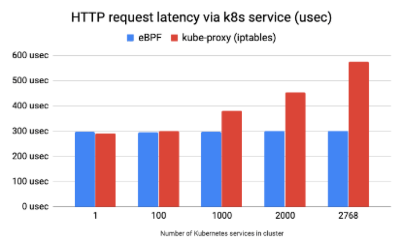

# Cilium Accelerates Pod Access to Services

Cilium optimizes the access to Services by performing NAT resolution of Service destination addresses within the Pod's network namespace. This eliminates the need for traffic to go through host iptables rules for resolution, resulting in improved performance.

In the official [test report]((https://cilium.io/blog/2019/08/20/cilium-16/#hostservices)), it is highlighted that when accessing Services between Pods using HTTP, the traditional iptables resolution can incur increasing latency as the number of Services grows. However, Cilium's acceleration solution ensures stable and consistent access latency between applications, regardless of the number of Services.
