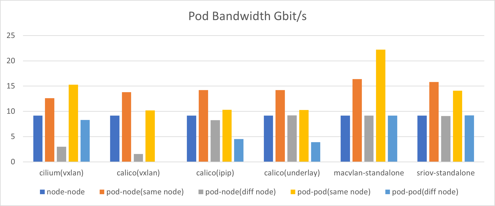
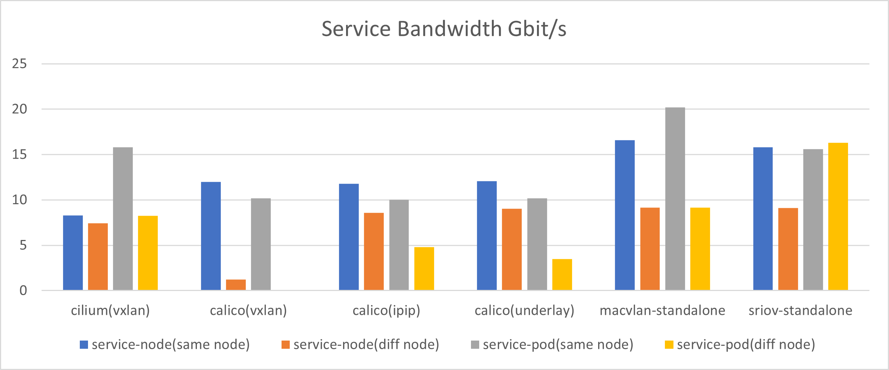
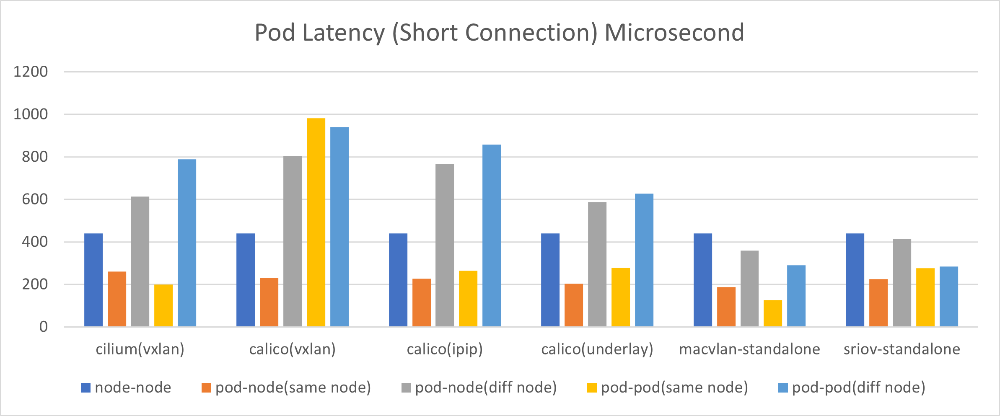

# CNI Performance Test Report

This test report covers the performance testing of CNIs including Cilium, Calico and Macvlan.

## Test background

### Test environment

| Models | CPUs | Memories | NICs | Systems | Node IPs |
| --- | --- | ---| --- | --- | --- |
| Dell PowerEdge R620 | Intel(R) Xeon(R) CPU E5-2620 0 @ 2.00GHz * 2 | 4G 1333M * 4 | Mellanox cx5 Physical NIC Bandwidth | Ubuntu 22.04 | 10.20.0.11 |
| Dell PowerEdge R620 | Intel(R) Xeon(R) CPU E5-2620 0 @ 2.00GHz * 2 | 4G 1333M * 4 | Mellanox cx5 | Ubuntu 22.04 | 10.20.0.12 |

### Tested CNI types

This test covers three CNIs including Cilium, Calico and Macvlan, and is based on the following models:

- Cilium
    - Cilium (VXLAN mode)
- Calico
    - Calico (VXLAN mode)
    - Calico (underlay mode)
    - Calico (IPIP mode)
- Macvlan-Standalone

### Test cases

This test includes the following nine Test cases:

- Node to node
- Pod to node where the pod resides
- Pod to node across nodes
- Pod to pod on the same node
- Pod to pod across nodes
- Node to Service, and the Endpoint corresponding to the Service is on this node
- Node to Service, and the Endpoint corresponding to the Service is on other nodes
- Pod to Service, the Endpoint corresponding to the Service is on the same node as this Pod
- Pod to Service, and Service corresponding Endpoint and this Pod are on different nodes

### Test metrics

- Pod throughput (pod to node)
- Service throughput (Service to node)
- Latency - long connection (pod to node)
- Latency - short connection (pod to node)

### Testing tools and commands

This test uses the netperf tool for performance testing, and the test commands for different metrics are as follows:

- Throughput

    ```shell
    netperf -t TCP_STREAM -H <serverIP> -p <serverPort> -l 60 -- -m 1024
    iperf3 -c <serverIP> -i 1 -t 60
    ```

- Time delay - long connection

    ```shell
    netperf -t TCP_RR -H <serverIP> -p <serverPort> -l 60 -- -r 1024 -O "MIN_LATENCY,MAX_LATENCY,P50_LATENCY,P90_LATENCY,P99_LATENCY,MEAN_LATENCY. STDDEV_LATENCY"
    ```

- Time delay - short link

    ```shell
    netperf -t TCP_CRR -H <serverIP> -p <serverPort> -l 60 -- -r 1024 -O "MIN_LATENCY,MAX_LATENCY,P50_LATENCY,P90_LATENCY,P99_LATENCY,MEAN_LATENCY. STDDEV_LATENCY"
    ```

## Test results

For the four test metrics, the test results for different CNI patterns in different test cases are shown below:

### Chart conclusion

- pod throughput

    

    | Test Cases | Conclusions |
    | --- | --- |
    | Pod to node (on the same node) | Macvlan-Standalone has the highest throughput, while Cilium VXLAN has the lowest |
    | Pod to node (across nodes) | Calico-IPIP, Calico-underlay and Macvlan-Standalone outperform than Calico-VXLAN and Cilium-VXLAN |
    | Pod to pod (on the same node) | Macvlan is the best and followed by Cilium, and Calico has similarly worse performance in three modes |
    | Pod to pod (across nodes) | Macvlan is the best, followed by Cilium-vxlan and then Calico |

- Service throughput

    

    | Test Cases | Conclusions |
    | --- | --- |
    | Service to node (on the same node)  | Macvlan is the best and followed by Cilium, and Calico has similarly worse performance in three modes |
    | Service to node (across nodes) | Macvlan, Calico-IPIP, Calico-underlay, and Cilium-VXLAN have similar performance, while Calico-VXLAN is the worst |
    | Service to pod (on the same node) | Macvlan has the best performance and is followed by Cilium.  Calico has similarly worse performance in all three modes |
    | Service to pod (across nodes) | Both Macvlan and Cilium perform better than Calico |

- pod latency

    

    | Test Cases | Conclusions |
    | --- | --- |
    | Pod to node (on the same node) | The five CNI modes perform similarly, with the lowest Macvlan latency |
    | Pod to node (across nodes) | Macvlan has the best performance, and is followed by Cilium-VXLAN, and Calico-VXLAN has the highest latency |
    | Pod to pod (on the same node) | Macvlan has the best performance and is followed by Cilium.  Calico has similarly worse performance in all three modes |
    | Pod to pod (across nodes) | Macvlan has the best performance, followed by Calico-underlay and then Calico-VXLAN |

- pod short traces

    

    | Test Cases | Conclusions |
    | --- | --- |
    | Pod to node (on the same node) | The five cni modes has similar latencies,  with macvlan and Calico-underlay having the lowest latency |
    | Pod to node (across nodes) | Macvlan has the best performance, and is followed by  Cilium-VXLAN, and Calico-VXLAN has the highest latency |
    | Pod to pod (on the same node) | Macvlan has the best performance and is followed by Cilium.  Calico has similarly worse performance in all three modes |
    | Pod to pod (across nodes) | Macvlan has the best performance, followed by Calico-underlay and then Calico-vxlan |

### Detailed data

- pod-related throughput (Gbits/sec)

    | Test Cases| Cilium(VXLAN) | Calico(VXLAN) | Calico(IPIP) | Calico(underlay) | Macvlan-Standalone |SR-IOV-Standalone |
    | --- | --- | --- | --- | --- | --- | --- |
    | Node to node | 9.16 | 9.16 | 9.16 | 9.16 | 9.16 | 9.16 |
    | Pod to node (on the same node) | 12.6 | 13.8 | 14.23 | 14.2 | 16.4 | 15.8 |
    | Pod to node (across nodes) | 3.02 | 1.5 7 | 8.24 | 9.2 | 9.15 | 9.09 |
    | Pod to pod (on the same node) | 15.3 | 10.2 | 10.33 | 10.27 | 22.2 | 14.1 |
    | Pod to pod (across nodes) | 8.30 | 1.37 | 4.51 | 3.89 | 9.18 | 9.21 |

- Service related throughput (Gbits/sec)

    | Test Cases | Cilium(VXLAN) | Calico(VXLAN) | Calico(IPIP) | Calico(underlay) | Macvlan-Standalone | SR-IOV-Standalone |
    | --- | --- | --- | --- | --- | --- | --- |
    | Service to node (on the same node) | 8.30 | 12 | 11.77 | 12.07 | 16.6 | 15.8 |
    | Service to node (across nodes) | 7.41 | 1.23 | 8.57 | 9.037 | 9.14 | 9.10 |
    | Service to pod (on the same node) | 15.8 | 10.2 | 10 | 10.17 | 20.2 | 15.6 |
    | Service to pod (across nodes) | 8.27 | 1.3 | 4.81 | 3.49 | 9.15 | 16.3 |

- netpref latency (long connection) (Microseconds)

    | Test Cases | Cilium(VXLAN) | Calico(VXLAN) | Calico(IPIP) | Calico(underlay) | Macvlan-Standalone | SR-IOV-Standalone |
    | --- | --- | --- | --- | --- | --- | --- |
    | Node to node | 113.27 | 113.27 | 113.27 | 113.27 | 113.27 | 113.27 |
    | Pod to node (on the same node) | 76.76 | 76.81 | 74.55 | 62.27 | 61.25 | 74.34 |
    | Pod to node (across nodes) | 150.26 | 241.46 | 225.68 | 170.23 | 95.76 | 109.77 |
    | Pod to Pod (on the same node) | 65.62 | 104.82 | 91.44 | 103.71 | 45.47 | 66.74 |
    | Pod to Pod (across nodes) | 201.27 | 275.22 | 248.72 | 195.61 | 81.74 | 78.83 |

- netpref latency (short connection) (Microseconds)

    | Test Cases | Cilium(VXLAN) | Calico(VXLAN) | Calico(IPIP) | Calico(underlay) | Macvlan-Standalone | SR-IOV-Standalone |
    | --- | --- | --- | --- | --- | --- | --- |
    | Node to node | 439.04 | 439.04 | 439.04 | 439.04 | 439.04 | 439.04 |
    | Pod to node (on the same node) | 259.92 | 230.65 | 226.26 | 203.63 | 187.41 | 225.66 |
    | Pod to node (across nodes) | 613.59 | 803.80 | 767.08 | 587.53 | 358.48 | 413.77 |
    | Pod to pod (on the same node) | 198.99 | 982.92 | 265.07 | 277.75 | 127.48 | 275.52 |
    | Pod to pod (across nodes) | 789.32 | 940.65 | 857.6 | 628.21 | 290.59 | 284.16 |
