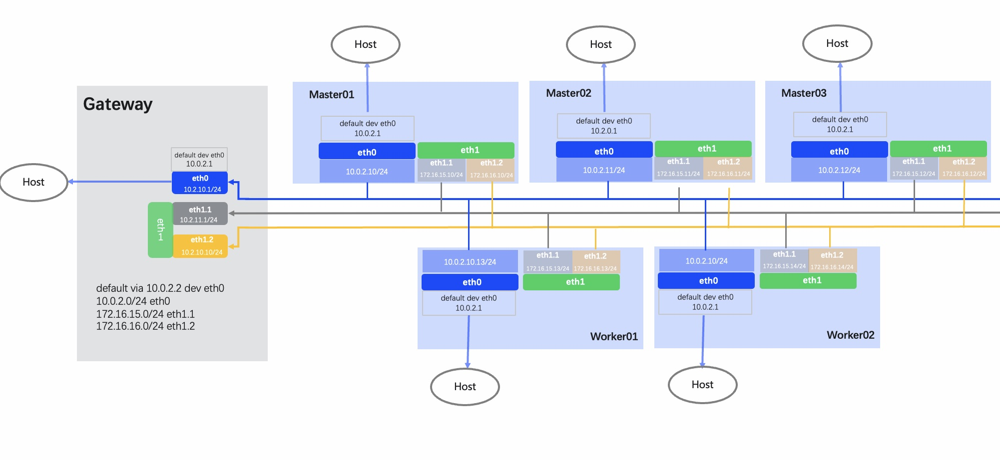
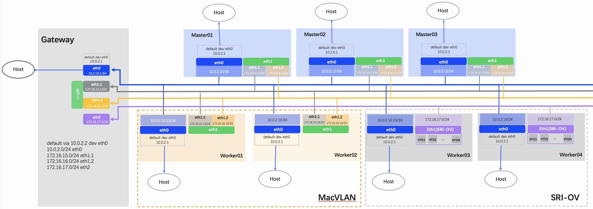

---
hide:
  - toc
---

# Network Planning

This page describes best practice in Overlay + Underlay CNI based on [Eth card planning](./ethplan.md), with the main scenarios covered is as follows:

1. Calico with Macvlan CNI
2. Calico with Macvlan and SR-IOV CNI

In the following scenarios, the best practice is to have 2 NICs, with different NICs carrying the following traffic:

1. **NIC 1 (eth0)**: Mainly responsible for Kubernetes internal management traffic, Calico traffic, and Inter-Node Communication traffic
2. **NIC 2 (eth1)**: Mainly responsible for Underlay (Macvlan/SR-IOV) network traffic

## Calico with Macvlan CNI

**Planning Instructions**:

- In this plan, Calico or Cilium serves as the default CNI,
requiring co-installation with components including Multus-underlay and Spiderpool.
- It is advised that each node is equipped with multiple physical NICs with the same name.
- eth0 is a NIC where the default route of the host is located, and the gateway points to the Gateway host, which forwards to the external network.
  The main uses are: communication between nodes, K8s management NIC, Calico pod communication.
- eth1 is the Underlay service NIC and does not need to be set an IP address.
  Creating VLAN subinterfaces (eth1.1, eth1.2) is based on the eth1, each respectively corresponding to network segments such as 172.16.15.0/24 and 172.16.16.0/24.
  The created pods for business application can utilize the corresponding network segment addresses to meet the requirements for connecting to multiple VLANs and subnets.
- The eth1.1, eth1.2 VLAN subinterfaces does not need to be set an IP address.

## Calico with Macvlan and SR-IOV CNI

**Planning Instructions**:

- In this plan, Calico or Cilium serves as the default CNI,
requiring co-installation with components including Multus-underlay and Spiderpool.
- It is advised that each node is equipped with multiple physical NICs with the same name.
- eth0 is a NIC where the default route of the host is located, and the gateway points to the Gateway host, which forwards to the external network.
  The main uses are: communication between nodes, K8s management NIC, Calico pod communication.
- eth1 in `Worker01` and `Worker02` is a NIC for the VLAN service and does not need to be set an IP address.
  Creating VLAN subinterfaces (eth1.1, eth1.2) is based on the eth1, each respectively corresponding to network segments such as 172.16.15.0/24 and 172.16.16.0/24.
  The created pods for business application can utilize the corresponding network segment addresses to meet the requirements for connecting to multiple VLANs and subnets.
- The eth1.1, eth1.2 VLAN subinterfaces does not need to be set an IP address.
- eth1 in `Worker03` and `Worker04` is the SR-IOV service NIC and does not need to be set an IP address.
  The network segment for eth1 is 172.16.17.0/24, and eth1.1 and eth1.2 can also correspond to this network segment.
  You have the option to decide whether to utilize the same IP address range for these interfaces based on your requirements.
  In this example, these network segments should be different. The created pods for business application uses the network segment, which can be directly invoked by the container after using the extended VF (Virtual Functions) to get the acceleration effect.
