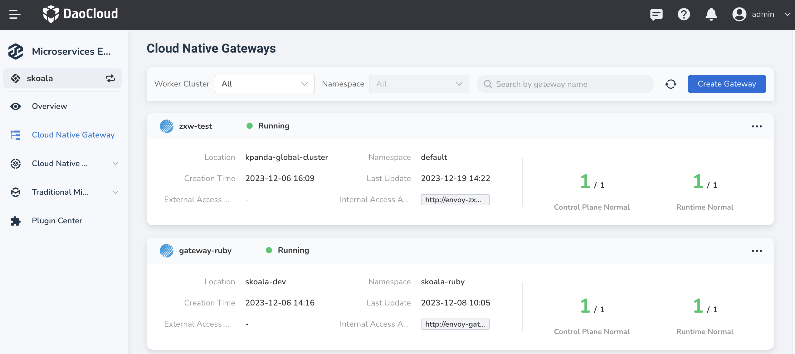
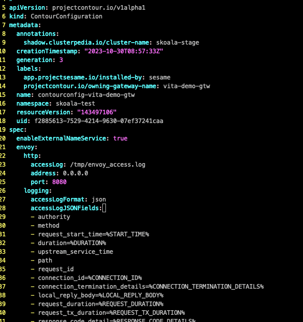

# Add Custom Attributes to Gateway Request Logs

The underlying gateway used in the microservice engine is contour, which is responsible for delivering configuration to envoy for the control plane. The logging fields for request logs are also configured by contour and sent to envoy. Therefore, all that is needed is to add the desired fields to the contour configuration file.

The specific steps are as follows:

1. Go to the Microservice Engine - Cloud-Native Gateway List and locate the cluster and namespace where the gateway with the configuration to be modified is located.

    

2. In the cluster and namespace where the gateway is located, search for the custom CR (ContourConfiguration).

    ```shell
    kubectl get contourconfig -n skoala-test

    NAME                          AGE
    contourconfig-vita-demo-gtw   21d
    ```

3. Edit the CR resource obtained in the previous step and add the desired log fields in
   `.spec.envoy.logging.accessLogJSONFields`. For example, to add a log field for the response header
   X-Envoy-Upstream-Service-Time, add the following line: `X-Envoy-Upstream-Service-Time=%RESP(X-ENVOY-UPSTREAM-SERVICE-TIME)%`.

    ```shell
    kubectl edit contourconfig -n skoala-test
    ```

    Before editing:

    

    After editing:

    

4. Restart the contour component (this will not cause any interruption to the traffic).

    ```shell
    kubectl get pods -n skoala-test | grep contour | awk '{print $1}' | xargs kubectl delete pod -n skoala-test

    pod "contour-vita-demo-gtw-785f495bdf-n7knb" deleted
    pod "contour-vita-demo-gtw-b5fcc57bb-pbssx" deleted
    ```

5. After the pods have started successfully, access the interface through the gateway API and observe the log fields in the gateway logs.

    

    Select a log entry and view the original text:

    

    The custom response header can be seen in the log entry.

!!! note

    This feature is applicable to Microservice Engine version 0.29.0 and higher.
