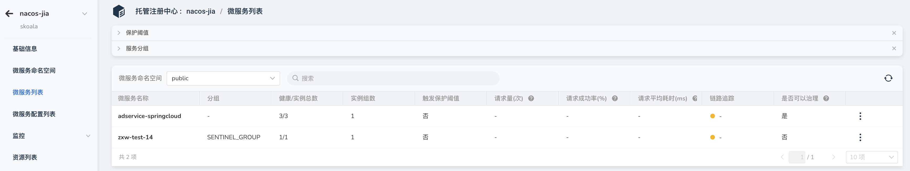
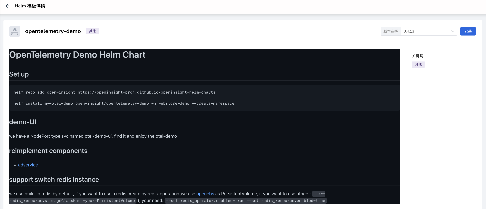
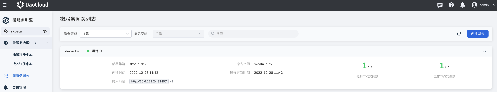
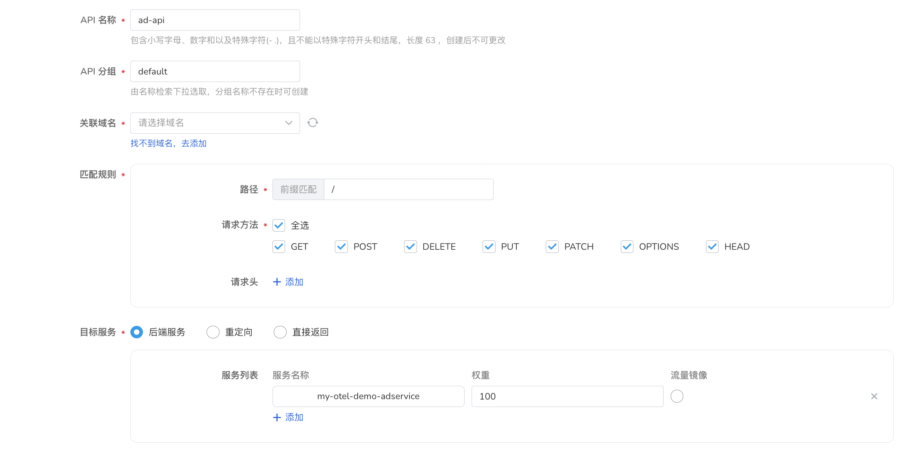

# Example application experience microservice governance

The microservice engine belongs to the advanced version of DCE5.0, which includes registration center, configuration center, microservice governance (traditional microservices, cloud-native microservices), cloud-native gateway and other modules; it will take you to experience how the sample application is deployed successfully Finally, experience the microservice governance function.

## Flow Description

- Deploy the sample application on the application workbench and enable microservice governance
- Enable traditional microservices governance
- Configure the corresponding governance rules
- Expose service API
- Access to testing services via Postman

## Sample application introduction

The sample application comes from the standard demo application of OpenTelemetry, which can well reflect the cloud native and observability capabilities. It is also convenient for our governance rules to be presented. Below is the sample application optimized by the DaoCloud large and micro service team based on DCE5.0 functions and open sourced on Github.

- <https://github.com/openinsight-proj/openinsight-helm-charts>

> Application Architecture Diagram


For more sample applications, please check our open source site: <https://github.com/openinsight-proj/openinsight-helm-charts>

## Application Deployment

The application workbench is an application management module provided by DCE5.0, which is convenient for you to create/maintain various types of applications here, supports CICD, and can easily and quickly deploy applications to any cluster.

To learn more about the application workbench, click [Application Workbench to view](../../amamba/01ProductBrief/WhatisAmamba.md)

### Deployment method selection

The application workbench currently supports deployment methods based on Git repo, Jar package, Image, Helm Chart, etc. Here we use `Git repo` as an example.


### Deployment preparation

#### Import Helm Chart

This step needs to be operated in `container management`, jump to the Helm Chart registry, and add the registry:


#### Prepare Nacos instance

For the specific operation here, please refer to the registry configuration, [](../registry/managed/registry-lcm/create-registry.md)

Pay attention to obtain the link address information of the registration center, which will be used later when the application below is installed.



### Deploy the application

In the application workbench, directly choose to use Helm Chart to install, find the openinsight application, and then choose to deploy.




### Parameter configuration

On the Helm installation interface, pay attention to confirm the deployment location and the parameter configuration below, find the corresponding module through the keyword `JAVA_OPTS`, and update the configuration below.


- Through the registration center address obtained above
- Update the configuration parameters below, the main update fields are
     -Dspring.cloud.nacos.discovery.enabled
     -Dspring.cloud.nacos.config.enabled
     -Dspring.cloud.nacos.config.server-addr
     -Dspring.cloud.nacos.discovery.server-addr
     -Dspring.cloud.nacos.discovery.metadata.k8s_cluster_id
     -Dspring.cloud.nacos.discovery.metadata.k8s_cluster_name
     -Dspring.cloud.nacos.discovery.metadata.k8s_namespace_name

> The configuration modification location is as follows:

```java
-javaagent:./jmx_prometheus_javaagent-0.17.0.jar=12345:./prometheus-jmx-config.yaml
     -Dspring.extraAdLabel=Daocloud -Dspring.randomError=false
     -Dspring.matrixRow=200 -Dmeter.port=8888
     -Dspring.cloud.nacos.discovery.enabled=false # Enable Nacos service registration discovery
     -Dspring.cloud.nacos.config.enabled=false # Enable Nacos configuration management capabilities
     -Dspring.cloud.sentinel.enabled=false
     -Dspring.cloud.nacos.config.server-addr=nacos-test.skoala-test:8848 # Configure Nacos registration center address
     -Dspring.application.name=adservice-springcloud
     -Dspring.cloud.nacos.discovery.server-addr=nacos-test.skoala-test:8848 # Configure Nacos registration center address
     -Dspring.cloud.nacos.discovery.metadata.k8s_cluster_id=xxx # Configure the cluster ID where the Nacos registry is located
     -Dspring.cloud.nacos.discovery.metadata.k8s_cluster_name=skoala-dev # Configure the name of the cluster where the Nacos registry is located
     -Dspring.cloud.nacos.discovery.metadata.k8s_namespace_name=skoala-test # Configure the namespace where the Nacos registry is located
     -Dspring.cloud.nacos.discovery.metadata.k8s_workload_type=deployment
     -Dspring.cloud.nacos.discovery.metadata.k8s_workload_name=adservice-springcloud
     -Dspring.cloud.nacos.discovery.metadata.k8s_service_name=adservice-springcloud
     -Dspring.cloud.nacos.discovery.metadata.k8s_pod_name=${HOSTNAME}
     -Dspring.cloud.sentinel.enabled=false
     -Dspring.cloud.sentinel.transport.dashboard=nacos-test-sentinel.skoala-test:8080
```

After the creation is successful, the application will appear in the Helm application list of the application workbench.


### Other deployment methods

If you use other deployment methods, the method for configuring the registry address may be different depending on the deployment method.

#### Java project self-development and debugging

This generally refers to Java projects. When developing, you need to integrate the Nacos SDK. The registry module provided by DCE5.0 is fully compatible with the open source Nacos, so you can directly use the open source Nacos SDK.

When using java -jar to start the project, pay attention to add the corresponding environment variable configuration

```java
     -Dspring.cloud.nacos.discovery.enabled=false # Enable Nacos service registration discovery
     -Dspring.cloud.nacos.config.enabled=false # Enable Nacos configuration management capabilities
     -Dspring.cloud.sentinel.enabled=false
     -Dspring.cloud.nacos.config.server-addr=nacos-test.skoala-test:8848 # Configure Nacos registration center address
     -Dspring.application.name=adservice-springcloud
     -Dspring.cloud.nacos.discovery.server-addr=nacos-test.skoala-test:8848 # Configure Nacos registration center address
     -Dspring.cloud.nacos.discovery.metadata.k8s_cluster_id=xxx # Configure the cluster ID where the Nacos registry is located
     -Dspring.cloud.nacos.discovery.metadata.k8s_cluster_name=skoala-dev # Configure the name of the cluster where the Nacos registry is located
     -Dspring.cloud.nacos.discovery.metadata.k8s_namespace_name=skoala-test # Configure the namespace where the Nacos registry is located
     -Dspring.cloud.nacos.discovery.metadata.k8s_workload_type=deployment
     -Dspring.cloud.nacos.discovery.metadata.k8s_workload_name=adservice-springcloud
     -Dspring.cloud.nacos.discovery.metadata.k8s_service_name=adservice-springcloud
     -Dspring.cloud.nacos.discovery.metadata.k8s_pod_name=${HOSTNAME}
```

Note that the above `metadata` information should not be missing, otherwise the service presented in the registry will be missing this part of information

#### Deploy using the Application Workbench image

When using container image deployment through the application workbench, you can easily enable microservice governance through configuration and directly select the corresponding registry module.


## Microservice Governance Strategy

When the application is successfully deployed, we can see the corresponding service in the previously prepared registry.


### Governance strategy example: current limiting

Here is an example of the current limiting policy. We can add the corresponding current limiting policy to the service through simple configuration.


### Current limiting strategy test

By accessing the service address, we can see that after the number of requests is greater than 2 within 1 minute, subsequent requests will be blocked; it will be automatically restored after more than 1 minute.

### More Strategies


## Cloud native gateway open API

When the deployment of the microservice application is completed, we need to open the application entrance to external access through the API gateway. Only at this step is the completed service experience.

### Create a cloud-native gateway

First, we need to create a cloud-native gateway. For specific steps, please refer to: [Create a cloud-native gateway](../ms-gateway/gateway/create-gateway.md)

Here we have prepared a cloud native gateway



> Note that when creating a gateway, the working cluster application deployed by the gateway is in the same cluster as the sample application, and the managed namespace of the cloud-native gateway needs to include the namespace where the instance application resides

### Service access and discovery

Based on the features of DCE5.0, the cloud-native gateway will automatically discover services in the managed namespace, so we don't need to create services separately.

This demonstration uses the services of the Nacos registration center, which greatly expands the number of services that the gateway can access. We can choose from the service access to access the services of the Nacos registration center.


The role of manual access, when the service is not in the managed namespace, or we want to access the registration center or other external services (using domain name/IP), we can use manual access.

### Create the corresponding API route

Jump to the API list, use the upper right to create an API, complete the corresponding API, and pay attention to select the corresponding service; the following is the basic information of the API corresponding to the sample application



> For more API creation details, please refer to the corresponding document [Create API](../ms-gateway/api/add-api.md)

### Access the application

After the gateway API is created, we can successfully access the application page by using the **domain name** and **external API path** configured when creating the API; the access page is below.

> Sample Application Home


> Sample Application Order Confirmation Page


## Conclusion

The above is the experience journey of the entire microservice engine module. With the support of the entire DCE5.0 capability, we have successfully completed the application deployment, the configuration of the microservice governance strategy, and the use of cloud-native gateway capabilities to open and actually access the API.

### More Capabilities

After our application is successfully deployed, we actually rely heavily on the observability provided by DCE5.0 in the subsequent application maintenance process; next, we will supplement the practice of corresponding observability.

- View the topology structure after application deployment
- View the log content of the application
- View the access logs of the cloud gateway gateway API
