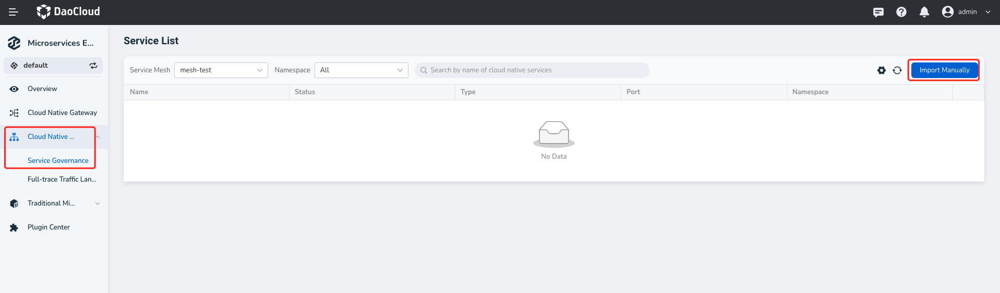
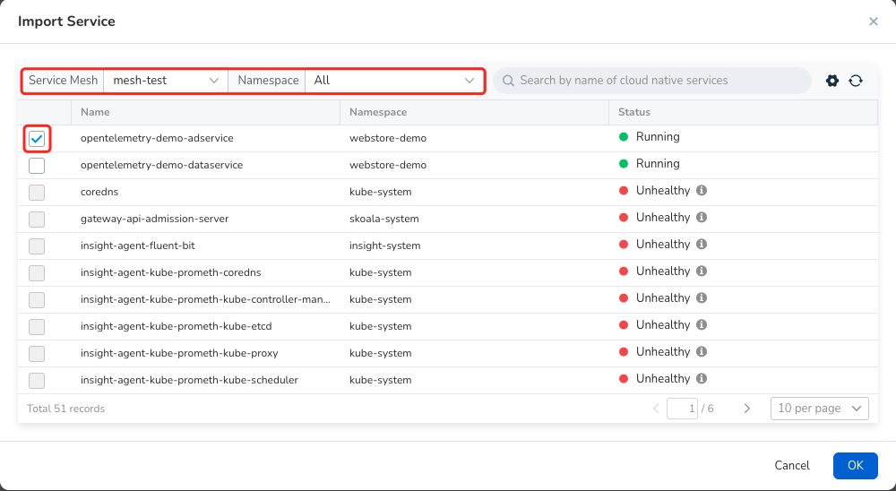
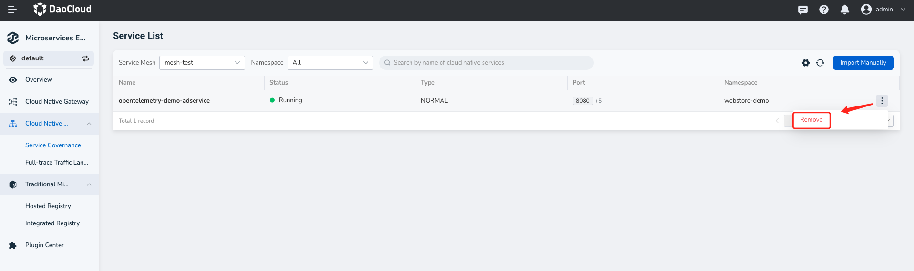
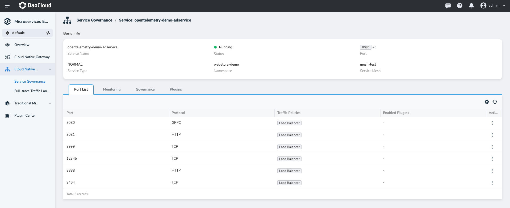

Import/Remove Service

Before managing cloud native microservices, you need to import these microservices into the Microservice Engine. Currently, you can import services only from [DCE 5.0 Service Mesh](../../mspider/intro/index.md) module.

## Import Service

1. Go to the `Microservices` module, click on `Cloud Native Microservices`→`Service Governance` on the left, and then click `Manual import` in the upper right corner.

    <!---->

2. Select the service mesh and namespace where the target microservice is deployed, select it, and then click `OK`.

    <!---->

## View Service

To view all the imported cloud native microservices, click the service name to further view the ports and protocols exposed.

<!---->

## Remove Service

Remove unwanted microservices from the right-side `Actions` column.

<!---->