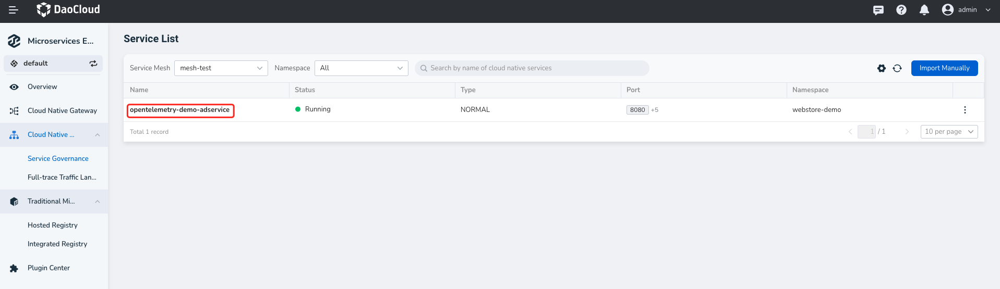
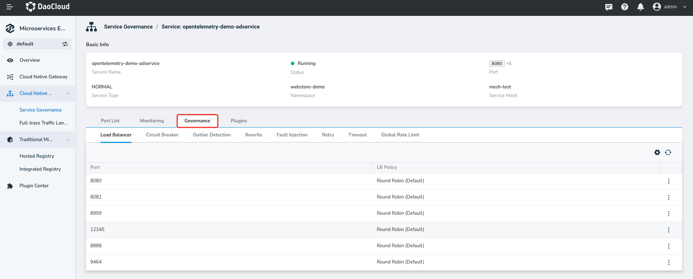

# Service Governance

Service governance allows you to manage the east-west traffic of microservices imported from the [DCE 5.0 Service Mesh](../../mspider/intro/index.md) based on features of Service Mesh.

After [microservices](service.md) are imported, different east-west traffic policies can be set individually for each exposed port of the service.

1. Click on the service name.

    <!---->

2. Select the target port.

    <!---->

3. Configure the traffic policy as needed, and click `OK` to confirm.

<!-- Specific descriptions of each policy will be added later -->