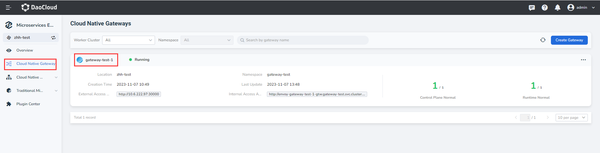
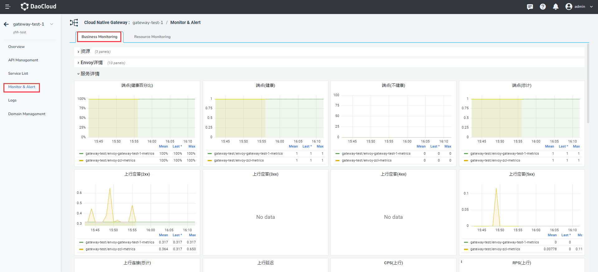
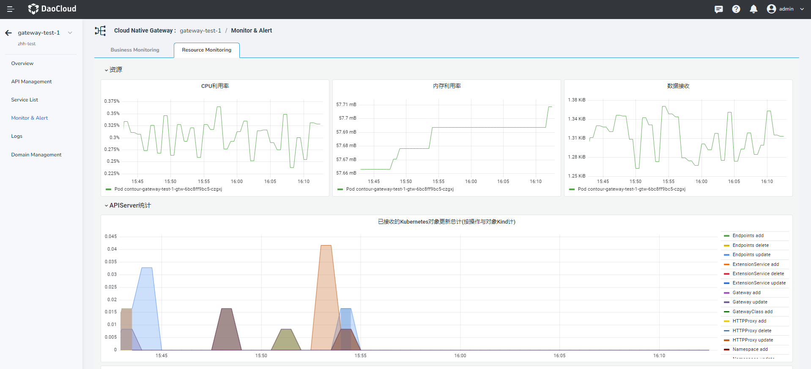

# Monitoring alert

The micro-service gateway uses the built-in Grafana dashboard to monitor resource usage of the gateway, monitoring details from Envoy, service monitoring details, and resource running information such as APIServe, and HTTPProxy.

To view monitoring alert information, perform the following steps:

Enter the micro-service engine module, click the micro-service gateway in the left navigation bar, and click the name of the target gateway.

   

On the left navigation bar, click `Monitoring & Alert`, and click the `Data Planel` TAB to view service monitoring information.

    > You can select the monitoring time window and refresh period in the upper right corner of the page.

    

Click the `Resource Planel` TAB to view the resource monitoring information.

     