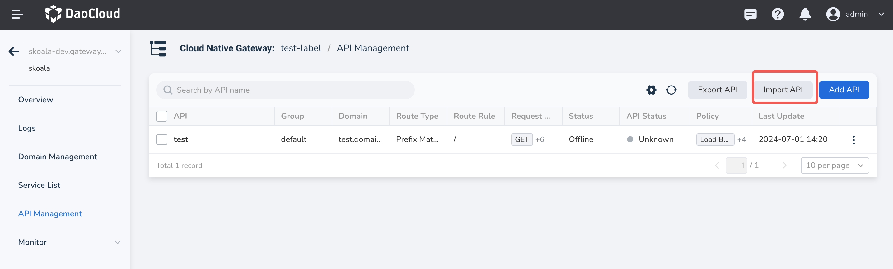
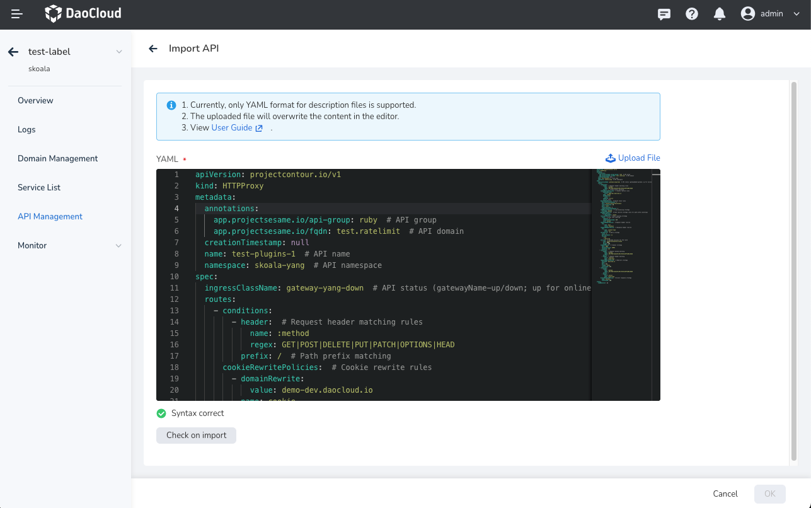

# Import API

The feature to import API allows you to fetch data from external systems or services and
import it into your application. Below is a simple overview of the feature, including
the request format and processing logic.

Select **Microservice Engine** -> **Cloud Native Gateway** .
Click the name of a functioning gateway, then in the left navigation bar, choose **API Management** .
Click the **Import API** button in the top right corner to upload or enter new API information
into the DCE 5.0 microservice engine.



You can import API configurations using a YAML file.



Here’s an YAML example:

```yaml
apiVersion: projectcontour.io/v1
kind: HTTPProxy
metadata:
  annotations:
    app.projectsesame.io/api-group: ruby  # API group
    app.projectsesame.io/fqdn: test.ratelimit  # API domain
  creationTimestamp: null
  name: test-plugins-1  # API name
  namespace: skoala-yang  # API namespace
spec:
  ingressClassName: gateway-yang-down  # API status (gatewayName-up/down; up for online, down for offline)
  routes:
    - conditions:
        - header:  # Request header matching rules
            name: :method
            regex: GET|POST|DELETE|PUT|PATCH|OPTIONS|HEAD
          prefix: /  # Path prefix matching
      cookieRewritePolicies:  # Cookie rewrite rules
        - domainRewrite:
            value: demo-dev.daocloud.io
          name: cookie
          pathRewrite:
            value: /
          sameSite: Strict
          secure: true
      healthCheckPolicy:  # Health check rules
        healthyThresholdCount: 1
        host: contour-envoy-healthcheck
        intervalSeconds: 60
        path: /test
        timeoutSeconds: 2
        unhealthyThresholdCount: 3
      loadBalancerPolicy:  # Load balancer policy
        strategy: Random
      pathRewritePolicy:  # Path rewrite policy (only for path prefix matching)
        replacePrefix:
          - replacement: /test2
      rateLimitPolicy:  # Rate limiting policy
        local:  # Local rate limiting
          requests: 2
          responseStatusCode: 429
          unit: second
      requestHeadersPolicy:  # Request header rewrite
        set:
          - name: host
            value: testhost
      responseHeadersPolicy:  # Response header rewrite
        set:
          - name: content-type
            value: xxx
      retryPolicy:  # Retry policy
        count: 1
        perTryTimeout: 1s
        retryOn:
          - 5xx
          - cancelled
      services:  # Backend services for the route
        - name: sesame-ba73aa79cd-sesame
          port: 8088
          weight: 100
      timeoutPolicy:  # Timeout policy
        idle: 300s
        idleConnection: 3600s
        response: 15s
    - conditions:
        - header:  # Request method matching
            name: :method
            regex: GET|POST|DELETE|PUT|PATCH|OPTIONS|HEAD
          prefix: /
        - header:  # Request header matching
            exact: redirect
            name: route-type
      requestRedirectPolicy:  # Redirect policy
        hostname: daocloud.io
        path: /
        port: 443
        scheme: https
        statusCode: 301
    - conditions:
        - header:
            name: :method
            regex: GET|POST|DELETE|PUT|PATCH|OPTIONS|HEAD
          prefix: /
        - header:
            exact: direct
            name: route-type
      directResponsePolicy:  # Direct response policy
        body: success
        statusCode: 200
status:
  loadBalancer: {}
```

This YAML structure outlines various policies and configurations for your API, including routing,
health checks, and rate limiting.
