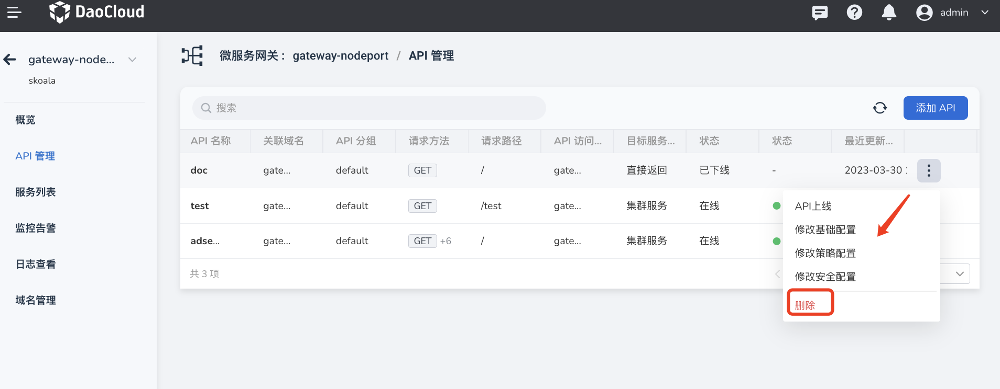
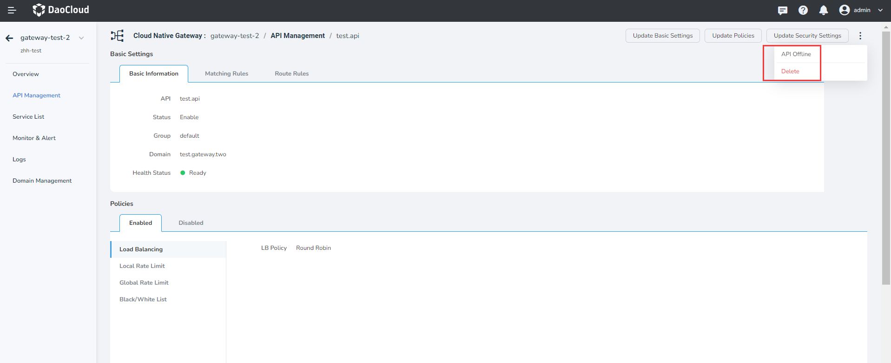

# Remove API

The microservice gateway supports the full lifecycle management of the API of the gateway instance, including adding, updating, and removing the API. This page explains how to remove an API.

You can remove an API in two ways.

!!! danger

- In the `API Management` page to find the need to delete the API, on the API right click ** `ⵗ` ** and select `Remove`.

    

- Click the API names into the API details page, at the upper right corner of the page by clicking on the ** `ⵗ` ** hold and select `Remove`.

    
