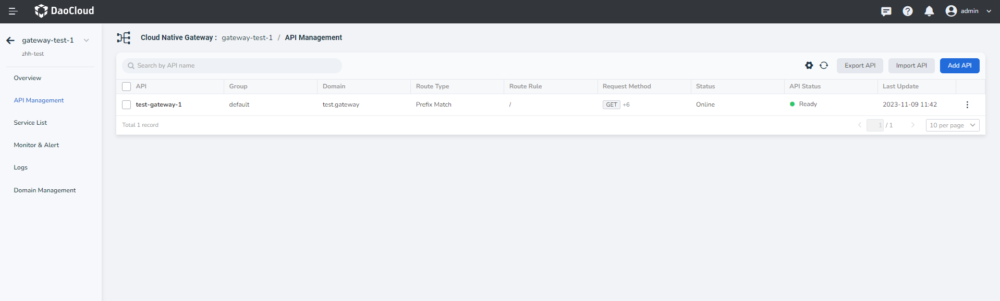
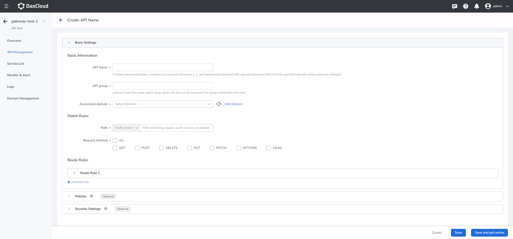
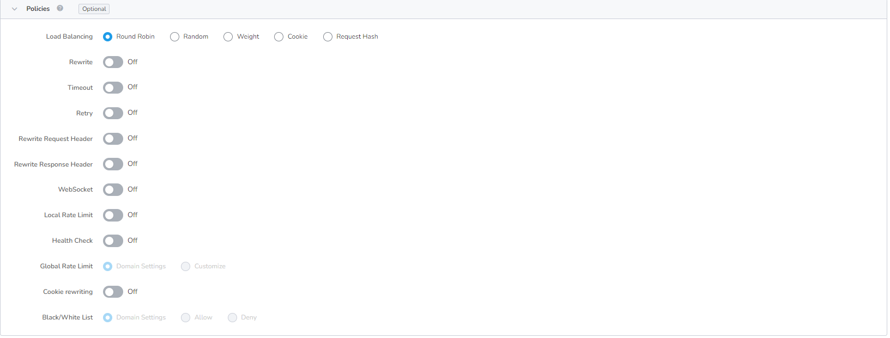
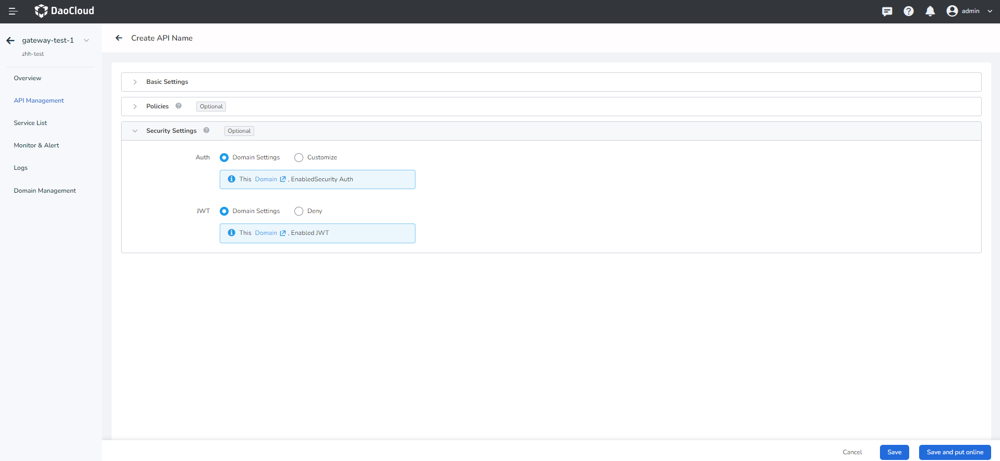
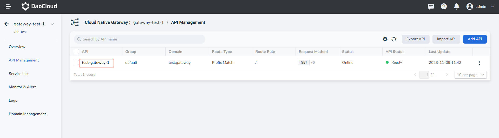
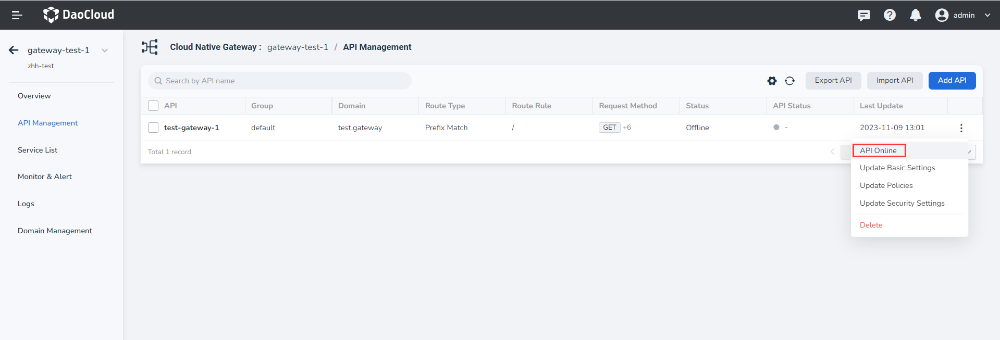
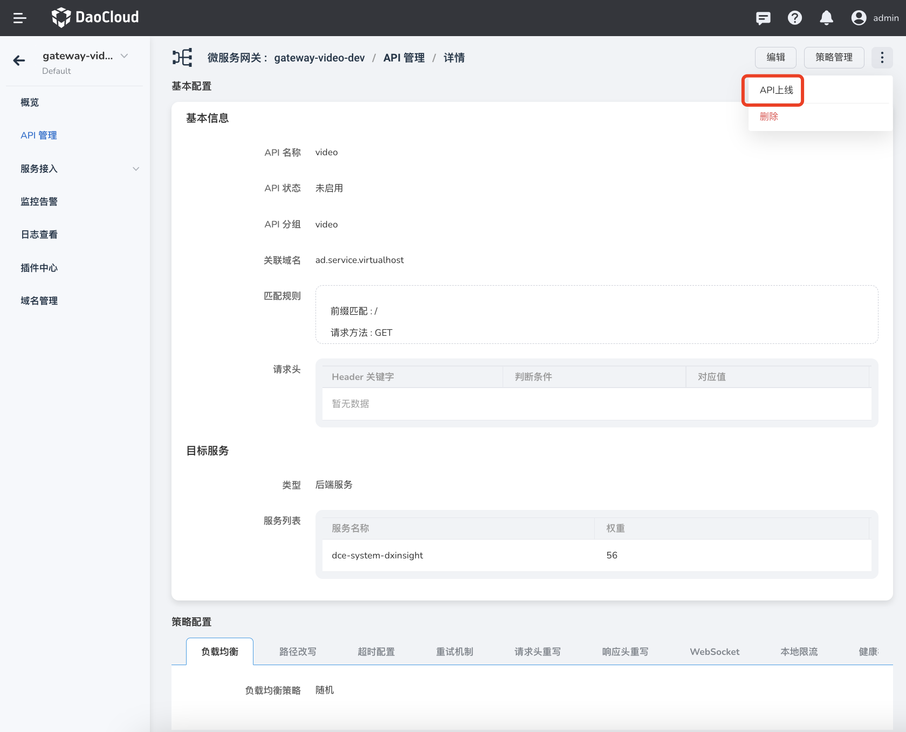

# Add API

The microservice gateway supports the full lifecycle management of the API of the gateway instance, including adding, updating, and deleting the API. 

**Prerequisites**

- For optional domain names, see [Domain Management](../domain/index.md) to create a domain name.
- If the target service of the API is the back-end service, ensure that an optional back-end service is available. For details, see [Manual](../service/manual-integrate.md) or [Auto](../service/auto-manage.md).

The steps to create an API are as follows:

1. Click the gateway name to enter the gateway overview page, then click `API Management` in the left navigation bar, and click `Add API` in the upper right corner of the page.

    

2. Fill in basic configurations by referring to the following instructions.

    The configuration includes basic configuration and policy configuration and security settings. When filling in the basic configuration information, note the following:

    - API name: Contains lowercase letters, numbers, and special characters (-.). Cannot start or end with a special character.
    - API group: Select the name of the group to which the API belongs. If you enter a group name that does not exist, a new group is automatically created.
    - Associated domain name: After you enter the associated domain name, you can access the API in `Domain + Port`. If the domain name cannot be found, you can add a new domain name. For details, see [Add Domain](../domain/index.md).
    - Matching rule: Only the requests that match the rule are allowed through. If multiple rules are set, all the rules must be met. If a request header is added, it needs to be added when the API is accessed.
    - Request Method: Select the HTTP request mode. See the official W3C document [Name Method Definitions](https://www.rfc-editor.org/rfc/rfc9110.html#name-method-definitions) for detailed instructions on the various request methods.
    - Target service: Choose to send the request directly to the back-end service, redirect it to another service, or return the HTTP status code directly.
    - If you select back-end services, you need to set weights. The larger the weight, the more traffic the gateway distributes to the weight.

        

3. Fill in the policy configuration by referring to the following description (Optional).

    Supports 12 API policies: load balancing, path rewriting, timeout configuration, retry mechanism, request header rewriting, response header rewriting, WebSocket, local traffic limiting, health check, cookie rewriting, access whitelist, and global rate limit. For details about how to configure each policy, see [API Policies](api-policy.md).

    

4. Fill in the security configuration by referring to the following description (Optional).

    - Auth: Enable Security Auth or customize it.
    - JWT: Enable JWT domain settings or customize it.

        

5. Click `Save` in the lower right corner of the page (not online). If you click `Save & Online`, you can directly go online API.

    After you click `OK`, if all configurations are normal, a `Successfully create an API` message will appear in the upper right corner. You can view the new API on `API Management`.

    

6. API online

    After the API is created successfully, ** It is offline by default and cannot be accessed **. You need to set the API to `Online` for normal access. There are two ways for an API to go live.

    - The API in `API Management` page to find the need to update the API, on the API right click ** `ⵗ` ** choose `API Online`.

        

    - Click the API name to enter the API details page. In the upper right corner of the page, click ** `ⵗ` ** and select `API Online`.

        

!!! info

    Click the API name to enter the API details. You can view the detailed configuration information of the API, such as online and offline status, domain name, matching rule, target service, and policy configuration.

    

