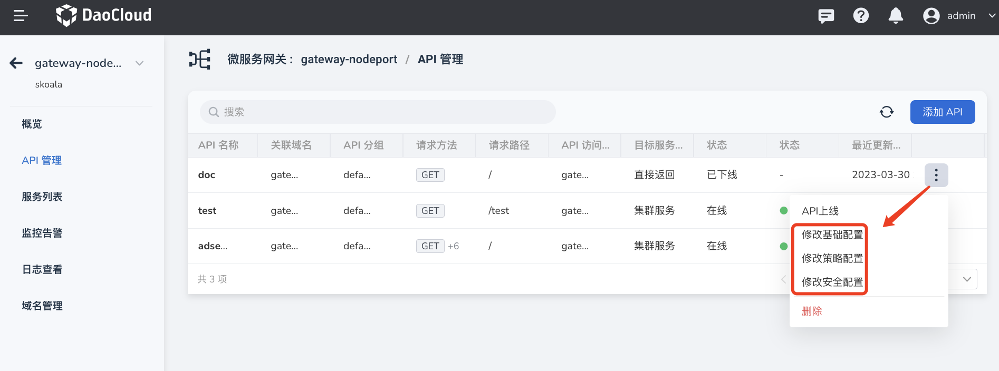
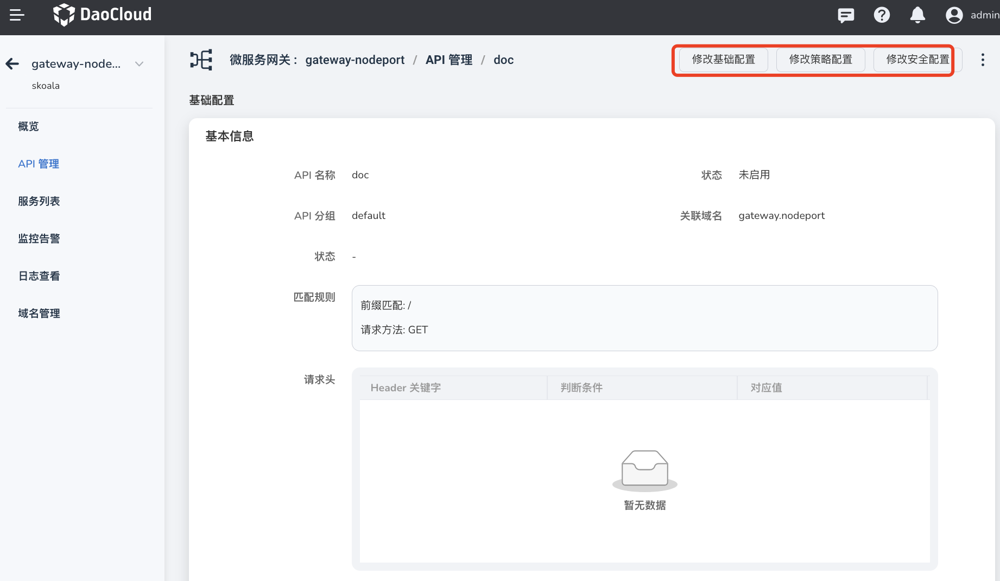

# Update API

The microservice gateway supports the full lifecycle management of the API of the gateway instance, including adding, updating, and deleting the API. This page describes how to update the API.

You can update the base configuration, policy configuration, and security configuration of the API in two ways.

- In the `API Management` page to find the need to update the API, on the API right click ** `ⵗ` ** choose `Update Basic Settings`, `Update Policy Settings` or `Update Security Settings`.

    

- Click the API name to enter the API details page. In the upper right corner of the page, `Update Basic Settings`, `Update Policy Settings` or `Update Security Settings`.

    
