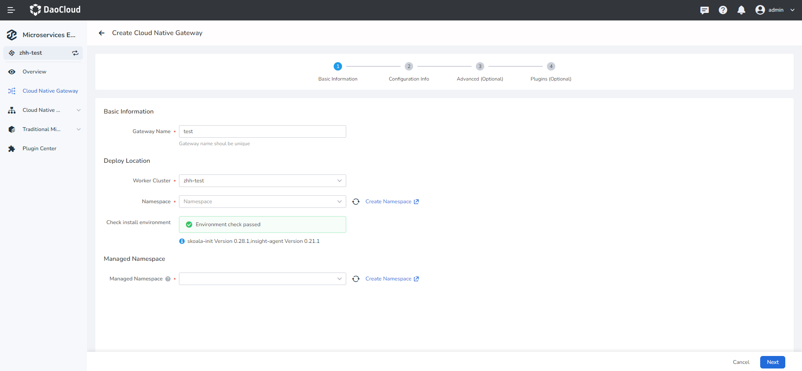
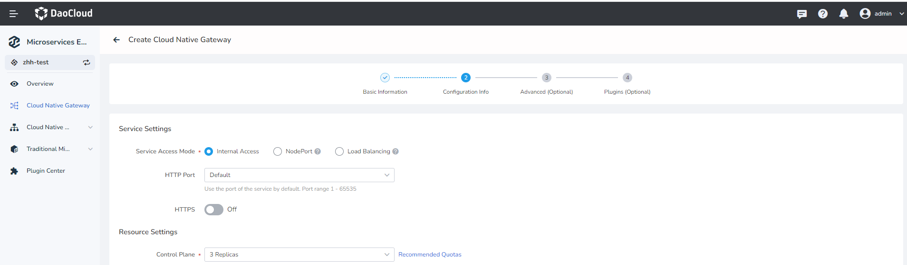
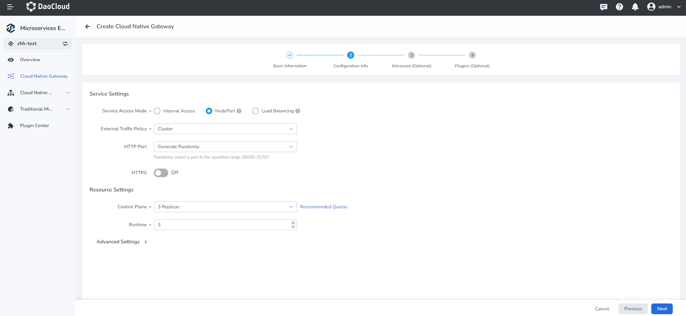
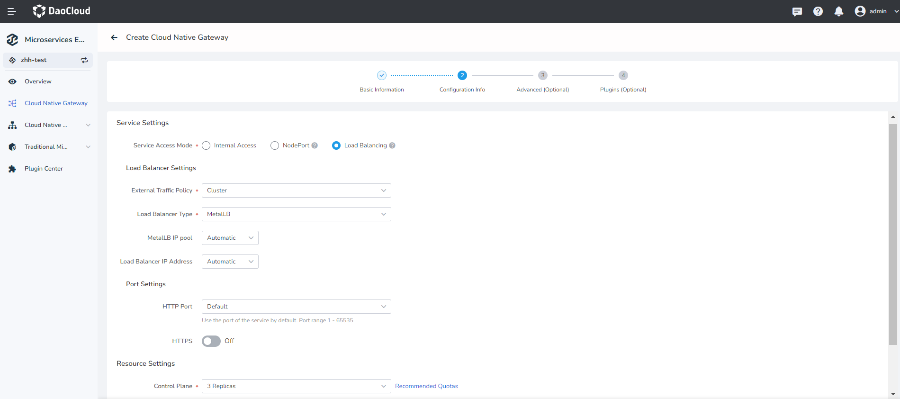
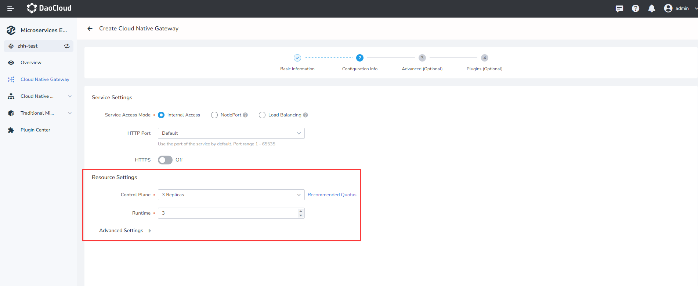
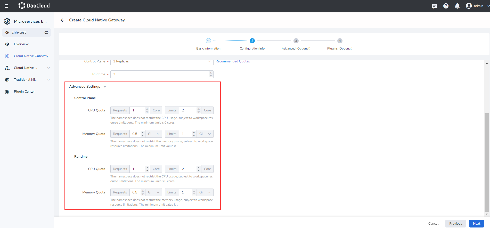
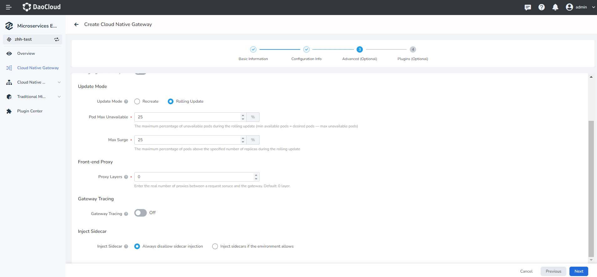
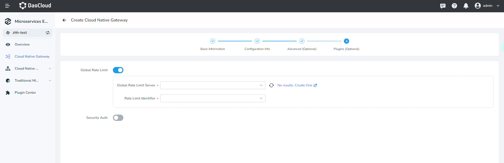
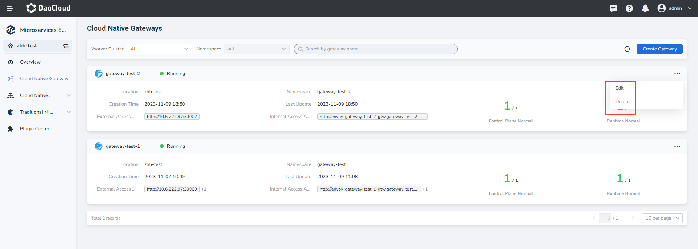

---
hide:
  - heel
---

# Create a microservice gateway

The micro-service gateway supports the high-availability architecture of multi-tenant instances and is compatible with the unified gateway access capabilities of micro-services in various modes. This page describes how to create a microservice gateway instance.

To create a microservice gateway, perform the following steps:

1. In the left navigation bar, click `Cloud native Gateway`, and in the upper right corner of the `Gateway List` page, click `Create Gateway` to enter the page for creating the micro-service gateway.

    

2. Follow the instructions below to complete the basic configuration (required).

    - Gateway name: contains a maximum of 63 letters, digits, hyphen (-) and must start and end with a letter or number character. The name cannot be changed after the gateway is created.
    - Deploy cluster: Select the cluster to deploy the gateway in.

        > If the target cluster does not appear in the optional list, you can go to the [Integrate](../../kpanda/user-guide/clusters/integrate-cluster.md) or [Create](../../kpanda/user-guide/clusters/create-cluster.md) cluster in the container management module and set the [The cluster or namespace under the cluster is bound to the current workspace ](../../../ghippo/user-guide/workspace/quota/#_4) through the global management module.

    - Namespace (deployment) : Select the namespace in which to deploy the gateway. Only one gateway can be deployed in a namespace.
    - Environment check : After the cluster and namespace are selected, the system automatically detects the installation environment. If the check fails, the system displays the cause and operation suggestions. You can perform operations as prompted.
    - Namespace (jurisdiction) : Sets which namespaces can be governed by the new gateway. Specifies the namespace of the default jurisdiction gateway. Supports managing multiple namespaces at the same time. A namespace cannot be managed by two gateways at the same time.

        

3. Enter the configuration information according to the following instructions

    === "Service entry mode"

        - Intra-cluster access: Services can be accessed only within the same cluster

            

        - Node port: Access services from outside the cluster through the IP address and static port of a node
              
            External traffic policy: 'Cluster' refers to Pods where traffic can be forwarded to other nodes in the cluster; 'Local' indicates that traffic can only be forwarded to the Pod on the local node.

            

        - Load balancer: Use a cloud service provider"s load balancer to make services publicly accessible

            - External traffic policy: `Cluster` Indicates that traffic can be forwarded to pods on other nodes in the cluster. `Local` Indicates that traffic can be forwarded only to the Pod on the local node
            - Load balancing type: MetalLB or other
            - MetalLB IP pool: Supports automatic selection or assignment of IP pools
            - Load balancer IP address: You can automatically select or specify an IP address

                

    === "Resource Settings"
           
        How many control nodes and working nodes are configured for the current gateway. Single copy is unstable, so select it with caution.

        

    === "Advanced Settings"

        - Control node: Sets how many CPU and memory resources to configure for the control node (contour)
        - Working node: Sets how many CPU and memory resources are allocated to the working node (envoy)
            
          

4. Follow the instructions below to complete the advanced configuration (optional).

    - Log Level: Sets log levels for working node (envoy) and Pod
    - Update Mode: 'Recreate' means to delete the original gateway and create a new gateway, 'rolling update' means not to delete the gateway, but to roll to update the gateway related Pod
    - Front-end Proxy: specifies how many proxy endpoints a request must pass through before reaching the gateway from the client. Set this parameter based on actual conditions. For example, 'client-nginx-gateway' has one agent layer because only one Nginx agent endpoint passes through it.
    - Gateway tracing: After this function is enabled, link information can be generated based on requests made through the gateway and sent to the observable module for data collection.

        

5. Please refer to the following information to fill in the plug-in configuration (optional), and finally click 'confirm' in the lower right corner of the page.
    
    Select whether to enable the Global Rate Limit plugin.

    You need to access the plugin in the plugin center in advance, or click the blue text on the current page to jump to the corresponding page to access and create.

       

!!! note

    Click `OK` at the lower right corner of the page to return to the micro-service gateway list page. You can perform the operations [Update Gateway](update-gateway.md) or [Delte Gateway](delete-gateway.md) on the right.

    
