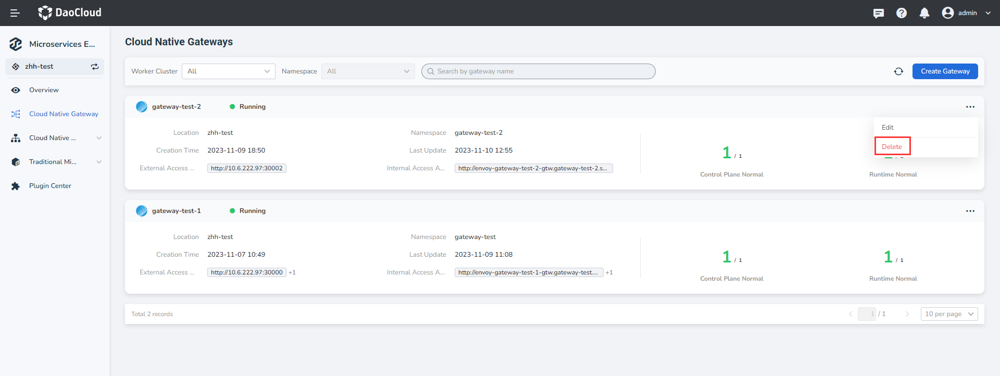

---
hide:
  - heel
---

# Example Delete the microservice gateway

The micro-service gateway supports the high-availability architecture of multi-tenant instances and is compatible with the unified gateway access capabilities of micro-services in various modes. This page describes how to delete a microservice gateway instance.

There are also two ways to delete a gateway. To ensure that services are not affected, release the API of all routes to the gateway before deleting it.

!!! danger

- In the `Gateway List` page choose the need to remove the gateway instance, at the instance of right click ** `⋯` ** and select `Delete`.

    

- After entering into the overview page, click on the gateway name in the upper right corner of the ** `⋯` ** and select `Delete`.

    
